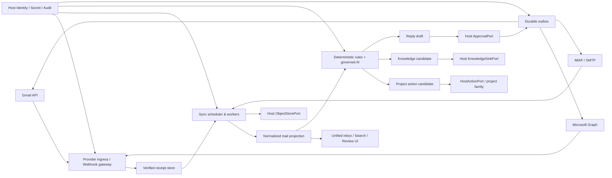
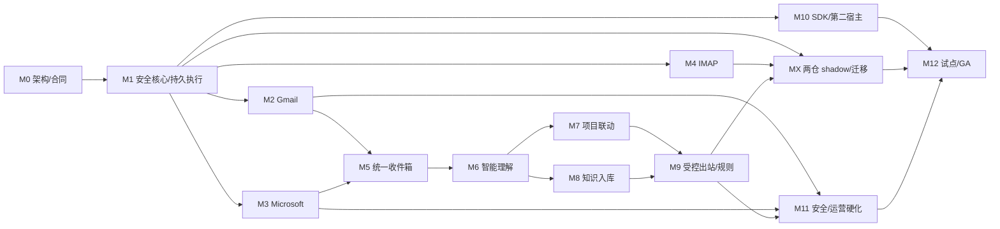

# 可复用智能邮件管理模块（MailHub）主待办

状态：CAPlatform MailHub 工程 Beta 已完成（本地/宿主闭环与普通推送完成；M2/M3 真实 Provider 激活延后；国内发布路径以 IMAP/SMTP + 应用授权码为主，Gmail 出范围、Graph 可选低优先级）
日期：2026-07-28  
工作名称：`MailHub`（正式命名由 M0 ADR 确认）  
当前唯一目标产品：CAPlatform
目标：先完成可在 CAPlatform 真实使用的智能邮件模块；通过稳定合同和 Host Port 保持可移植性，其他项目只作为未来消费者
本轮已完成：核心包、合同、迁移、测试、OAuth 宿主边界、只读 Provider 安全门和预检脚本已实现；真实邮箱权限、生产凭据和 Provider 运行证据仍由部署/宿主按激活手册提供

## CAPlatform Beta 最短关键路径（2026-07-30 决策）

本节是当前开发的唯一排序依据。本文其余 M0–M12、MX、验收和 GA 条目继续作为**完整生命周期总账**，
但不得再把全部未勾选项当作一个连续开发批次，也不得用汇总/API/事件重复项推高“剩余代码量”。

### 产品和复用边界

- CAPlatform 是当前唯一目标产品；`packages/mailhub` 是 CAPlatform 中可移植、可独立部署的邮件领域核心。
- Beta 阶段保持“逻辑独立、物理留在 CAPlatform monorepo”；稳定真实 Provider 合同和首个生产版本后再决定拆仓。
- CAACTRAINING/AeroLink 不是目标宿主、底座或并行交付物，只保留固定快照、clean-room 行为测试、数据迁移和未来 consumer adapter。
- 不导入 CAACTRAINING 的 Campaign/培训营销业务模型，不导入 AeroLink 的 RFQ/quotation 权威事实；它们不能决定 MailHub domain/API。
- 开源组件只补认证、Secret、测试服务器等基础设施，不整体替换 MailHub 领域核心、CAPlatform 项目/知识写入和 Agent 治理。

### 顺序门（2026-07-30 调整：先完成不依赖真实 Provider 的工程闭环）

| 顺序 | Beta 门 | 当前事实 | 关闭条件 | 对应总账 |
| --- | --- | --- | --- | --- |
| B0 | 决策与可回退基线 | 已创建 `codex/mailhub-caplatform-beta` 专用分支并形成 MailHub 范围提交 `4460597`；MailHub 333、根项目 226、BFF 133、deployment 93、Web 10 tests 与 Agentctl assessment/manifest validate/apply 通过；业务事件中心等非邮箱改动未混入该提交 | 已关闭；后续 Provider 证据独立提交，继续禁止把无关业务改动标成 MailHub 交付 | `MAIL-ARCH-001/002/009/010/011/017` |
| B1 | CAPlatform Host Credential Broker | 工程 Beta 已关闭：已实现 CAPlatform `/v1/mail-host/oauth/state|exchange` 与 `/credentials/resolve|refresh|revoke`、一次性加密 state、tenant/subject binding、服务 Bearer 鉴权、Gmail endpoint revoke、Graph 本地 token 销毁和审计；production/staging durable runtime 强制 PostgreSQL、显式 Provider、带服务鉴权的 Host Ports、零 Sandbox/内存 fallback | Provider 激活仍开放：宿主权威 Secret Manager/KMS、真实 Gmail/Graph code exchange/refresh/revoke、浏览器/MailHub DB 零 token 运行证明及 Graph consent 撤权证据 | `MAIL-GMAIL-001/002/007/009`、`MAIL-MS-001/002/009`、`MAIL-SEC-001/002` |
| B2 | CAPlatform 本地用户价值闭环 | 已关闭（工程 Beta）：`/mail` 的已批准候选 apply 不再接受浏览器自造 approval ref；BFF 签发 tenant/subject/candidate/revision/action 绑定的短期 opaque ref。任务通过 Agentctl `ca.project.create_task` preflight/invoke 写入并保留 result/evidence；知识候选经本地 Sandbox 安全门、签名 scope/content gate 和正文/凭据泄漏拒绝后，加密进入 CAPlatform 宿主候选台账。两类写入均有幂等重放与冲突测试 | 真实知识源发布、生产 AV/DLP/rights、Gmail/Graph 邮件证据仍由 B4/B5/B6 验收；不得把本地候选台账称为已发布知识库 | `MAIL-UX-*`、`MAIL-PROJ-*`、`MAIL-KNOW-*` 的工程 Beta 子集 |
| B3 | 本地发布与运行准备 | 已关闭：排除未纳入本提交的业务事件中心测试后，本地门为 MailHub 333、BFF 137、根项目 230、Web 10 tests；MailHub verify、Ruff、strict mypy、迁移/OpenAPI/provenance/license、Agentctl manifest validate、Web typecheck/build 绿色；MailHub 范围提交 `41f1204` 已普通推送到 `origin/codex/mailhub-caplatform-beta` | GitHub Actions 继续仅作远端待复验项；后续提交继续不得混入无关并行改动 | `MAIL-REL-*` 的工程 Beta 子集 |
| B4 | Gmail A1/A2 真实只读纵切（国内出范围，延后） | connector/history/cursor/backfill/重试/证据校验已有本地合同；Provider 默认 disabled | 隔离 Gmail 账号真实 OAuth；`gmail.readonly`；有界 backfill + history 增量；重复运行幂等；refresh/revoke 后零访问；脱敏 bundle 通过 `--require-real` | M2 的 A1/A2 条目 |
| B5 | Microsoft Graph A1/A2 真实只读纵切（可选低优先级，延后） | connector/delta/cursor/backfill/重试/证据校验已有本地合同；Provider 默认 disabled | 隔离 Entra/M365 账号真实 OAuth；`Mail.Read offline_access`；有界 backfill + delta；重复运行幂等；refresh/revoke 后零访问；脱敏 bundle 通过 `--require-real` | M3 的 A1/A2 条目 |
| B6 | Provider 激活后的发布门与扩展波次 | 合同或本地实现不等于启用资格 | 真实 Provider E2E/撤权/回滚完成后，再分别评审 A3 push、SMTP/Provider send、L3A/L3B 自治、IMAP、第二宿主、旧系统迁移和 GA | M4/M5/M7/M9/MX/M11/M12 |

当前 B0–B3 工程 Beta 路径已关闭；Gmail/Graph 不再阻塞本地后续开发。进入 Provider 激活阶段后，国内部署
默认按 **IMAP/SMTP + 应用授权码**（QQ/163/网易企业/阿里企业/自建 IMAP）为主路径执行：先关闭
`MAIL-IMAP-*`/`MAIL-SMTP-*` 的服务器矩阵与发送证据，再按需推进 Graph（世纪互联 O365，可选低优先级）。
Gmail 在国内基本不可达，标记为**出范围**：保留 connector 代码与测试，但从发布阻断门中摘除，不要求
真实 Gmail OAuth/邮箱证据即可国内发布。A3 watch/change notification 不再是只读纵切的前置，首期采用
polling-only、`read_only=true`、`push_enabled=false`。

GitHub Actions 当前只作为远端待复验信号，不作为开发阻塞条件。提交与推送使用普通 Git 模式，不创建
自动 PR、不等待 Actions、不因计费/额度问题修改产品代码；本地门禁失败仍必须立即处理。

### 工程 Beta 完成定义

工程 Beta 与真实 Provider 激活分开记账。工程 Beta 可以使用 Sandbox/受控导入验证产品闭环，但所有界面、
文档和证据必须显示 `sandbox/unverified`，不得据此勾选 Gmail/Graph 条目。

工程 Beta 需满足：

- [x] CAPlatform `/mail` 完成查看、分类、摘要、任务候选和知识候选的本地合同/E2E。
- [x] 任务写入与知识候选 intake 均经显式用户确认和宿主权威 Port；重复提交不产生重复事实。
- [x] 租户/主体/候选 revision/action/content gate、正文泄漏、伪审批和副作用默认关闭的负向测试通过。
- [x] 本地 MailHub、BFF、Web、迁移、Schema、SDK、Agentctl manifest 与构建门禁通过。
- [x] 本轮 MailHub 范围变更已以 `41f1204` 完成普通 Git commit/push，且未混入其他并行开发改动。
- [x] Gmail/Graph、send、push、L3B 保持 disabled/unverified，不因缺少外部账号阻塞后续本地开发。

### Provider 激活完成定义（当前延后，不属于工程 Beta 阻塞门；国内路径以 IMAP/SMTP 授权码为主）

只有同时满足以下条件，才可称为“CAPlatform 智能邮箱真实 Provider Beta 激活完成”：

1. 至少一个国内真实邮箱（163/QQ/网易企业/阿里企业或自建 IMAP）完成真实授权码连接、只读增量同步、cursor 重建、刷新与撤权后零访问证明；Gmail 不在国内发布阻断范围，Graph（世纪互联 O365）仅在目标客户明确需要时作为可选低优先级补齐。
2. CAPlatform `/mail` 可查看真实同步结果，但凭据、原始授权码和 refresh token 不进入浏览器、日志或 MailHub 关系库。
3. 至少一封真实邮件完成“分析 → 任务候选 → 人工确认 → CAPlatform 任务写入”，并可从任务追溯邮件 evidence ref。
4. 至少一封真实邮件完成“高价值识别 → 知识候选 → 人工确认 → 权威知识服务写入”，并通过去重、权限和撤回测试。
5. Agent 在 Beta 中只允许同步、分类、摘要和候选生成；发送、扩大收件人、附件外发和 L3B 自治保持关闭。
6. 全量自动化门禁、真实 Provider 脱敏 bundle、回滚/撤权演练和已知限制文档一致；fixture/sandbox 不作为真实完成证据。

### 精选外部组件策略

| 能力 | Beta 决策 | 引入位置 |
| --- | --- | --- |
| Gmail 认证/刷新 | 优先官方 Google Auth/OAuth 库；不重写已测试的 Gmail History REST connector | CAPlatform Credential Broker adapter |
| Microsoft 认证/刷新 | 优先官方 MSAL；Graph SDK 只有在真实 delta 联调证明能降低风险时才采用 | CAPlatform Credential Broker adapter |
| Secret/KMS | 开发适配可复用 CAPlatform 加密/审计基础；生产接云 Secret Manager 或经批准的 OpenBao/Vault 类后端 | Host Credential Broker，MailHub 只持有 `credential_ref` |
| SMTP/IMAP 测试 | Beta 后使用 Mailpit/Apache James 做受控兼容矩阵 | 测试与认证环境，不进入 Gmail/Graph A1/A2 主路径 |
| CAACTRAINING/AeroLink | 只复用已登记行为、恢复测试和迁移映射；不复制业务服务 | source ledger、conformance tests、未来 adapter |

### 明确移出首期 Beta 的项目

- Gmail Pub/Sub watch、Graph change notification、7 天 A3 观察；首期 polling 足够验证用户价值。
- IMAP/SMTP、Provider 真实发送、Agent 自主回信、L3A/L3B、群发、附件外发。
- MailHub 独立仓库拆分、公共 registry、第二宿主发布、CAACTRAINING/AeroLink shadow/cutover。
- 30 天 SLO、完整 PIPL/GDPR/Provider 条款、PITR/容量/渗透和 GA；这些保留在生命周期总账，Beta 后逐门关闭。

### Agentctl 采用结论

2026-07-30 重新执行 `agentctl integration assess --root . --json`：`use_agentctl=true`、
`recommendation=extend_agentctl`、`recommended_mode=assist`、`assurance_profile=enterprise_controlled`，
并检测 tenant/scope/entitlement、approval、durable execution、idempotency/replay、trace/evidence 与 capability
discovery。结论是：AI 分析、候选动作和未来副作用提交继续通过唯一
`agentctl.product_capabilities.v1` manifest 与产品自有 JSON-in/JSON-out handler；Provider adapter、同步 worker、
OAuth/Secret、用户、邮件/任务/知识权威数据继续留在 CAPlatform/MailHub，不新增产品专用 Agentctl Core route。
评估的 `parallel_provider_control_layer` 警告通过“Provider worker 留在宿主、只有受控提交 seam 进入 handler”关闭。

> **激活决策更新（2026-07-30）**：M2「Gmail 真实只读接入」与 M3「Microsoft
> Graph 真实只读接入」保留完整激活手册和工程准备，但外部激活执行延后，不进入当前工程 Beta 阻塞门。
> A0 离线预检、A1 受控 OAuth、A2 有界只读同步和 A3 订阅状态/通知对账已有工程准备；A3
> 的真实 watch/change notification、A4 连续运行、A5 安全/合规与 A6 发布仍需真实隔离账号、宿主授权和结构化证据。
> 本轮不以 sandbox、fixture 或本地 connector 合同代替 Provider 通过证据。
> M2/M3 下方任务仍只有在代码、测试和真实证据同时具备时才勾选；当前 UI 将演示连接标记为
> “未验证”，真实 Provider 能力仍为 preflight/degraded。
>
> 运行时也遵守该边界：默认开发图只注册 Sandbox；`MAILHUB_GMAIL_ENABLED` 与
> `MAILHUB_MICROSOFT_GRAPH_ENABLED` 均默认为 `false`；显式打开开关只用于受控预检，连接器
> 默认 `read_only=true`、`push_enabled=false`，不等同于 OAuth、真实邮箱、watch/history/delta
> 或生产能力验收。开发默认图若显式打开真实 Provider，会在 `GET /health/ready` 报 `degraded`，
> 并列出 OAuth、Credential Broker、Host Identity、ObjectStore/KMS 等缺失依赖。

> **收尾核验（2026-07-29）**：当前范围内的 MailHub 核心、Sandbox/IMAP-SMTP/Gmail-Graph
> connector 合同、智能分析、Agent policy/delegation、受控草稿/出站、项目/知识 Host Port、
> CAPlatform/CAACTRAINING/AeroLink clean-room 适配、可嵌入 UI/SDK 与第二宿主示例均已落地。
> `packages/mailhub/scripts/verify.ps1` 全门禁通过（327 tests、Ruff、strict mypy、import/secret/
> migration 0001–0021/OpenAPI/provenance/license、synthetic eval、Agentctl manifest validate）；根项目 221、
> BFF 128、deployment 93、Web 10 tests 及 Web/UI/TypeScript SDK 构建也通过。上述数字均为本地/合同
> 证据，不替代真实 Provider、生产数据库/对象存储、宿主审批链、安全审计或 30 天运行证据。

> **撤权边界核验（2026-07-29）**：真实 Provider 的 `:revoke` 现在在 `REVOKED` 持久化前
> 调用 Host `CredentialRevocationPort`，缺 Port、调用失败或秘密形响应均保持非终态；重复
> `:revoke` 与已撤权后的 `:delete` 均不重复调用 Host。此前撤权回归已包含在上述 319 tests，
> 但真实 Credential Broker 的零访问报告仍需 A1–A5 外部证据，故不勾选 M2/M3。

> **本次中断恢复核验（2026-07-29）**：从仓库根目录重跑 `python -m pytest -q --maxfail=1`
>（221 passed）、`python -m pytest -q deployment/tests --maxfail=1`（93 passed）和
> `packages/mailhub/scripts/verify.ps1`（312 passed、全部静态/合同门禁通过）；BFF
> `python -m pytest -q`（128 passed）、Web 10 tests/typecheck/build、Ruff 与 strict mypy 也通过。
> `provider_preflight.py --json --require-config-ready` 报告 `network_access=false`，Gmail 与 Microsoft Graph 均为
> `enabled=false`、`readiness=disabled`、`config_ready=false`、`real_provider_evidence=false`、warning
> `provider_disabled`；这只是离线配置门，不是 A1/A2 真实授权或同步证据，因此 M2/M3 仍不勾选。

> **中断恢复增量（2026-07-30）**：OAuth callback 现在写入只含 scope、PKCE、redirect、
> OAuth flow digest 与 Provider identity hash 的 `mail.oauth.completed` 审计事件；同一
> state 的重放失败写入绑定 flow digest 的 `mail.oauth.callback_rejected`。新增
> `scripts/collect_oauth_evidence.py` 只从 owner-scoped MailHub audit API 采集
> `oauth-consent.json`，要求真实 replay rejection、refresh 和 revoke 观察，不接收任意
> JSON、authorization code 或 token。新增 A1 采集器/审计回归后 MailHub 包全量门禁为
> **319-test baseline**；本地结果仍不产生真实 Provider 证据，M2/M3 保持未勾选。

> **继续恢复增量（2026-07-30）**：Provider notification 路由追加脱敏 duplicate 与
> ACK latency 审计事件；新增 `scripts/collect_notification_evidence.py`，只能从 owner-scoped
> sync-state、receipt 和 audit API 生成 `webhook-receipts.json`，要求真实续期、重复投递、
> 正向 ACK、reconcile 完成和至少 168 小时的事件时间窗。SQL audit projection 与内存仓储
> 统一为平坦事件形状，sync-state/订阅响应不再返回 host-owned clientState 原文。新增通知
> 采集/审计回归后 MailHub 包全量门禁为 **327 tests**；当前环境仍没有真实 Provider，
> M2/M3、A3/A4 和撤权零访问条目继续保持未勾选。

> **撤权证据采集增量（2026-07-30）**：新增 `scripts/collect_revocation_evidence.py`，只从
> owner-scoped connection/audit API 观察 credential-revoked、订阅取消、撤权后同步拒绝、
> Provider/Host broker 零访问计数与 deletion proof；不执行 `:revoke`/`:delete`，不接受
> token、credential ref 或手填 JSON。清理后的 `connection_status=deleted` 可进入证据包，
> 但真实 Host 零访问报告仍缺失，因此 M2/M3、A4 和对应 checklist 继续保持未勾选。

> **CAPlatform Beta 收敛增量（2026-07-30）**：BFF 已实现 Host Credential Broker 的一次性
> OAuth state、真实 code exchange、identity binding、refresh/revoke、加密持久化、服务 Bearer
> 鉴权和无秘密响应，并把 client secret/独立 credential encryption secret/Host service token
> 全部纳入运行时 readiness；缺一项时 UI 只显示 enabled/not-ready，授权与 callback 均 fail closed。
> MailHub 新增 production/staging durable factory，强制 PostgreSQL、显式 Gmail/Graph connector、
> 全部 Host Port 服务鉴权和零 Sandbox/内存 fallback；镜像包含 asyncpg 与迁移资产，迁移仍为独立
> operator step。全量门禁为 MailHub 333、BFF 133、根项目 226、deployment 93、Web 10 tests，
> Web typecheck/build 通过。Agentctl validate/apply 通过；doctor 仅被当前环境缺少与邮箱无关的
> `CAPLATFORM_LITE_VALUATION_HANDLER_TOKEN` 阻断，邮箱 smoke 的 selection/preflight/evidence
> 通过并因无主体身份 fail closed。真实 Provider hard preflight 返回 exit 2：两 Provider 均
> disabled、`config_ready=false`、`real_provider_evidence=false`，故 B2/B3 与 Beta DoD 不勾选。

> **远端 CI 与 Worker 可部署复核（2026-07-30）**：分支
> `codex/mailhub-caplatform-beta` 已推送提交 `4460597` 与 `e6a8842`。GitHub Actions
> `quality` run `30477369954` 的 `mailhub`、`mcp-integration`、`web`、`deployment-contracts`
> 和 `bff` 均为 `runner_id=0`、无执行步骤；check annotation 明确指出近期账户付款失败或需提高
> spending limit。因此不得用代码改动“修复”该红灯；该远端检查延后复验，不再阻塞本地开发、普通
> commit/push 或工程 Beta。同步执行模型同时复核为：MailHub 只提供 tenant/subject/job_ref 绑定的
> durable worker unit、lease/fencing 和显式 `:run`，调度/重试唤醒由宿主部署层持有；不在核心内新增
> 需要跨租户 `BYPASSRLS` 的数据库轮询器，也不引入第二套 broker/control plane。

> **继续收尾（2026-07-29）**：新增 `MailHubStandalone` 可注入 React shell、Python/TypeScript SDK
> 安全示例、包级 `LICENSE`/NOTICE 一致性和管理员/用户/开发者/Security-Privacy/排障手册；
> `MAIL-DIST-010/011` 已有仓库内完整证据并勾选。重跑 MailHub 312、根项目 221、BFF 128、
> deployment 93、Web 10 tests；UI 与 TypeScript SDK `typecheck/build`、Git diff check 通过。
> Python wheel 构建未作为证据：当前开发环境未安装 `hatchling`，不借此伪报发布成功。

> **隔离数据库演练（2026-07-29）**：在临时 `postgres:16.4` 中完成 0001–0017 全量
> upgrade、回滚至 0005 后 re-upgrade、N-1（回滚至 0016）后再升级；真实 SQLAlchemy
> 仓储验证两个租户可见性与跨租户负向，19 张租户表 FORCE RLS/policy 检查通过。
> `MAIL-CORE-002` 已据此勾选；报告见 `docs/reports/mailhub-postgres-isolated-2026-07-29.md`。
> 这不替代生产 PITR/备库/容量/故障注入证据。当前主待办计数为 79 checked / 190 open。

> **Provider 删除事件收尾（2026-07-29）**：Gmail History 的 `messagesDeleted` 与 Inbox/过滤标签
> 的 `labelsRemoved`、Graph delta 的 `@removed` 现在都通过 `ProviderSyncPage.deleted_message_refs`
> 进入服务层；InMemory/PostgreSQL projection 在同一租户事务中幂等删除消息、候选和规则执行记录，
> 重算空线程摘要并清理正文对象，随后发布 body-free `mail.message.deleted` 审计/事件。新增
> connector、边界和服务幂等测试；这只是本地/合同证据，真实 Provider 移动/删除对账仍不勾选 M2/M3。

> **同步作业计数收尾（2026-07-29）**：新增 migration `0018_mailhub_sync_deleted_count.sql`，将
> provider deletion count 持久化到 `MailSyncJob`、SQLAlchemy/内存仓储、Worker 完成审计、激活证据
> 脱敏结果和 Web 作业进度。0018 已通过静态 migration contract、round-trip 与 durable job 测试；此前
> 隔离 PostgreSQL 报告覆盖至 0017，0018 的真实数据库/N-1 演练仍需在受控部署环境补证，不把本地
> 结果记作生产数据库证据。

> **同步取消收尾（2026-07-29）**：migration `0019_mailhub_sync_cancelling.sql` 新增运行中作业的
> `cancelling` 状态；Memory/SQLAlchemy repository 保留 lease/fencing，Worker 在 Provider 返回、
> 投影循环和 cursor 提交前执行协作式取消检查，租约过期时只完成取消而不重新排队。新增运行中取消、
> lease 过期收尾和 SQL round-trip 测试；临时 `postgres:16.4` 的 0001–0019 upgrade/down/up
> migration smoke 记录在 `docs/reports/mailhub-sync-cancelling-migration-2026-07-29.md`；这仍是
> 隔离 SQL 证据，不替代托管数据库故障注入。

> **连接清理引用收尾（2026-07-29）**：新增 `ConnectionCleanupRefs` 仓储合同，撤权/删除在
> 取消订阅后以无正文、无凭据的全量引用快照收集消息 ID、知识候选来源和正文/草稿对象引用，
> 不再复用 200 条用户分页或 10,000 条草稿上限；SQLAlchemy 与内存仓储均实现，201 条消息/候选/
> 对象引用回归验证全部清理并生成下游撤回请求。该证据加强本地删除完整性，但不替代生产对象存储、
> Secret Manager、知识下游和法律保留清理证明。

> **Provider 生命周期处置收尾（2026-07-29）**：Graph `reauthorizationRequired`、
> `subscriptionRemoved` 与 `missed` 现在在已验签、body-free 通知进入服务层后做有界分类；前两者将
> `MailboxSyncState` 置为 `renewal_required` 并立即到期，连接分别进入
> `reauthorization_required` 或 `degraded`，后一者保持连接可恢复但强制 `reconcile`。重授权事件不再
> 排队只能失败的增量同步，订阅移除/漏通知才排队对账；撤销/删除等终态不会被迟到通知重新打开。
> 已补分类、续期门、连接 revision fencing、API job disposition 和服务回归测试；真实 Graph
> webhook 验签、续期、Retry-After、权限/生命周期运行报告仍属于 A3–A4 外部证据，不能勾选 M3。

> **Provider 错误处置收尾（2026-07-29）**：Gmail `rateLimitExceeded`/
> `userRateLimitExceeded`/`dailyLimitExceeded`/`quotaExceeded` 与 Graph 429/
> `TooManyRequests` 现在统一进入 `rate_limited`，保留有限 reason/status 与数值或 HTTP-date
> `Retry-After`；已知权限/凭据错误进入 `permission_denied` 并把活动同步连接置为
> `reauthorization_required`；只读同步 5xx 可重试，未来写操作 5xx 标记 `outcome_unknown`。
> 这是本地 connector contract evidence，真实配额、退避窗口、权限变化和撤权演练仍需 A2–A4
> 证据包，故不改变 M2/M3 勾选状态。

> **Provider 失败观测收尾（2026-07-29）**：同步失败的 audit/event/telemetry 现在会在
> `error_code` 之外追加经过白名单校验的 `provider_status`、`provider_reason` 和
> `retry_after_seconds`；原始 Provider message/body 不会进入运行证据。该改动只增强本地
> 告警与退避调度输入，真实账号的限流窗口、权限变化和重试闭环仍需 A2–A4 运行报告。
>
> 只读 HTTP GET transport 另增加最多 3 次、单次不超过 30 秒的 `Retry-After`/指数退避；
> Provider POST/send 不自动重试，继续保留 outcome-unknown 保护。

> **同步作业重试收尾（2026-07-29）**：新增 migration `0021_mailhub_sync_retry.sql` 与
> `MailSyncJob.retry_wait` 状态；只有 rate-limit、网络不可用和 Provider 5xx 才能进入有界
> retry（最多 5 次总尝试），继承脱敏 `Retry-After` 或 30 秒起的指数退避，释放 worker lease 并在
> `next_attempt_at` 到期后重新 claim。权限、scope、撤权、格式错误和其它非瞬时失败仍立即
> `failed`；retry/cancel/lease fencing、内存/SQLAlchemy round-trip 和 durable worker 回归已补齐。
> 这是本地持久化/合同证据，真实 Provider 的退避窗口、连续运行与撤权零访问仍属于 A2–A4，
> 不改变 M2/M3 勾选状态。

> **0021 隔离迁移演练（2026-07-29）**：临时 `postgres:16.4` 中通过同一
> `scripts/apply_migrations.py` 完成 `0001`–`0021` 全量 upgrade、回滚至 `0020` 并重新升级
> `0021`；最终 SQL 检查确认 21 条 migration ledger、retry 字段、due index 与非负约束。
> 记录见 [`mailhub-sync-retry-migration-2026-07-29.md`](reports/mailhub-sync-retry-migration-2026-07-29.md)。
> 这补强仓库级 migration smoke，不替代生产托管数据库、PITR/备库、容量和故障注入验收。

> **Clean-room 恢复合同收尾（2026-07-29）**：`MAIL-CORE-015` 已按第 2.3/2.4 节
> 的允许范围完成行为/测试重建，覆盖 Provider 接受后崩溃、outcome reconciliation、cursor
> 重放、lease fencing、bounded retry、dead-letter 与 kill switch；目标测试和来源 commit/path
> 映射已写入两个 source ledger，未复制 CAACTRAINING/AeroLink 业务实现或 fixture。

> **撤权 Host 调用收尾（2026-07-29）**：真实 Provider 的 `:revoke` 现在在写入
> `REVOKED` 前调用 `CredentialRevocationPort`，仅接受有界撤权状态证明；缺少 Host Port、
> 失败或 token/credential-ref-shaped 响应均保持非终态并 fail closed。已 revoked 连接的
> `:delete` 重试不会重复撤权。新增回归覆盖撤权成功、缺 Port、秘密响应和重复撤权计数；
> 真实 Host/Provider 零访问报告仍属于 A1–A4 外部证据。

> 详细边界报告见 [`mailhub-revoke-host-boundary-2026-07-29.md`](reports/mailhub-revoke-host-boundary-2026-07-29.md)。

> **A1–A4 证据校验收尾（2026-07-29）**：`validate_provider_bundle.py --require-real` 现在
> 交叉绑定所有结构化 artifact 的 `environment`/`run_id`/账号与租户 hash，并要求 A0 报告明确
> Provider 已启用、`read_only=true`；定时/拉取式波次为 `push_enabled=false`，显式 A3 push 波次
> 必须为 `push_enabled=true` 且 Host endpoint marker 齐全；无缺失依赖时才通过。只读门或环境串包时
> fail closed。新增负向测试，MailHub 包回归为 312 tests；这仍只是证据机器验收，不产生
> 真实 Provider 观察。

> **安全审查证据增量（2026-07-29）**：`security-review.md` 现在必须包含版本化的
> Provider/环境/run id、approved 决策、scope、DLP/AV、privacy、retention、deletion 审查
> 标志和 `signoff_ref_sha256`；缺字段、未批准或非法 hash 均 fail closed。该字段校验不等于
> 人工签字本身，真实 Security/Privacy/Provider owner 审批仍需外部证据。

> **OAuth scope 证据增量（2026-07-29）**：`oauth-consent.json` 现在必须同时记录
> `requested_scopes`/`granted_scopes` 实际列表；校验器独立验证 Gmail `gmail.readonly` 或
> Graph `Mail.Read` + `offline_access`、granted 子集关系，并拒绝写权限。仅填布尔验证字段
> 不能通过 M2/M3 证据门。

> **通知证据增量（2026-07-29）**：`webhook-receipts.json` 现在要求至少一次续期、一次
> receipt、非零 ACK p95，且重复计数不得超过 receipt 总数；空通知窗口不能冒充 A3/A4 运行证据。

> 观察窗口还必须提供带时区的 `observation_started_at`/`observation_finished_at`，由校验器
> 计算至少 168 小时；手工填写“7 天”字段不能替代起止时间。

> 观察窗口结束时间不得晚于校验时刻；未来时间戳会 fail closed，避免尚未发生的窗口被当成
> 连续运行证据。该校验与新增 bundle 负向测试已纳入前一轮 307 tests 基线。

> `sync-reconciliation.json` 同样拒绝倒置或未来结束时间；新增两个 evidence validator 负向
> 测试后，本轮 MailHub 全量回归为 312 tests。时间门只强化证据真实性，不产生真实 Provider
> 观察或 M2/M3 勾选资格。

> A2 激活采集器现在会在发出网络请求前重新执行离线 A0 `config_ready` 门，并把脱敏的
> `preflight.json` 写入证据目录；缺少 OAuth/Host/KMS 配置时 fail closed，不生成伪真实同步包。

> A0 redirect allowlist 增量：预检现在逐项校验 `MAILHUB_*_REDIRECT_URIS`，并要求单值回调
> 属于完整 allowlist；带 query/fragment、非 TLS 或未列入 allowlist 的地址不会进入激活波次。
> 显式 A3 push 的 Host subscription/verifier base URL 也由预检校验为 HTTPS（本地仅允许 loopback），
> 且不得带凭据、query 或 fragment；`push_enabled=false` 的定时只读不要求这两项地址。
> `MailHubSettings.validate_for_runtime()` 同步执行相同的 Host URL 负向门，防止注入式生产图绕过 A0。

> **本轮 A0 配置门回归（2026-07-29）**：MailHub 全量门禁为 312 tests；新增内容覆盖
> 运行时/预检的 push endpoint 条件、URL 安全合同和真实 bundle marker 门，不改变 `real_provider_evidence=false`
> 或 M2/M3 真实证据缺口。

> OAuth 底层合同增量：`OAuthAuthorizationService` 现在与 A0 预检统一拒绝回调 query、凭据、空路径
> 和公网显式端口；loopback 开发回调可带显式端口，避免直接 service/API 调用绕过预检。新增负向测试
> 已纳入前一轮 307 tests 基线；当前全量门禁为 312 tests。

> A3 Host 边界增量：Gmail/Graph connector 在显式 `*_PUSH_ENABLED=true` 时可安全声明 push 能力；
> 真实 watch/change-notification 仍只经 `ProviderSubscriptionPort` 与
> `ProviderNotificationVerifierPort`。A0 现在要求对应 Host subscription/verifier endpoint，
> 未配置则 fail closed；connector 不直接接收未经验证的 Provider callback。
> 定时/拉取式只读同步保持 `push_enabled=false` 时，不要求这两类 endpoint。

> **归档独立开发增量（2026-08-15，B4 工程准备）**：独立归档内完成三处缺陷修复并搭建
> B4 本地激活宿主。修复：Gmail `Date` 头 RFC 5322 解析（此前静默回退 `now()` 污染
> `received_at` 投影与 backfill 日期过滤，现优先 `internalDate`）；订阅测试的过期硬编码
> fixture 改相对时钟；`_oauth_registration_urls_allowed` 此前拒绝 loopback 开发回调的显式
> 端口，与 A0/`oauth.py` 合同矛盾，已对齐并加回归测试。MailHub 包全量门禁为
> **336 tests**（+1 loopback 回归），ruff/format/strict mypy/import/secret/synthetic-eval/
> migration/provenance/license 全绿。新增 `local-host/` 最小宿主：复用
> `caplatform_bff.mailhub_credentials` 参考 broker，实现全部 `/v1/mail-host/*` 合同
> （服务令牌认证、加密 SQLite 对象/事件/配额/审批账本、AI/AV/DLP fail-closed），
> 10 个合同测试（含 MockTransport 下 broker 全生命周期：exchange→resolve→refresh→revoke）；
> `docker compose`（postgres:16.4）+ 21 条迁移 + durable 图 E2E 验证
> （`b4_smoke.py` 9/9：`/health/ready=ready`、Gmail connector 只读注册、连接创建/列表、
> 删除 fail-closed）。以上均为本地工程证据；B4 勾选仍需隔离 Gmail 账号真实 OAuth 与
> A1/A2 脱敏证据包，M2/M3 保持未勾选。

> **IMAP 免 OAuth 切片增量（2026-08-15，MAIL-IMAP 工程准备）**：为不阻塞真实邮箱
> 验证，durable runtime 现可显式注册 `ImapSmtpConnector`（`MAILHUB_IMAP_ENABLED` +
> `MAILHUB_IMAP_HOST/SMTP_HOST/PORT/FOLDER`），发送保持双重关闭
> （`MAILHUB_SMTP_SEND_ENABLED=false` 且 `outbound_enabled` 为假时 `supports_send=false`）；
> 缺主机名 fail closed。本地宿主新增服务令牌认证的应用密码加密入库
> （`POST /v1/mail-host/admin/credentials`，Fernet 加密、`imapcred_*` 引用、
> resolve/refresh/revoke 租户隔离），`scripts/b4_imap.py` 走查
> 入库→创建/激活→有界 backfill（幂等重放）→增量→投影→规则分析并写
> `b4-imap-state.json`。门禁：MailHub **338 tests**、local-host **11 tests**，
> ruff/format/mypy 全绿；真实网络预演（imap.gmail.com:993，假凭据）验证 TLS 连接、
> 连接生命周期与 job fail-closed（`provider_failure`、零游标推进、审计落账），
> 成功切片待真实应用密码执行。真实 IMAP 服务器矩阵/IDLE 与 SMTP 对账仍属
> `MAIL-IMAP-002/004/005/006`，不因本地预演勾选。

> **真实邮箱切片完成（2026-08-16，网易企业邮箱 imap.qiye.163.com:993）**：用真实
> 企业邮箱（授权码入库、只读）完成首个真机价值链验证：backfill **fetched=50
> saved=50**（幂等键重放同 job_ref）、增量 **duplicate=50 saved=0**、45 线程/50
> 消息投影、50/50 分析成功、1 个知识候选持久化（送修协议邮件链，其余按置信度门槛
> 保守 abstain）。真机暴露并修复 4 个真实缺陷：① 现代 imaplib `response()` 返回
> `(code, data)` 而非历史 `("OK", data)`，`_uid_validity`/`_highest_modseq` 误判为
> 缺失（任何真实服务器必失败）；② BCC 群发邮件空 `To` 头使整批 fail——收件人回退
> 连接邮箱地址、缺 `From` 回退 `Return-Path`；③ 超大邮件被静默跳过且游标前进造成
> 数据丢失——改 fail-closed；④ `summarize()` 截断返回 601 字符违反 AI merge ≤600
> 合同——长邮件分析失败。门禁：MailHub **340 tests**、local-host **12 tests**
> 全绿。本地宿主 AI 端口为确定性规则直通（`model_ref=mailhub-rules-pass-through-v1`），
> 不伪装模型输出。以上是 IMAP 传输的真实运行证据，不构成 Gmail REST (M2) 激活；
> `MAIL-IMAP-002/004/005/006` 的服务器矩阵/IDLE/SMTP 对账仍开放。

> **受控发送闭环完成（2026-08-16，MAIL-SMTP 本地证据）**：本地宿主补齐出站链：
> kill-switch 检查（本地恒允许）、无绑定本地确认（镜像参考内存端口语义；有绑定时强制
> 校验 action id/digest）、本地出站 worker（`local_host.worker`，宿主调度单元，共享
> durable 图与 PostgreSQL，租约/fencing 由核心合同保证）。`scripts/b4_send.py` 走查：
> 宿主确认 → 策略(L3B 线程内 send_reply/域白名单/限额)+委托 → 草稿（真实线程内回复、
> 收件人=本邮箱）→ `:send`（decision=delegation_allowed、确认绑定入 approval_ref）→
> worker 经 `smtp.qiye.163.com:465` 真实发出 → durable operation **succeeded**；约 15 秒后
> 增量同步拉回该测试邮件（收发闭环）。无策略发送被 `policy_missing` 正确拒绝
> （确认不能绕过缺失策略）。local-host 门禁 **14 tests** 全绿。这是本地单用户
> 审批/开关语义下的 SMTP 证据；`MAIL-SMTP-001/002` 的对账、认证与四眼审批仍开放。

> **AI 模型网关与每日自主周期增量（2026-08-16，MAIL-AI 本地运行证据）**：本地宿主
> AI 端口升级为"规则基线 + 模型增强"：确定性规则先跑并作为注入硬门（命中注入
> 绝不调模型、直接 abstain）；配置 OpenAI 兼容网关后（`HOST_AI_GATEWAY_URL/MODEL/
> API_KEY`，正文出境为宿主 `.env` 记录的数据决策），模型输出经 MailHub 自有
> `merge_ai_result` 合同校验，网关超时/解析/校验失败自动回退规则
> （`mailhub-rules-fallback-v1`），分析永不中断。真机验证（qwen3.6-plus 教育网关）：
> 单封分析 `mode=ai_enriched`、`model_ref=qwen/qwen3.6-plus-2026-04-02`，摘要为真实
> 语义理解（29 项航空部件询价、需回复工时费/周转时间/报价）；`scripts/b4_autonomy.py`
> 跑通真实 recommend_only 自主周期（同步→10 封模型分析→候选），对一封新到业务邮件
> 生成项目候选（项目 ref/风险/决定/承诺/截止日期齐全，confidence 0.74）与知识候选
> （0.85），全部 `requires_review=true`、无外部副作用。门禁：local-host **17 tests**
> （网关成功/回退/注入跳过三条负向）、MailHub **340 tests** 全绿。注入语料
> shadow/canary、成本/延迟与生产模型网关治理仍属 `MAIL-AI-010/011/012/013`，
> 不因本地演示勾选。

> **日常闭环增量（2026-08-16，B2 用户价值本地闭环补证）**：候选应用链首次真机走通：
> `b4_apply.py` 批准+应用（宿主确认→review→apply），知识候选写入宿主知识账本
> （`host_knowledge`：status approved + knowledge_ref + approved_at），项目候选写入
> 宿主动作账本（`host_actions`：稳定 action_id + execution_id + result_ref），
> 候选终态 `applied` 且 `application_result` 证据持久化；未审核直接 apply 被
> `candidate_approval_required` 拒绝（fail-closed），重复应用幂等。新增
> `b4_daily.py` 每日摘要（自主周期→今日新邮件/AI 提取事实/待审核候选+审核命令/今日已
> 处理 → `reports/daily-*.html`，事实取自候选 payload 不再重复调用模型），
> `install_daily_task.ps1` 已注册 Windows 计划任务（每日 08:00）；`b4_backfill.py`
> 按周窗口全量回填（2026-01 起 33 窗口 0 失败，+4 封历史邮件，其余为重复；
> 服务器对 INBOX 的 UID SEARCH 仅暴露约 56 封可见消息，与 SELECT 计数差异属服务器
> 行为，待 MAIL-IMAP 服务器矩阵复核）。注意：同消息不同模型输出的再次分析会生成
> 新候选（精确内容去重、附重复谱系），属设计内行为。以上均为本地宿主闭环证据；
> `MAIL-PROJ-*/MAIL-KNOW-*` 的真实宿主写入仍待 CAPlatform。

> **生产加固与重复候选修复增量（2026-08-17，MAIL-REL/MAIL-AI 加固）**：
> ① API 鉴权：`MAILHUB_API_AUTH_TOKEN`（SecretStr，恒时比较）在配置后强制所有
> `/v1/mail/*` 请求携带 Bearer 令牌（不取代 Host Identity 端口；未配置保持原模式）；
> 全部 b4 脚本与宿主回调自动携带。② PostgreSQL 密码从 compose 默认值改为 .env
> 注入的随机密码并完成轮换（ALTER USER + 连接验证）。③ 宿主知识安全门/AV/DLP
> 端口从 503 桩升级为真实本地 DLP（身份证/银行卡/手机号/口令模式 + 批量邮箱检测，
> 命中即隔离 → 知识候选 apply fail-closed；可选 HOST_CLAMAV_HOST 接 ClamAV）。④ CI：
> 新增根级 `scripts/verify_all.ps1`（9 步全绿）与 `.github/workflows/ci.yml`
> （mailhub/local-host/deployment 三 job）。⑤ wheel 构建证据关闭缺口
> （`mailhub-0.1.0-py3-none-any.whl` 205KB）；`b4_backup.ps1` 完成首份备份
> （pg_dump 自定义格式 + 宿主 SQLite + .env + reports，附恢复步骤）。
> ⑥ 真机发现并修复重复候选缺陷：自主周期对已分析邮件的再次分析生成同
> (message,type) revision=1 候选，触发唯一约束冲突（SQLAlchemy 把 23505 翻译为
> 内部码 "gkpj" 泄露进 durable error_code），整轮 failed；修复为按 (message,type)
> 递增分配 revision（谱系语义保留），非 MailHub 异常的错误码收口为
> `autonomy_internal_error`/`sync_job_internal_error`，加回归测试
> （模型输出变化 → revision 1/2 并存）。门禁：MailHub **343 tests**、local-host
> **18 tests**、verify_all 9 步全绿。备注：阿里教育网关间歇 ReadTimeout（45s 回退
> 规则，功能不受损但延迟升高）——`MAIL-AI-010` 的网关治理证据仍开放。

> **模型网关切换增量（2026-08-17）**：教育网关持续 ReadTimeout 后切换到用户新配置的
> OpenAI 兼容网关 `https://tk.qyb.mom/v1`。排查记录：凭据文件中的"grok / GPT-PRO"
> 是分组名而非 API 模型 ID（`GET /v1/models` 查询实际 ID 为 grok-4.5/4.6 与
> gpt-5.5/5.6 系列；gpt-5.6 实测 502 上游故障），最终启用 **grok-4.6**。单封分析
> `mode=ai_enriched`、`model_ref=grok-4.6`，摘要质量正常；每日周期 completed。
> `.env.example` 已注明"填 API 模型 ID 而非分组名"。

## 未勾选项复核（2026-07-29）

本节用于交接时解释为什么仍有 `[ ]`；未勾选不表示遗漏，也不应仅因 Sandbox、fixture 或静态合同通过就改为 `[x]`。

| 类别 | 代表任务 | 保持未勾选的原因 | 关闭所需证据 |
| --- | --- | --- | --- |
| M2/M3 真实 Provider 激活门 | 国内主路径 `MAIL-IMAP-*`/`MAIL-SMTP-*`；`MAIL-MS-*` 降为可选低优先级；`MAIL-GMAIL-*` 移出国内发布阻断（出范围） | 外部激活执行已延后；IMAP/授权码已有网易企业邮箱真实只读 + 受控发送本地验证，QQ/网易企业/阿里企业/自建 IMAP 服务器矩阵与 IDLE、SMTP 对账仍缺真实证据；Gmail/Graph 仅保留 connector 合同、只读安全门与离线预检 | 国内发布按 [`mailhub-provider-activation-runbook.md`](mailhub-provider-activation-runbook.md) 完成 IMAP/SMTP 阶段；Graph 仅目标客户需要时再恢复；每个条目同时具备代码、自动化测试、脱敏运行报告和责任人签字后才勾选 |
| Agentctl 外部门禁 | `MAIL-ARCH-011` | manifest validate/apply、handler loadability 和 doctor 已通过；真实 MailHub/Host endpoint 与模型环境未配置，smoke 必须保持失败而不能伪绿 | 配置真实宿主/模型端点，重新执行 init/validate/apply/doctor/smoke，并保留结果 |
| 真实持久化/连接器 | `MAIL-IMAP-002/004/005/006`、`MAIL-SMTP-001/002`、`MAIL-CONN-001` | `MAIL-CORE-002` 与 `MAIL-CORE-015` 已有隔离 PostgreSQL/clean-room 合同证据；仍缺真实持久化 crash/fault 注入、IDLE/服务器矩阵、SMTP 对账及第三方 certification | 受控数据库/服务器演练、兼容证书、故障注入、发布版本兼容表 |
| UI/SDK 发布验收 | `MAIL-UX-001` 至 `MAIL-UX-011`、`MAIL-DIST-003/004/008/009/012` | CAPlatform 页面、嵌入 UI、SDK、`MailHubStandalone` shell、服务端固定注册信息的 OAuth 向导和 metadata 合同已落地；standalone 签名发布、WCAG 审计、OpenAPI 代码生成/registry、完整搜索/附件/健康视图仍缺宿主和发布证据 | 发布产物、可访问性审计、宿主主题/慢网验证、SDK/Schema 兼容和运行手册 |
| AI/Agent 生产门禁 | `MAIL-AI-010/011/012/013`、`MAIL-AGENT-002/003/004/006` | 版本化策略、合成 eval、abstain、recommend-only、L3A 约束和自动暂停已实现；真实模型 shadow/canary、成本/延迟、宿主 memory、分布式限额、L3B 事故演练未完成 | 脱敏离线集、shadow/canary/rollback、宿主 policy/memory/告警、真实事故演练 |
| 项目/知识宿主事实 | `MAIL-PROJ-002` 至 `MAIL-PROJ-009`、`MAIL-KNOW-003/004/007/008/009` | CAPlatform 已实现短期 opaque approval、Agentctl `ca.project.create_task` 执行、加密幂等 action ledger，以及仅限 Sandbox/受控导入的签名 knowledge gate/加密候选 intake；真实知识源发布、AV/DLP/PII/rights、反馈回流仍由宿主持有 | 宿主 EDM/扫描服务接入、真实业务 E2E、跨租户负向和知识污染评测 |
| 发送/规则风险 | `MAIL-OUT-002`、`MAIL-RULE-002/003/004/005`、`MAIL-AGENT-003/004` | 已覆盖外部域、BCC、附件、扩大收件人、群发和高风险词；群组目录、敏感附件扫描、L3A 分布式限额、L3B 试点和 CAA campaign 隔离仍未有生产证据 | 宿主目录/DLP、四眼审批、Kill Switch/限额事故演练和独立 L3B release |
| CAACTRAINING/AeroLink 切换 | `MAIL-MIG-001/003/005`、`MAIL-CAA-002` 至 `MAIL-CAA-006`、`MAIL-AERO-001` 至 `MAIL-AERO-010` | 当前是固定快照、source ledger、clean-room projection、sender interlock 和迁移映射；未解密/迁移真实 secret，未运行 shadow-read、RFQ/quotation consumer、single-read/single-send 或 rollback | 许可/数据分类签字、隔离账号、shadow 差异报告、单 sender 切换和回滚/清理证据 |
| 安全、运维与 GA | `MAIL-SEC-001` 至 `MAIL-SEC-007`、`MAIL-OPS-001` 至 `MAIL-OPS-006`、`MAIL-REL-001` 至 `MAIL-REL-012`，以及第 11/12 节汇总验收项 | 本地负向测试、脱敏、删除/导出、Kill Switch 和验证脚本已通过；渗透测试、PIPL/GDPR/Provider 条款、生产扫描/签名、PITR/RPO/RTO、容量、30 天 SLO 和 GA 证据必须由 Security/SRE/宿主完成 | 正式评审、生产演练、量化 SLO/质量报告和发布审批 |

因此当前应保持“核心实现完成、真实 Provider 与生产验收开放”的总体状态；下一次若只获得本地测试或 fixture，仍不得关闭上述条目。

## M2/M3 激活波次（工程准备保留，外部执行延后）

以下波次作为后续恢复激活时的顺序；当前不执行真实 OAuth/邮箱操作。每一波可以独立暂停，未通过的波次不能被后续波次绕过。

| 波次 | 仓库动作 | 外部前置 | 当前状态 |
| --- | --- | --- | --- |
| A0 配置与边界 | `provider_preflight.py`、OAuth state/PKCE、宿主 exchange、只读/推送开关、兼容矩阵与 runbook | 宿主端点、KMS/Secret、隔离 redirect | 已实现，待在目标环境运行 |
| A1 Gmail/Graph OAuth | 使用真实 provider app 完成一次授权、账号/tenant identity 校验与重放/撤权负向 | Gmail OAuth verification/scope 决策；Entra publisher/tenant consent | 工程准备完成，外部证据开放 |
| A2 只读同步 | 首次 backfill、history/delta cursor、429/5xx、reset、幂等和正文/附件安全门 | 隔离测试邮箱各一，允许最小数据集 | 本地合同通过；有界 backfill 已支持 folder/label/date 过滤并保持增量 cursor 不变，单文件脱敏证据可用 `validate_provider_evidence.py --require-real` 机器验收；完整 A1–A4 目录可用 `validate_provider_bundle.py --require-real` 交叉校验（两者均拒绝未知字段），真实执行开放 |
| A3 通知/对账 | Gmail Pub/Sub watch 或 Graph change notification、续期、lifecycle、receipt 去重和 reconciliation | Pub/Sub/notification endpoint、证书/clientState、定时 worker | 已补齐持久化 `MailboxSyncState`、续期/通知 watermark/fencing 编排、已知 Graph lifecycle 的 fail-closed 状态处置（重授权阻断新 job、移除/漏通知触发 reconcile），以及 Host `ProviderNotificationVerifierPort`、body-free connection routing、receipt 去重和增量 sync job 入队；真实 watch、连续对账、Retry-After 和告警仍未宣称完成 |
| A4–A6 运行/安全/发布 | 7 天 SLO、撤权后零访问、删除/导出、渗透/隐私、签名/SBOM、回滚/迁移 | Security/SRE/Provider owner 签字 | 尚未宣称完成 |

证据目录、环境变量、官方 Provider 参考和暂停/回滚规则见
[`docs/mailhub-provider-activation-runbook.md`](mailhub-provider-activation-runbook.md)。

关联基线：

- `docs/adr/0001-independent-product-repository.md`
- `docs/adr/0002-platform-identity-mode.md`
- `docs/adr/0003-knowledge-authority-and-tenancy.md`
- `docs/architecture/system-context.md`
- `docs/architecture/fact-ownership.md`
- `docs/architecture/adr-001-ai-native-project-management-boundaries.md`
- `docs/security/threat-model.md`
- `docs/adr/0006-mailhub-data-governance.md`
- `docs/adr/0007-mailhub-threat-model-and-pia.md`
- `docs/adr/0008-mailhub-public-contract-compatibility.md`
- `docs/adr/0009-mailhub-host-integration-map.md`
- `docs/adr/0010-mailhub-development-release-standard.md`
- `docs/mailhub-autonomy-runbook.md`
- `docs/mailhub-migration-runbook.md`
- `docs/mailhub-admin-guide.md`
- `docs/mailhub-user-guide.md`
- `docs/mailhub-developer-guide.md`
- `docs/mailhub-security-privacy-guide.md`
- `docs/mailhub-troubleshooting.md`
- `docs/ai-native-project-management-master-todo-2026-07-27.md`
- `deployment/agentctl.capabilities.yaml`

---

## 0. 执行摘要与决策

MailHub 不作为 CAPlatform BFF 中的一组大型路由直接生长，也不照搬任一开源邮箱产品。目标形态是一个
**独立可部署的邮件领域产品模块**：拥有邮件连接、同步、标准化投影、智能标注、候选动作、草稿、可靠
出站和审计；通过版本化 Host Port 接入不同宿主的身份、Secret、对象存储、审批、AI 运行、项目和知识
系统。

CAPlatform 只增加薄适配层和原生产品界面。其他项目可使用同一 API/Worker、SDK、UI 组件及连接器，
但替换各自的 Host Adapter，不得要求复制 CAPlatform、AIProjectOPS 或 Enterprise Document Management。

### 0.1 已确认的架构结论

- 邮箱 Provider 是实时邮件、文件夹、标签和最终发送结果的权威事实源。
- MailHub 是连接投影、同步游标、事件收据、标准化邮件投影、智能标注、规则、候选、草稿、出站尝试和
  邮件审计的权威方。
- 用户、tenant、组织、角色、授权和同意仍由宿主身份系统持有；CAPlatform 中为 Platform Core。
- OAuth refresh token、密码、应用密码和客户端密钥只存在于 Secret Manager/credential broker；MailHub
  普通数据库只保存 `credential_ref` 和非敏感授权元数据。
- 项目、任务、状态和交付物仍由宿主项目系统持有；CAPlatform 中为 AIProjectOPS。
- 文件原文字节、知识审核、有效性、RAG 准入和引用事实仍由宿主存储/知识系统持有；CAPlatform 中分别为
  Platform Core Storage 与 Enterprise Document Management。
- 邮件正文、附件、HTML 和链接全部视为不可信外部输入。AI 可以解释、提取、排序、起草和提出动作，
  不能把邮件正文当作系统指令，也不能直接获得不受限的邮箱工具。
- 首期所有发信、回复、任务写入和组织知识入库均需显式确认；只读分类不能悄悄升级成外部副作用。
- 首期采用“推送/增量同步 + 定期补偿对账”，而不是假设 Provider Webhook 永不丢失。
- 默认不复制整个邮箱。采用可配置内容驻留模式，正文与附件按最小必要、加密、限时方式处理。
- MailHub 不成为任意代码工作流平台、CRM、营销群发系统、合规归档/eDiscovery 系统或第二套 Agent runtime。
- MailHub 允许 Agent 在服务端 `MailAgentPolicy + DelegationGrant` 范围内自主收取、分类、整理和起草；自主
  回复属于 GA 后独立试点能力，不等同于给 Agent 任意收发邮箱权限。
- AeroLink 是首选旧邮件 transport 替换验证宿主；CAACTRAINING 用于验证“基础设施可替换、宿主业务域不被
  吞并”。迁移全程只允许一个 sender authority。

### 0.2 Agentctl adoption gate

2026-07-28 已执行只读命令：

```text
agentctl integration assess --root . --json
```

结果：

- recommendation：`extend_agentctl`
- recommended mode：`assist`
- assurance：`enterprise_controlled`
- confidence：`high`
- 当前/目标运行模式：`growth`，无模式差距
- 命中：provider governance、tenant/scope/entitlement、side-effect approval、durable execution、
  idempotency/replay、trace/ledger/evidence、capability discovery
- 高优先级警告：`parallel_provider_control_layer`

采用评估给出的边界：Provider adapter、Webhook endpoint、同步 Worker 和出站 Worker 属于 MailHub；
AI 处理提交入口、项目动作、知识发布和发信动作必须通过产品自有 JSON-in/JSON-out handler 接入宿主现有
治理面。CAPlatform 继续维护一个 `agentctl.product_capabilities.v1` manifest，不新增 MailHub 私有
Agentctl Core 路由。

### 0.3 已完成的发现项

- [x] **MAIL-DISC-001**：复核 CAPlatform 事实所有权、项目写入、知识源和外部事件边界。
- [x] **MAIL-DISC-002**：执行 Agentctl integration assessment 并记录治理结论。
- [x] **MAIL-DISC-003**：评估 Mail0、Inbox Zero、LangChain Gmail assistant、msgvault、
  Activepieces、Composio、Cloudflare Agentic Inbox 与 n8n。
- [x] **MAIL-DISC-004**：复核 CAACTRAINING 的 Campaign、Thread、Message、Mailbox Cursor、
  Reply Draft、Source Package、Outbox、重试、死信与 Kill Switch 模式。
- [x] **MAIL-DISC-005**：确认当前 CAPlatform 已有 `ca.project.external_event.propose`、
  `ca.project.create_task` 和知识源对象引用链，可作为首期宿主接缝。
- [x] **MAIL-DISC-006**：固定 CAACTRAINING `81139e9…` 与 AeroLink `1ad350f…` 快照，核实到文件/符号级的
  直接迁移、抽取重构、行为移植和禁止引入边界。
- [x] **MAIL-DISC-007**：确认两个固定快照根目录均未发现 `LICENSE`/`LICENSE.md`，因此把内部复用授权和
  source ledger 设为复制代码的 P0 门禁。
- [x] **MAIL-DISC-008**：确认 AeroLink 可替换 transport/sync/email outbox 分支但保留 RFQ/quotation/business
  outbox/auth mail；CAACTRAINING 只替换邮件基础设施并保留 Outreach/Source Package 业务域。

---

## 1. 产品终态

### 1.1 用户能力

1. 用户可以连接一个或多个常用 Gmail、Microsoft 365/Outlook 邮箱；后续连接标准 IMAP/SMTP 邮箱。
2. 用户在统一收件箱中查看线程、附件、待办、重要邮件、项目相关邮件和知识候选，不需要交出永久明文凭据。
3. 系统持续同步用户授权范围内的邮件，并展示连接健康、最后同步、权限范围、失败和重新授权状态。
4. 系统识别邮件中的项目、任务、时间、负责人、承诺、风险、决策、交付物和来源证据。
5. 系统只生成项目关联、任务创建/更新或跟进建议；用户可查看证据、目标、差异和风险后批准、修改或拒绝。
6. 系统识别高价值知识，给出价值维度、来源、敏感性、权利依据、建议知识空间和保留策略。
7. 用户确认后，邮件正文或附件以受治理对象引用进入个人、项目或组织知识；支持撤销、删除、重索引和来源追踪。
8. 系统可以生成线程内回复草稿，明确显示收件人、回复/回复全部、引用内容、附件、草稿 revision 和发送风险。
9. 用户可以配置低风险规则，但规则必须可解释、可预演、可停用、可回滚，并设定目标邮箱、文件夹、项目和风险上限。
10. 管理员可以查看租户级 Provider 配置、授权状态、配额、同步积压、死信、异常、数据保留和审计，不查看无授权正文。
11. 用户可向指定 Agent 签发可撤销、可过期的精细授权：自主收取/分类/整理/草稿；后续只在既有 thread、
    收件人不扩大、无敏感附件/承诺且限额明确时试点自动回复，其他发信和高风险动作仍进入审批。

### 1.2 “完整模块”的验收定义

- [x] 同一核心服务在没有 CAPlatform 代码依赖时可启动，并通过标准 Host Port 接入演示宿主。证据：`mailhub-api` standalone entrypoint、`examples/second_host` 与 `tests/test_second_host.py`；仅证明 Sandbox/Host Port 可移植性，不替代真实 Provider/生产验收。
- [ ] Gmail 与 Microsoft Graph 均通过真实受控测试邮箱完成授权、增量同步、补偿同步、撤权和恢复。
- [ ] IMAP 至少通过三种服务器能力组合的兼容测试；未测试 Provider 不宣称支持。
- [ ] 多账户统一线程、搜索、过滤、附件和同步健康界面可用。
- [ ] 项目候选、知识候选、回复草稿都有来源、置信度、revision、审批和结果证据。
- [ ] 重复通知、Worker 崩溃、Provider 429/5xx、token 失效和 outcome unknown 不造成重复任务或重复发信。
- [ ] 所有租户隔离、撤权、保留、删除、导出、审计和数据驻留策略有机器化测试。
- [ ] CAPlatform 与第二个演示宿主通过相同 SDK/合同接入，核心包中没有宿主名称和私有路由硬编码。
- [ ] 生产发布包含 OpenAPI、事件 Schema、SDK、部署清单、迁移、回滚、运行手册、SBOM 和兼容矩阵。
- [ ] 任何缺少真实 Provider、病毒扫描、DLP、Secret Manager 或审批依赖的环境均明确显示 degraded/blocked，
  不以 sandbox 结果冒充生产通过。

### 1.3 明确非目标

- 首期不做全功能 Gmail/Outlook 克隆，不追求覆盖日历、联系人、会议室和所有 Provider 设置。
- 首期不建设营销邮件群发、线索培育、邮件暖箱、追踪像素或联系人抓取产品。
- 首期不建设监管级不可篡改邮件归档、Legal Hold 或 eDiscovery；如后续需要，单独立项和取证认证。
- 不用自然语言任意创建可执行工作流；规则动作来自受版本控制的允许目录。
- 不允许 AI 自动扩大 OAuth scope、添加收件人、创建自动转发、启用群发或修改安全设置。
- 不将用户原始邮件自动用于模型训练、公共专家成长、组织共享记忆或跨用户推荐。
- 不在普通日志、分析事件、浏览器缓存、向量 metadata 或 Agent ledger 中保存完整邮件正文和 token。
- 不把注册激活、密码重置、MFA、告警等宿主事务型认证邮件交给智能体自主发送；该链路保持独立
  `TransactionalAuthMailPort`、独立模板/配额/审计和故障域，可选择复用底层 Provider transport，但不进入
  MailHub 收件箱规则、知识提取或 Agent delegation。

---

## 2. 开源、CAACTRAINING 与 AeroLink 借鉴/复用边界

星标和许可快照来自 2026-07-28，只用于设计参考。引入代码时必须重新做逐文件许可证、依赖、NOTICE、
来源 commit 和 SBOM 审查。

| 来源 | 采用内容 | 不采用内容 |
| --- | --- | --- |
| [Mail0 / Zero](https://github.com/Mail-0/Zero) | Gmail/Microsoft driver 抽象、统一邮箱交互、Provider 能力差异展示 | 不 Fork 其身份、数据库、AI runtime 和整套产品；MIT 代码也须逐文件审查 |
| [LangChain Agents From Scratch](https://github.com/langchain-ai/agents-from-scratch) | Human-in-the-loop、评测、记忆边界和 Gmail 助手实验设计 | 不把示例 agent 当作生产连接器或权限层 |
| [msgvault](https://github.com/kenn-io/msgvault) | MIME、附件、增量同步、内容寻址和只读归档思路 | 不采用本地文件 token 存储和单机信任假设 |
| [Activepieces](https://github.com/activepieces/activepieces) | polling/webhook trigger、重试、版本化流程和测试样例 | 不建设连接器市场或任意工作流控制面 |
| [Composio](https://github.com/ComposioHQ/composio) | 用户级连接会话与工具能力声明 | 仅在 SaaS、DPA、数据出境、成本和 Secret 边界通过后作为可选 adapter |
| [Inbox Zero](https://github.com/elie222/inbox-zero) | 产品功能清单和交互研究 | 许可证含商业/企业附加限制，不作为免费代码底座 |
| [Cloudflare Agentic Inbox](https://github.com/cloudflare/agentic-inbox) | Durable Object 邮箱状态和显式确认交互 | 自有域名收件箱且缺逐邮箱授权，不适用于用户现有邮箱主链 |
| [n8n](https://github.com/n8n-io/n8n) | Worker、执行历史和错误恢复思路 | 不嵌入 fair-code runtime，不形成第二个任意代码 iPaaS |

### 2.1 CAACTRAINING 迁移矩阵

| CAACTRAINING 模式 | MailHub 去向 | 迁移原则 |
| --- | --- | --- |
| `communication_thread/message` | `MailThread`、`MailMessageProjection` | 保留可追溯线程/消息模型，扩展为多用户、多 Provider、版本化 ID |
| `mailbox_cursor` | `MailboxSyncState` | 保留 cursor、lease、fencing 思路；增加 Gmail history、Graph delta、IMAP UID 族 |
| campaign approval snapshot | `MailActionProposal` / `MailDraft` approval snapshot | 保留 revision 与内容 digest 绑定，不把 Campaign 作为个人邮箱核心模型 |
| reply draft | `MailDraft` | 保留“草稿不等于已发送”；增加收件人 digest、线程状态和 Provider draft ref |
| sandbox/test mailbox connector | connector conformance harness | 保留隔离测试思想，重写为统一 Provider Contract 测试包 |
| source package | `MailKnowledgeCandidate` + governed object refs | 保留来源、hash、附件、权利和完整性；交由宿主知识系统审核/index |
| outbox/retry/dead-letter/kill switch | `MailOutboxOperation` | 保留模式，补充多实例租约、fencing、outcome unknown 和 Provider 对账 |
| campaign/institution outreach | 可选 `mailhub-campaigns` 扩展 | 不进入核心 MVP，避免把个人邮箱模块变成营销系统 |
| 单体 `outreach_service` | 分层 use case + ports + workers | 不复制大型服务文件，按领域、应用、Provider、基础设施拆分 |

迁移前必须输出 CAACTRAINING 来源 commit、可复制文件清单、需要重写文件清单、测试来源和许可归属。

### 2.2 “直接引入”的统一定义

为避免下一开发模型把“参考”误解成“整仓复制”，所有来源代码必须先标记以下等级。等级针对**具体文件中的
具体符号/测试**，不能只给仓库打一个总标签。

| 等级 | 含义 | 允许动作 | 开工门禁 |
| --- | --- | --- | --- |
| `A — 直接迁移` | 逻辑和职责已经通用，只需机械改包名、类型名、导入和 fixture | 可复制到 MailHub 后保留来源注释与测试；不得顺手改变语义 | 来源 commit、作者/权利人许可、原许可/NOTICE、目标文件、修改说明均已登记为 `approved` |
| `B — 抽取重构` | 算法有价值，但与原业务模型、同步 I/O 或存储耦合 | 以原实现为种子拆出通用函数/Port；必须新增 MailHub 合同测试 | 与 A 相同，且先写目标不变量和差异清单 |
| `C — 行为/测试移植` | 技术栈或事实所有权不同，不复制生产实现 | 只移植状态机、失败场景、测试向量和验收断言；重新实现代码 | 记录来源和“未复制实现”的决策 |
| `D — 禁止引入` | 宿主业务、弱安全模式、受限许可或会形成第二控制面 | 不进入 MailHub core；保留在原宿主或只写 ADR 说明 | 架构测试/代码审查阻止依赖 |

**当前结论：没有任何一个现有文件可以在未完成来源授权台账前无条件整文件复制。** 两个自有候选仓库在下列
固定快照的根目录均未发现 `LICENSE` 或 `LICENSE.md`。即使仓库由同一组织/个人控制，也要确认共同作者、历史
复制代码和第三方片段的权利；完成书面内部复用授权后，才可按下表引入。依赖开源库应通过包管理器声明，不能
从 Mail0、n8n、Activepieces 等应用仓库复制源码来规避其许可或升级链。

### 2.3 CAACTRAINING 可复用代码清单（固定快照）

来源仓库：[Jy027234/CAACTRAINING](https://github.com/Jy027234/CAACTRAINING)，固定 commit
`81139e95489b4659f970a7b8c030dd77e308c283`。下表是允许范围上限，不代表授权门禁已经完成。

| 来源文件/符号 | 等级 | MailHub 目标 | 必须保留/必须改变 |
| --- | --- | --- | --- |
| [`application/test_mailbox_delivery.py`](https://github.com/Jy027234/CAACTRAINING/blob/81139e95489b4659f970a7b8c030dd77e308c283/services/api/src/aviation_training/application/test_mailbox_delivery.py) 中 `TestMailboxRetryPolicy.delay_seconds`、已完成 attempt 不再调 Provider、回收 `SENDING` attempt 复用同一幂等键的协调逻辑 | B | `src/mailhub/application/outbound/delivery_coordinator.py` | 保留 kill switch、receipt identity 校验、有限退避；改为通用 `Delivery*` 类型、async Port、带 jitter/fencing；新增 `OUTCOME_UNKNOWN` 和 Provider 对账，去掉 CAAC UUID URN、campaign/provider 培训字段 |
| 同文件 `TestMailboxKnownDeliveryFailure` 的“已知未发送/可重试”分类 | A（符号级） | `src/mailhub/domain/errors.py` | 改为 `KnownNotSentFailure`；必须与“可能已发送”的 `DeliveryOutcomeUnknown` 分离，不能把 timeout/5xx 默认当成未发送 |
| [`tests/unit/test_test_mailbox_delivery.py`](https://github.com/Jy027234/CAACTRAINING/blob/81139e95489b4659f970a7b8c030dd77e308c283/tests/unit/test_test_mailbox_delivery.py) 中 completed replay、ambiguous recovery、receipt 内容身份冲突、bounded backoff、dead-letter、kill-switch 测试 | A（测试级） | `tests/unit/application/outbound/test_delivery_coordinator.py` | 可复制测试结构和断言后替换 fixture/类型；必须补 crash-after-provider-accept、lease fencing、outcome reconciliation、并发双 worker 测试 |
| [`infrastructure/test_mailbox_contract.py`](https://github.com/Jy027234/CAACTRAINING/blob/81139e95489b4659f970a7b8c030dd77e308c283/services/api/src/aviation_training/infrastructure/test_mailbox_contract.py) 中 exact-key、UUID/UTC/SHA-256/size/唯一性验证、响应范围绑定模式 | B；纯 helper 可 A | `src/mailhub/connectors/sandbox/contract.py` 与 conformance kit | 保留 fail-closed、响应大小和 identity/scope 绑定；改为 Pydantic v2 公共 DTO，媒体类型由策略配置；不能把 PDF/培训计划分类规则带入 core |
| [`infrastructure/test_mailbox_http.py`](https://github.com/Jy027234/CAACTRAINING/blob/81139e95489b4659f970a7b8c030dd77e308c283/services/api/src/aviation_training/infrastructure/test_mailbox_http.py) 中拒绝 redirect、base URL/token/domain allowlist、响应大小上限、HTTP 状态分类 | B | `src/mailhub/connectors/sandbox/http_connector.py` | 仅用于隔离 sandbox/test provider；改用统一 async HTTP transport、SSRF/DNS rebinding 控制和脱敏错误；不能冒充 Gmail/Graph/IMAP 生产 connector |
| [`application/outreach_ports.py`](https://github.com/Jy027234/CAACTRAINING/blob/81139e95489b4659f970a7b8c030dd77e308c283/services/api/src/aviation_training/application/outreach_ports.py) 中 `TestMailboxConnector` Protocol 的 send/poll/download/reconcile 分离 | B（Protocol 结构） | `src/mailhub/ports/provider.py` | 抽取能力分离思想；重写为 capability descriptor、分页/cursor/rate-limit/provider-request DTO；其余 Campaign/TrainingPlan Port 为 D |
| [`domain/outreach.py`](https://github.com/Jy027234/CAACTRAINING/blob/81139e95489b4659f970a7b8c030dd77e308c283/services/api/src/aviation_training/domain/outreach.py) 中 connector mode/capabilities、cursor、receipt、delivery attempt、reply draft 的不变量 | B | `src/mailhub/domain/` | 保留 draft≠sent、cursor 不含 password、attempt/receipt 可追溯；重命名并补 tenant/user/account/folder、Provider revision 和通用 participant；Campaign/Recipient/PublicEvidence 域对象不引入 |
| [`application/outreach_service.py`](https://github.com/Jy027234/CAACTRAINING/blob/81139e95489b4659f970a7b8c030dd77e308c283/services/api/src/aviation_training/application/outreach_service.py) | D（整文件）；少量场景为 C | 留在 CAACTRAINING | 机构名单、模板、公开用途声明、培训计划附件和 campaign approval 是 CAACTRAINING 业务事实；只把 approved snapshot、reply-thread 和失败演练场景写成 MailHub 测试 |
| [`tests/unit/test_test_mailbox_outreach_service.py`](https://github.com/Jy027234/CAACTRAINING/blob/81139e95489b4659f970a7b8c030dd77e308c283/tests/unit/test_test_mailbox_outreach_service.py) | C | `tests/contract/hosts/caactraining/` | 移植 approved snapshot、同 thread 回复、持久 attempt、reconciliation 的验收场景；不复制培训文案/地址/实体 fixture 到通用测试 |

### 2.4 AeroLink 可复用代码与替换清单（固定快照）

来源仓库：[Jy027234/AeroLink](https://github.com/Jy027234/AeroLink)，固定 commit
`1ad350f2ada2a54b14d4036f20c47f5ccdb56bd1`。AeroLink 是首选真实迁移验证宿主，但其 TypeScript/Prisma
实现不直接进入 Python MailHub core。

| 来源文件/能力 | 等级 | 处理结论 |
| --- | --- | --- |
| [`server/src/lib/emailService.ts`](https://github.com/Jy027234/AeroLink/blob/1ad350f2ada2a54b14d4036f20c47f5ccdb56bd1/server/src/lib/emailService.ts) 的 IMAP UID/UIDVALIDITY、MIME 拉取、SMTP Message-ID | C | 移植兼容场景；由 MailHub connector 替换。不得复制 regex 自动分类、一次最多 100 封的隐式限制、明文 config 形态或“SMTP Message-ID 即幂等”的假设 |
| [`server/src/lib/inboundEmailSyncService.ts`](https://github.com/Jy027234/AeroLink/blob/1ad350f2ada2a54b14d4036f20c47f5ccdb56bd1/server/src/lib/inboundEmailSyncService.ts) | C | 移植 cursor+lease、UIDVALIDITY reset、Message-ID/UID 去重、失败保留旧 cursor、独立 worker 场景；重写为 tenant/owner scoped、fencing token、对象引用和可恢复 backfill |
| [`server/src/lib/inboundEmailSyncService.test.ts`](https://github.com/Jy027234/AeroLink/blob/1ad350f2ada2a54b14d4036f20c47f5ccdb56bd1/server/src/lib/inboundEmailSyncService.test.ts) | C（测试场景） | 在 Python contract tests 重建三个核心断言：消息与 cursor 同事务、重放不重复但推进 cursor、Provider 失败保留 cursor 并调度重试；不能直接复制 Vitest 实现 |
| [`server/src/lib/outboxService.ts`](https://github.com/Jy027234/AeroLink/blob/1ad350f2ada2a54b14d4036f20c47f5ccdb56bd1/server/src/lib/outboxService.ts) | C；整文件 D | AeroLink 的 WEBHOOK/SOCKET/business outbox 继续留在宿主；仅将 `EMAIL` delivery 分支改为 MailHub command/operation。补 crash-after-SMTP 的 `OUTCOME_UNKNOWN`，禁止两个 sender 同时启用 |
| [`server/src/worker.ts`](https://github.com/Jy027234/AeroLink/blob/1ad350f2ada2a54b14d4036f20c47f5ccdb56bd1/server/src/worker.ts) 与 [`server/src/worker.test.ts`](https://github.com/Jy027234/AeroLink/blob/1ad350f2ada2a54b14d4036f20c47f5ccdb56bd1/server/src/worker.test.ts) | C | 移植“立即执行、按计划重复、优雅停止等待 in-flight”的测试；MailHub 使用独立 worker/scheduler，不在 API 进程使用内存 `setInterval` 作为持久调度 |
| [`emailAccounts.ts`](https://github.com/Jy027234/AeroLink/blob/1ad350f2ada2a54b14d4036f20c47f5ccdb56bd1/server/src/routes/emailAccounts.ts)、[`emailSync.ts`](https://github.com/Jy027234/AeroLink/blob/1ad350f2ada2a54b14d4036f20c47f5ccdb56bd1/server/src/routes/emailSync.ts)、[`emails.ts`](https://github.com/Jy027234/AeroLink/blob/1ad350f2ada2a54b14d4036f20c47f5ccdb56bd1/server/src/routes/emails.ts) | C/D | 用 MailHub API + AeroLink adapter 逐步替换账号/同步/邮件投影路由；权限仍由 AeroLink `capabilityPolicy` 适配。不得把全局唯一邮箱、普通产品库 `authCode` 或全正文/rawHeaders 存储模型带入 MailHub |
| [`server/prisma/schema.prisma`](https://github.com/Jy027234/AeroLink/blob/1ad350f2ada2a54b14d4036f20c47f5ccdb56bd1/server/prisma/schema.prisma) 的 `EmailAccount`、`EmailSyncCursor`、`Email`、`OutboundEmail` | C（迁移映射） | 只作为数据迁移源。目标使用 tenant+owner+provider account 复合身份、`credential_ref`、对象引用、版本化 projection 和 operation；旧 secret 完成验证后安全清理 |
| [`src/lib/agentOrchestrator.ts`](https://github.com/Jy027234/AeroLink/blob/1ad350f2ada2a54b14d4036f20c47f5ccdb56bd1/src/lib/agentOrchestrator.ts)、[`rfqSourcing/service.ts`](https://github.com/Jy027234/AeroLink/blob/1ad350f2ada2a54b14d4036f20c47f5ccdb56bd1/server/src/modules/rfqSourcing/service.ts)、[`quotationOrder/service.ts`](https://github.com/Jy027234/AeroLink/blob/1ad350f2ada2a54b14d4036f20c47f5ccdb56bd1/server/src/modules/quotationOrder/service.ts)、客户/供应商/报价/RFQ/PDF 逻辑 | D | 继续由 AeroLink 持有。MailHub 仅产生 `HostActionPort` proposal 或受批准 command；不得把采购、利润、报价状态机并入通用邮箱核心 |
| [`authEmailService.ts`](https://github.com/Jy027234/AeroLink/blob/1ad350f2ada2a54b14d4036f20c47f5ccdb56bd1/server/src/lib/authEmailService.ts) 的激活/重置邮件 | D（智能域） | 保持独立事务型认证邮件链；必要时只共享受限 transport adapter，永不受 Agent 邮箱规则、知识提取和自主发送授权控制 |

**可替换范围：** AeroLink 可最终停用 `emailService.ts`、`inboundEmailSyncService.ts`、邮箱账号/同步 transport
路由、`Email` transport projection 和 `outboxService.ts` 的 EMAIL 分支；保留 RFQ/quotation/order、业务 outbox、
capability policy、确认链和认证邮件。CAACTRAINING 只替换 sandbox/test/真实邮箱 transport、cursor/outbox 执行层，
保留 campaign、批准快照、机构受众、公开用途说明和 Source Package/Public Evidence 业务。

### 2.5 来源授权与 provenance 台账（P0 开工门禁）

目标仓库必须新增 `docs/provenance/source-ledger.yaml`，每个复制/改写项至少记录：

```yaml
- source_repository: Jy027234/CAACTRAINING
  source_commit: 81139e95489b4659f970a7b8c030dd77e308c283
  source_path: services/api/src/aviation_training/application/test_mailbox_delivery.py
  source_symbols: [TestMailboxRetryPolicy, TestMailboxDeliveryCoordinator.execute]
  reuse_level: B
  target_path: src/mailhub/application/outbound/delivery_coordinator.py
  rights_basis: pending-internal-reuse-approval
  original_license: no-root-license-detected
  copied_or_reimplemented: reimplemented-with-attribution
  modifications: generalize domain; async port; add fencing, jitter and outcome_unknown
  reviewer: pending
  status: blocked
```

规则：

- `status != approved` 时，CI 阻止来源代码进入 release branch；可先写独立 clean-room 合同/测试，不复制实现。
- 每个 A/B 项目标文件顶部保留简短 `SPDX-FileCopyrightText`/来源 commit/修改说明；仓库级 NOTICE 汇总。
- 生成代码、官方 SDK、PyPI/npm 依赖也进入 SBOM，但不要把第三方 `node_modules`、虚拟环境或 vendored 应用源码提交。
- 任一来源 commit 变化必须重新做 diff 和许可审查；不得把浮动 `main` 链接当作可审计来源。
- 如果无法取得 CAACTRAINING/AeroLink 复用许可，所有 A/B 项自动降为 C，以本文不变量和测试场景 clean-room 重写。

---

## 3. 事实所有权、信任边界与宿主端口

### 3.1 事实所有权

| 事实 | 权威方 | MailHub 保存内容 |
| --- | --- | --- |
| 用户、tenant、组织、角色、同意 | Host Identity | 经验证的主体/租户引用和短期执行上下文，不复制成员表 |
| OAuth/IMAP/SMTP secret | Host Secret Broker | `credential_ref`、scope、授权时间、状态、版本和非敏感 Provider account ref |
| 实时邮件、文件夹、标签、Provider draft/send 状态 | Gmail/Graph/IMAP Provider | 可重建的规范化投影、hash、cursor、Provider ref 和同步状态 |
| Webhook/推送收据与同步执行 | MailHub | Receipt、verification、dedupe、lease、attempt、trace、结果和安全摘要 |
| AI 标注、项目/知识候选、规则与草稿 | MailHub | 版本化对象、证据引用、置信度、审批状态和结果引用 |
| 邮件正文/附件原件 | Host Object Store 或 Provider | 默认短期加密对象引用；不写普通关系表；长期归档必须显式启用 |
| 项目、任务、状态、交付物 | Host Project System | `project_ref/task_ref`、候选和执行结果引用；不复制权威任务 |
| 文档版本、有效性、RAG 准入 | Host Knowledge System | Candidate、source locator、knowledge source ref 和撤回状态 |
| AI provider、能力、确认、运行、ledger/evidence | Host Governance Runtime | invocation/work item/evidence ref；不建第二套运行状态机 |
| 平台审批决定 | Host Approval Authority | approval ref、绑定 revision/digest、过期/撤销投影 |

### 3.2 必需 Host Ports

核心模块不得直接依赖 CAPlatform 类名。生产部署必须实现以下接口：

| Port | 责任 | CAPlatform adapter |
| --- | --- | --- |
| `IdentityContextPort` | 验证 user/tenant/role/scope/consent，不信任浏览器 tenant | Platform Core session/introspection |
| `CredentialBrokerPort` | 创建、解析、轮换、吊销 SecretRef；执行时发放短期凭据 | Platform Core integration connection + Secret Manager |
| `ObjectStorePort` | 加密正文/附件、短期 URL、删除、保留、hash | Platform Core Storage |
| `ApprovalPort` | revision-bound 审批、撤销、过期和四眼原则 | Platform Core ReviewDecisionAuthority |
| `AiExecutionPort` | schema 约束推理、模型策略、工具约束、证据 | Agentctl product capabilities |
| `HostActionPort` | 发现宿主允许对象/动作、读取受限上下文、提交建议、执行已批准动作；项目只是首个 action family | BFF + AIProjectOPS |
| `KnowledgeSinkPort` | 提交候选、查询审核/index、撤销/重索引 | Core Knowledge + EDM |
| `KnowledgeSafetyPort` | AV/DLP/PII/文件/rights 门禁；返回 cleared/quarantined 与 rights decision | Core Security + EDM/EDM rights service |
| `AuditPort` | 写入最小化审计、trace 与结果引用 | Platform Core/Agentctl audit |
| `NotificationPort` | 站内通知、需要确认、故障和重新授权提醒 | CAPlatform notifications |
| `TelemetryPort` | 发送脱敏的 trace/metric/log 事件；限制字段、长度和高基数标签 | OpenTelemetry Collector / host observability |
| `QuotaPort` | 租户/用户/Provider account 并发、小时/日窗口与 lease 过期 | Host quota store / durable worker scheduler |

其他宿主可以替换实现，但不得以 `tenant_id` HTTP header、普通数据库明文 token 或“开发模式自动批准”作为
生产 Port。

### 3.3 内容驻留模式

| 模式 | 保存范围 | 使用场景 | 默认性 |
| --- | --- | --- | --- |
| `metadata_only` | Provider ref、必要 headers、时间、参与者、snippet/hash；正文按需读取 | 最小权限、手动查询 | 可选最小模式 |
| `bounded_processing` | 授权文件夹正文/附件加密暂存，分析完成按 TTL 删除 | 智能分类、项目/知识候选 | 推荐默认 |
| `encrypted_cache` | 租户隔离的加密正文索引与受控全文搜索 | 高频统一搜索 | 需租户管理员启用 |
| `archive` | 原始 MIME、附件、长期索引与保留策略 | 合规/归档扩展 | 非首期；单独评审 |

内容模式按 tenant + account + folder 生效。降低保留等级时必须有可验证清理任务和删除报告。

---

## 4. 目标架构



### 4.1 建议服务拓扑

| 进程/包 | 职责 | 扩缩容 |
| --- | --- | --- |
| `mailhub-api` | 用户/API、连接管理、查询、候选评审、规则、草稿和运维投影 | 无状态横向扩展 |
| `mailhub-webhook` | Provider 验签、raw hash、receipt、快速 202、限流和 quarantine | 独立公网入口，可横向扩展 |
| `mailhub-sync-worker` | backfill、增量同步、补偿同步、订阅续期、附件拉取 | 按 Provider/account 分片 |
| `mailhub-intelligence-worker` | 解析、分类、项目匹配、知识评分、摘要、草稿 | 通过 AiExecutionPort 异步执行 |
| `mailhub-action-worker` | 发信、回复、标签/归档和 Host action；处理重试与对账 | 只消费已批准 operation |
| `mailhub-scheduler` | watch/subscription 续期、reconcile、TTL 清理、死信和健康检查 | leader lease + fencing |
| `mailhub-core` | 领域模型、状态机、用例、Port 与公共 Schema | 无基础设施依赖 |
| `mailhub-connectors-*` | Gmail、Microsoft、IMAP/SMTP adapter | Provider 隔离发布 |
| `mailhub-sdk-python/ts` | Host 接入、签名、事件、错误和测试客户端 | SemVer 发布 |
| `mailhub-ui-react` | 可嵌入页面组件；另提供 standalone shell | 主题/token 可注入 |

### 4.2 技术基线

- 后端建议 Python 3.11+、FastAPI、Pydantic v2、async HTTP；与 CAPlatform/CAACTRAINING 栈一致。
- 权威业务库使用 PostgreSQL；多租户过滤由应用门禁与数据库约束/RLS 双层保证。
- 首期可靠队列采用 PostgreSQL outbox/inbox + lease + fencing；达到量化阈值后再引入 broker，不把内存队列
  描述为持久执行。
- 正文/附件经 `ObjectStorePort` 保存，生产使用 KMS/外部密钥；本地开发使用隔离临时对象存储。
- 公共合同使用 OpenAPI 3.1、JSON Schema、AsyncAPI/事件目录；JSON 字段使用 `snake_case`。
- UI 使用 React + TypeScript，核心 UI 包不依赖 CAPlatform 路由或状态层。
- 可观测性使用 OpenTelemetry 兼容 trace/metrics/logs；日志默认只写 ID、hash、状态、大小、耗时和错误码。
- 所有长操作返回稳定 `job_ref`；`queued/running/waiting_confirmation` 都是 pending，不映射为成功。

### 4.3 目标仓库骨架（下一开发模型按此落位）

推荐创建独立 `MailHub` 仓库；在仓库尚未建立前，不得把 canonical core 临时堆进 CAPlatform BFF。允许先在
隔离分支建立下列骨架，CAPlatform、CAACTRAINING、AeroLink 只保存各自 adapter 和 UI composition：

```text
MailHub/
  pyproject.toml
  uv.lock
  src/mailhub/
    domain/                    # 纯实体、值对象、枚举、不变量、状态机、领域错误
    application/               # use cases、commands/queries、transaction boundary
    ports/                     # Provider 与 Host Protocol；只依赖 domain/contracts
    connectors/
      sandbox/
      gmail/
      microsoft_graph/
      imap_smtp/
    infrastructure/
      persistence/             # SQLAlchemy repositories、Alembic migrations、outbox/inbox
      object_store/
      security/
      telemetry/
    services/
      api/
      webhook/
      worker/
      scheduler/
  contracts/
    openapi/
    jsonschema/
    events/
    fixtures/
  packages/
    sdk-python/
    sdk-typescript/
    ui-react/
  integrations/
    demo-host/                 # 只用于证明 Host Port，不进入 core
  tests/
    unit/
    contract/
    integration/
    e2e/
    security/
    migration/
  docs/
    adr/
    provenance/source-ledger.yaml
    compatibility/
    runbooks/
  deployments/
    compose/
    helm/
  scripts/
```

宿主落位：

```text
CAplatform/   -> integrations/mailhub/ + apps/web 的 mail feature composition + 单一 agentctl manifest 更新
CAACTRAINING/ -> application adapter（Campaign/Source Package <-> MailHub refs），不搬业务领域
AeroLink/     -> server integration adapter（RFQ/Quotation <-> MailHub refs），逐步停用旧 transport
```

依赖只能从外向内：`services/connectors/infrastructure -> application -> domain`；`domain` 禁止导入 FastAPI、
SQLAlchemy、Provider SDK、CAPlatform、CAACTRAINING 或 AeroLink。CI 使用 import-boundary 测试阻止反向依赖。

### 4.4 强制开发标准

| 范畴 | 标准 | 发布阻断示例 |
| --- | --- | --- |
| Python | Python 3.11+；`pyproject.toml` 单一配置源；Pydantic v2/FastAPI/SQLAlchemy 2/Alembic；公共函数与 Port 完整类型；Ruff format/lint + strict mypy/pyright 之一 | public contract 使用无约束 `dict/Any`、同步网络 I/O 阻塞 async worker、业务状态散落字符串 |
| TypeScript/UI | TypeScript `strict`；API client 从固定 OpenAPI 生成；React UI 通过 props/context 注入 identity/theme/router；禁止 core UI 直接 import 宿主 store/route | 手写漂移的 DTO、在组件中直连 Gmail/Graph、把 token/正文写 localStorage |
| 合同 | OpenAPI 3.1/JSON Schema 为机器事实；统一 UTC RFC3339、UUID、`snake_case`、稳定 error code；所有 command 带 tenant-scoped subject、revision、idempotency、trace | 仅靠自然语言约定、返回 `200 {success:true}` 掩盖 queued/failed、破坏性字段变更不升 major |
| 数据库 | PostgreSQL；所有事实表显式 tenant/owner/account scope；`timestamptz`/UTC；复合唯一键；迁移需 upgrade、rollback（可安全时）、fresh install、N/N-1 检查 | 只按 `id` 查询、连接账号全局唯一、token/正文/raw MIME 默认进关系表、无约束 JSON 状态 |
| 持久执行 | inbox/outbox、事务写入、可回放 command、DB lease + monotonically increasing fencing token、bounded exponential backoff + jitter、dead-letter、reconcile | API 内存队列/`setInterval` 充当持久 worker、先 ACK 成功后丢 job、SMTP timeout 直接重发 |
| Provider | 每个 connector 实现 capability descriptor 和 conformance suite；Provider DTO 在 adapter 边界归一；保留原始 request/operation ref 的安全摘要 | SDK 异常/响应正文/token 泄漏到 API；把 Gmail thread、Graph conversation、IMAP Message-ID 当成同一语义 |
| 安全 | SecretRef only、最小 OAuth scope、HTML 活动内容/远程资源默认阻断、附件先隔离扫描、外链不自动抓取、日志字段 allowlist | 开发模式自动批准、缺 KMS/AV/DLP 时 fail open、把正文/附件交给无 scope 工具 |
| Agent | AI 只经 `AiExecutionPort` 和版本化结构化 handler；输出先验证再形成 proposal；模型永不持有 Provider credential；每次执行记录 policy/model/prompt/schema/evidence ref | 自由 MCP send 工具、邮件内容决定工具名/recipient/endpoint、模型自由文本直接写项目或发送 |
| 测试 | 单元测试不联网；contract tests 由 fake/real adapter 共用；集成使用 sandbox；真实 Provider 测试使用隔离账号；任何 mock 不得作为 production capability 证据 | 删除失败测试、只测 happy path、用 sandbox 绿灯宣称 Gmail/Graph production ready |
| 可观测性 | OpenTelemetry；metric label 禁止正文/地址/token 等高基数敏感值；日志默认 ID/hash/status/error_code；trace 通过 governed ref 取证 | 全 MIME/raw headers/error response 写日志，或无法区分 blocked/degraded/failed/outcome_unknown |
| 代码质量 | 一个模块优先单一职责；生产文件超过约 600 行或 use case 超过约 80 行需拆分或 ADR；禁止占位成功、吞异常、无 owner TODO；生成代码不可手改 | 新的单体 `mail_service`、catch-all 后返回成功、生产路径调用 fake connector |

依赖与供应链：

- 锁文件必须提交并在 CI 使用 frozen install；版本升级单独 PR，附 changelog/兼容测试/回滚说明。
- 首选标准库和官方 Provider API/SDK；引入 MIME、HTML sanitizer、OAuth、AV/DLP 等库前记录维护状态、许可、
  CVE、替代方案和数据流。不得仅凭 GitHub star 决定生产依赖。
- 依赖、镜像、生成 SDK 和复制代码统一生成 SBOM/provenance；高危漏洞、未知许可证或未签名 release 阻断 GA。

目标验证入口（M0 必须真正实现脚本，未实现前不能在交接报告中声称可运行）：

```text
scripts/bootstrap.ps1             # frozen dependency bootstrap
scripts/verify.ps1                # format + lint + type + unit + contract + schema + license
scripts/test-integration.ps1      # sandbox/PostgreSQL/object-store integration
scripts/test-migrations.ps1       # fresh/upgrade/rollback/re-upgrade/N-1
scripts/test-provider.ps1 <name>  # 显式真实测试环境；输出 evidence，不默认运行
```

每个脚本必须有等价 CI job；Linux 发布环境另提供 `.sh`，二者调用同一底层命令，不能维护两套不同门槛。

---

## 5. Provider Connector Contract

### 5.1 统一能力

每个连接器发布版本化 capability descriptor，至少声明：

- 授权方式、可用 OAuth scope、委托/应用权限、共享邮箱能力和凭据类型；
- push、poll、delta/history、backfill、draft、send、labels/folders、attachments、search 支持情况；
- Provider ID 稳定性、线程语义、删除语义、速率限制、最大消息/附件和已知降级；
- Webhook 验签、订阅续期、cursor 失效、全量重同步与撤权清理策略；
- sandbox/emulator 与真实受控测试覆盖范围。

建议接口：

```text
describe_capabilities
begin_authorization / complete_authorization / revoke_authorization
create_or_renew_subscription / verify_notification
bootstrap_sync / incremental_sync / reconcile
fetch_thread / fetch_message / fetch_attachment
create_provider_draft / update_provider_draft / send_draft
apply_mailbox_action
get_operation_status
health_check
```

接口返回 Provider-neutral DTO、cursor、rate-limit hints、retry classification 和 `provider_request_id`；不得把
SDK 异常、access token 或原始响应正文直接向上抛出。

### 5.2 Provider 实施顺序

#### Gmail

- OAuth Authorization Code + PKCE/state；分离测试与生产 OAuth app。
- 默认从只读 scope 起步，发信和标签权限分次申请并展示用途。
- `watch + Pub/Sub + historyId` 增量同步；watch 续期失败有告警和轮询补偿。
- history cursor 失效时可恢复 backfill，不静默跳过时间窗口。
- 保留 Gmail thread/message/label ref，不假设 RFC `Message-ID` 全局唯一且稳定。
- 处理 draft/send、alias、reply-to、附件、内联图片、垃圾箱/删除和配额语义。
- 服务端处理受限 Gmail 数据前完成 OAuth verification/security assessment 评估与预算。

#### Microsoft Graph

- OAuth Authorization Code + PKCE/state；区分 delegated/application permission，首期只使用 delegated。
- change notification + delta query；订阅续期、lifecycle notification 和补偿同步并存。
- 处理 folder/category、conversation、internetMessageId、attachment、draft/send 和 throttling。
- 共享/委托邮箱单列能力矩阵；没有真实验证前不宣称支持共享文件夹全部事件。
- tenant consent、个人 Microsoft account 与企业 Entra ID 分别测试。

#### IMAP/SMTP

- 首期 IMAP 只读；必须 TLS，优先 OAuth2/XOAUTH2，应用密码只通过 SecretRef。
- 正确处理 UIDVALIDITY、UID、MODSEQ、IDLE、poll fallback、文件夹编码和 cursor 重建。
- MIME 解析覆盖 multipart、quoted-printable、base64、字符集、内联资源、S/MIME/PGP 不可读状态和异常附件。
- SMTP 发送在 Gmail/Graph 受控出站稳定后再启用；不自动探测并保存明文密码。
- QQ、163、自建 Exchange/IMAP 等逐项形成真实兼容报告；“标准协议”不等于未经测试即可支持。

### 5.3 连接状态机

```text
pending_authorization
  -> active
  -> degraded
  -> reauthorization_required
  -> revoked
  -> deleting
  -> deleted
```

所有状态变化保存 reason code、Provider request ref、last_success_at、next_action 和审计；撤权后立即停止新任务，
取消订阅，并按驻留策略执行清理。

---

## 6. 领域模型与公共合同

| 对象 | 关键字段/不变量 |
| --- | --- |
| `MailboxConnection` | tenant/subject/owner refs、provider、account ref、credential_ref、granted scopes、content mode、status、revision；不含 token |
| `MailboxFolderBinding` | connection、provider folder/label ref、include/exclude、project hints、retention、sync policy |
| `MailboxSyncState` | connection/folder、cursor type/value ref、subscription ref/expiry、lease owner/fencing、watermark、status |
| `MailEventReceipt` | provider event id、body hash、received_at、verification、dedupe key、routing/quarantine、trace |
| `MailThread` | provider thread refs、normalized subject、participant refs、latest time、message count、project/knowledge links |
| `MailMessageProjection` | provider message ref、internet message id、thread、direction、headers summary、times、body/object refs、content hash、revision |
| `MailAttachmentProjection` | provider attachment ref、object ref、name、MIME、size、hash、scan/DLP state、rights state |
| `MailAnnotation` | type、value、model/rule version、confidence、evidence locators、created_at、supersedes |
| `MailProjectLinkCandidate` | message/thread refs、target project/task、match method、confidence、reason/evidence、revision、review state |
| `MailTaskActionCandidate` | create/update/follow-up、target ref、field diff、source refs、risk、idempotency seed、revision |
| `MailKnowledgeCandidate` | source refs、title/summary、value dimensions、scope suggestion、rights/sensitivity、dedupe hash、revision、state |
| `MailDraft` | thread、reply mode、to/cc/bcc、subject/body/attachment refs、recipient/content digest、provider draft ref、revision |
| `MailActionProposal` | action type、target、input digest、risk/data class、required approval、expiry、state、result/evidence refs |
| `MailOutboxOperation` | operation id、proposal/revision、idempotency key、attempt、lease/fencing、status、next_retry、provider result、outcome_unknown |
| `MailRule` | owner/scope、version、conditions、allowed action、risk ceiling、dry-run result、enabled/paused、approval ref |
| `MailAgentPolicy` | tenant/owner/connection/folder scope、允许 action catalog、risk/data ceiling、recipient/thread/attachment constraints、频率/日上限、validity、revision、kill switch |
| `DelegationGrant` | issuer subject、agent identity、精确 capability/scopes、policy revision、granted_at/expires_at/revoked_at、approval/evidence refs；默认拒绝 |
| `AgentActionRequest` | source refs、observed revision、proposed diff、matched policy/grant、risk facts、idempotency seed、preflight/result refs；正文不能自行生成权限 |
| `MailAuditEvent` | tenant、actor、action、target ref、trace、result、policy/approval refs、minimal metadata；无正文/token |
| `RetentionPolicy` | metadata/body/attachment TTL、delete trigger、legal override、region、version、effective_at |

### 6.1 核心状态机

候选：

```text
proposed -> awaiting_review -> approved -> applying -> applied
                       |          |           |
                       v          v           v
                    rejected   expired    failed/outcome_unknown
proposed/approved/applied -> revoked（按下游能力执行撤回或标记失效）
```

出站：

```text
draft -> awaiting_confirmation -> approved -> queued -> leased -> sending
                                                     -> succeeded
                                                     -> retry_wait
                                                     -> dead_letter
                                                     -> outcome_unknown -> reconciled_succeeded/retry_allowed/manual_resolution
```

知识：

```text
candidate -> security_check -> rights_check -> awaiting_review -> submitted
          -> rejected/quarantined                 -> indexed/failed/revoked
```

### 6.2 版本化合同

首批合同名称建议：

- `mailhub.provider_event.v1`
- `mailhub.message_observed.v1`
- `mailhub.thread_changed.v1`
- `mailhub.project_action_candidate.v1`
- `mailhub.knowledge_candidate.v1`
- `mailhub.reply_draft.v1`
- `mailhub.action_operation.v1`
- `mailhub.audit_event.v1`
- `mailhub.host_capabilities.v1`

同一 major 只追加可选字段；删除、重命名、改变含义或收紧枚举必须升 major。跨服务事件默认不含正文，
通过 tenant-scoped governed ref 按权限读取。

### 6.3 幂等键

| 场景 | 稳定键 |
| --- | --- |
| Provider receipt | tenant + connection + provider event id；缺 ID 时使用 raw body hash + 有界时间窗 |
| 邮件物化 | connection + provider message id + provider revision/change key |
| 增量同步 | connection + folder + cursor transition |
| AI 标注 | message content hash + annotation type + policy/model/schema version |
| 项目候选执行 | tenant + candidate id + revision + target action |
| 知识提交 | tenant + candidate id + revision + destination scope |
| 发信 | connection + draft id + revision + recipient digest + content digest |
| 手工重放 | 新 operation id + `replay_of` 原 operation；仍使用原业务去重键 |

---

## 7. 智能处理、安全自动化与评测

### 7.1 处理流水线

1. 验证 Provider 事件、账号绑定和 tenant 路由，生成 receipt。
2. 规范化 headers、参与者、线程、时间、正文 part、附件和 Provider refs。
3. 清洗 HTML，默认阻止远程图片/追踪像素；链接不自动访问，外部抓取走独立 allowlist 工具。
4. 对附件执行文件类型检测、hash、大小/解压限制、病毒扫描、DLP 和宏/活动内容识别。
5. 分离历史引用、转发正文、签名和退订文本，保留原始定位，不让模型混淆当前发件人承诺与历史引用。
6. 确定性规则先提取发件人、域名、项目编号、任务编号、日期、Message-ID、附件类型和显式关键词。
7. 受治理 AI 输出结构化摘要、行动项、决策、风险、项目匹配、知识价值和草稿；schema 不合格即失败/修复，
   不回退为自由文本“成功”。
8. 策略引擎应用 scope、风险、敏感性、权利、置信度和用户规则，形成候选或隔离状态。
9. UI 展示来源定位、置信度、目标和差异；用户批准后通过 Host Port 执行。
10. 下游结果写 evidence ref；失败、过期、撤销和 outcome unknown 保持真实状态。

### 7.2 高价值知识判定

`value_score` 只用于排序，不能绕过硬门禁。建议维度：

| 维度 | 示例 |
| --- | --- |
| 权威性 | 正式机构、合同方、项目负责人、受信任域和可验证签名；仅作为信号而非绝对真伪 |
| 相关性 | 明确关联用户、项目、任务、专业主题或组织目标 |
| 行动价值 | 含决策、要求、承诺、截止时间、风险、结论或可复用方法 |
| 新颖性 | 相对现有知识/线程不是重复、签名、通知模板或低信息回复 |
| 持久性 | 超出即时沟通，未来仍可能复用或作为证据 |
| 完整性 | 有上下文、附件、来源、时间、版本和可引用定位 |
| 权利与合规 | 允许保存/共享，未被保密、个人信息、出口或版权规则阻断 |
| 安全性 | 无恶意内容、DLP 阻断或不可信附件未决状态 |

组织知识必须满足 rights/security/tenant policy 硬门禁并经确认。个人知识也必须可撤销、可删除，不将
“个人空间”当作规避数据治理的后门。

### 7.3 自动化等级

| 等级 | 行为 | 首期策略 |
| --- | --- | --- |
| L0 Observe | 同步、去重、解析、健康检查 | 允许，需授权和审计 |
| L1 Recommend | 分类、摘要、项目/知识候选、草稿 | 允许，结果可拒绝 |
| L2 Review Queue | 批量候选、低风险规则进入审核队列 | 允许，逐批/逐项确认 |
| L3A Bounded Organize | 用户创建的确定性低风险规则，如打标签/归档/移入用户指定文件夹 | 后续灰度；有 DelegationGrant、范围、模拟、上限、有效期、Kill Switch |
| L3B Bounded Reply | 仅限既有 thread、收件人不得扩大、预批准模板/意图、无敏感附件/金额/法律承诺的低风险自动回复 | GA 后单独试点，默认关闭；逐账号/域名/模板授权、严格日限额、可撤销、全量审计 |
| L4 High-risk Auto | 首次联系、reply-all 扩大范围、转发/BCC/群发、报价/合同/付款、改项目事实、组织知识发布 | 禁止自主执行；即使未来开放也必须逐项审批或四眼原则 |

Agent 自主权来自服务端验证的 `MailAgentPolicy + DelegationGrant`，不是 system prompt 中一句“可以发送”。每次
动作执行前重新校验账号状态、thread/recipient 集合、内容/附件 digest、风险分类、速率、授权有效期和 Kill
Switch；校验后任何变化都使 preflight/approval 失效。Agent 可以自主调用收取、去重、分类、摘要、打标签和
草稿用例；只能在 L3B 的窄授权内自主回复，不能调用任意 SMTP/Gmail/Graph 工具。

### 7.4 提示注入控制

- 系统提示明确将正文、附件、HTML、OCR 和链接内容标记为 data，不是 instructions。
- 模型不直接持有 OAuth token，也不直接获得“任意搜索/任意发送/任意项目写入”工具。
- 工具输入来自服务端已验证对象和 allowlist capability，不接受正文拼接出的 endpoint、scope 或 recipient。
- 发信确认绑定 recipients、thread、body/attachment digest、draft revision 和 expiry；确认后任何变化使批准失效。
- 项目/知识动作必须显示邮件 source refs 和提取依据；低置信度不自动补猜目标。
- 建立注入评测集：伪管理员指令、要求泄密、要求转发、附件宏、HTML 隐藏文本、quoted-history 注入、
  base64/多语言混淆和“忽略之前规则”等。

### 7.5 评测集与门槛

- 数据只来自合成、公开许可或明确同意的脱敏邮件；生产正文不得进入开发 trace 或公共测试夹具。
- 覆盖中英文、长线程、转发、引用、签名、别名、共享邮箱、时区、重复通知、扫描 PDF、表格和图片 OCR。
- 项目匹配分别评估 Top-1 precision、abstain quality、跨项目误配和未知项目拒绝。
- 高价值知识以 precision 为首要门槛；记录 false positive 的隐私/知识污染成本。
- 行动项评估标题、负责人、截止日期、条件、来源定位和重复任务检测，不只评估摘要可读性。
- 草稿评估事实一致性、收件人、语气、承诺升级、敏感内容、引用和附件遗漏。
- 每次模型、prompt、解析器、规则或 schema 升级均跑离线回归；版本和结果进入 evidence。

---

## 8. CAPlatform 集成结论

### 8.1 入站邮件到项目

```text
Provider notification
  -> MailHub verified receipt
  -> normalized message/thread
  -> project match + task action candidate
  -> CAPlatform adapter
  -> ca.project.external_event.propose
  -> AIProjectOPS intake/review
  -> explicit confirmation
  -> existing ca.project.create_task or future governed task capability
```

- 首期不得由邮件 Worker 直接调用 AIProjectOPS task PATCH/command API。
- `ca.project.external_event.propose` 只生成待审阅 intake，不应被改成隐式事实写入。
- 创建任务复用现有 `ca.project.create_task` 的 preflight、confirmation、idempotency 和 evidence。
- 修改、流转、分配任务只有在 `ca.project.update_task/transition_task/assign_task` 真实发布、完成
  `integration init/validate/apply/doctor/smoke` 且 revision-bound 审批通过后才启用。
- 项目匹配支持显式项目邮箱别名、线程绑定、项目编号、已知联系人/域和 AI 建议；冲突时 abstain。
- 同一邮件/行动项重放不得产生重复任务；任务保留 thread/message/source locator。

### 8.2 入站邮件到知识

```text
MailMessage/Attachment
  -> MailKnowledgeCandidate
  -> Core Storage object ref
  -> security/DLP/rights checks
  -> EDM document lifecycle
  -> personal/project/organization review
  -> KnowledgeSource + citation locator
```

- MailHub 不直接写向量库，也不把邮件正文塞进 Agentctl memory。
- 候选必须保留 connection/thread/message/attachment refs、content hash、sender/time、版本和精确定位。
- 组织知识需要人工/组织策略确认；个人知识也必须显示内容、来源、保留期和撤回效果。
- 源邮件删除、账号撤权或权限变化触发 downstream review；是否删除已批准知识由明确 retention/rights 策略决定，
  不做隐式级联或永久保留。
- 重复附件/转发线程按内容 hash + source lineage 去重，但不能把不同权限来源合并成更宽权限对象。

### 8.3 建议 Agentctl capability

先复用已有能力，再按实际用例扩充 CAPlatform 单一 manifest：

| capability | 风险 | 副作用 | 说明 |
| --- | ---: | --- | --- |
| `ca.mail.thread.summarize` | R1/D2 | none | 结构化摘要、行动项和来源定位 |
| `ca.mail.project_link.propose` | R1/R2 | none | 只生成候选，不改项目 |
| `ca.project.external_event.propose` | R2/D2 | proposal | 复用现有 intake seam |
| `ca.mail.knowledge_candidate.propose` | R2/D2-D3 | proposal | 只提交候选，发布由知识权威决定 |
| `ca.mail.reply.draft` | R1/R2 | none/provider draft optional | 默认只生成 MailHub 草稿 |
| `ca.mail.reply.send` | R2/R3 | external | 显式确认、recipient/content digest、幂等和 outcome unknown |
| `ca.mail.mailbox_action.apply` | R1/R2 | external | 标签/归档等有限动作；规则自动化需单独 policy |
| `ca.mail.rule.activate` | R2/R3 | durable external policy | 绑定规则 revision、范围、动作目录和 Kill Switch |

Provider adapters 不注册成给模型自由调用的通用 MCP 邮箱工具。产品 handler 接收最小化、已验证、
tenant-scoped 的对象引用和结构化参数。

---

## 9. 产品界面与交互

### 9.1 页面

| 页面 | 主要内容 |
| --- | --- |
| 连接中心 | 账号、Provider、scope、授权人、内容模式、文件夹范围、最后同步、健康、重授权、撤销/删除 |
| 统一收件箱 | 多账户、重点/待处理/项目/知识候选、未读、附件、时间、账号和项目筛选 |
| 线程详情 | 安全渲染正文、参与者、附件、摘要、行动项、项目/知识关联、来源定位和活动时间线 |
| 智能处理中心 | 项目候选、任务候选、知识候选、草稿、置信度、证据、批量审核和拒绝反馈 |
| 草稿与发件箱 | reply mode、收件人 diff、内容 revision、附件、确认、排队、发送/失败/outcome unknown |
| 规则中心 | 模板、条件、动作、范围、模拟命中、版本、风险、审批、启停、Kill Switch 和运行记录 |
| 搜索 | metadata/provider/local index 模式、权限范围、消息/附件/项目/知识结果和引用 |
| 运维与审计 | Webhook receipt、cursor、subscription、同步 job、配额、死信、重放、清理、trace 和告警 |

### 9.2 关键交互规则

- 默认阻止远程图片，HTML 使用严格 sanitizer 和独立渲染边界；不执行脚本、表单或自动下载。
- “回复”和“回复全部”始终显式显示收件人；外部域、新增 BCC、群组和大附件提高风险等级。
- AI 摘要和提取结果与原文并列，支持点击来源定位；不能只显示无证据的自然语言结论。
- 每个候选提供批准、修改、拒绝、以后处理和“以后不要按此规则建议”的反馈。
- 批量批准显示总项目、账号、收件人、知识 scope 和动作数；风险混合时拆批。
- 连接失败、同步延迟、权限不足、正文未缓存、附件隔离和 Provider 限流都有不同状态，不显示伪空收件箱。
- UI 组件满足 WCAG 2.2 AA、键盘、焦点、屏幕阅读器名称、窄屏和慢/空/错状态。

---

## 10. 完整实施待办

说明：`MH`=MailHub，`CAP`=CAPlatform，`CAA`=CAACTRAINING，`AERO`=AeroLink，
`CORE`=Platform Core，`CTL`=Agentctl，`OPS`=AIProjectOPS，`EDM`=Enterprise Document Management，
`SEC`=Security/Privacy，`SRE`=Operations。
P0 阻断首个受控试点，P1 阻断可用产品，P2 为完整产品增强。

### 10.1 给下一开发模型的执行协议

将以下规则与本文件一起作为下一模型的首条开发指令；不得只发送某个里程碑的任务列表而丢失边界：

1. 先读目标仓库 `AGENTS.md`、本文件第 0/2/3/4/6/7/10/12/16 节和相关 ADR，输出“本批事实所有权、
   允许文件、禁止文件、测试命令、风险”五项摘要，再改代码。
2. 开始新的 AI-backed 模块前，在实际开发仓库运行 `agentctl integration assess --root . --json`；按结果执行
   `integration init/validate/apply/doctor/smoke`。CAPlatform 只维护一个
   `agentctl.product_capabilities.v1` manifest，不创建 MailHub 私有 Core route。
3. 开始前执行 `git status --short`；已有改动均视为用户所有。一次只实施明确 task ID 或一个不可拆的垂直切片，
   不顺带格式化/重构无关文件，不删除或覆盖他人改动。
4. 实施顺序固定为：`M0 合同/骨架/来源门禁 -> M1 安全核心/持久执行 -> sandbox conformance -> 只读
   Provider -> UI -> AI proposal -> Host action/knowledge -> 受控发送 -> 自主规则`。不得为演示先接真实 SMTP
   或把 mock 结果标记成功。
5. 复制任何 CAACTRAINING/AeroLink 代码前检查 `source-ledger.yaml`。A/B 项未 `approved` 时只能根据不变量和
   测试 clean-room 重写；D 项禁止进入 core。每次复制都固定 commit，不从浮动 main 取代码。
6. 每个写操作先建立/通过状态机与失败测试，再实现 adapter；Provider 429/5xx/timeout、Worker crash、重复事件、
   lease 过期、审批过期、撤权和 Kill Switch 都是主路径，不是后续优化。
7. 没有用户明确授权时只使用 synthetic fixture、sandbox 和 fake SecretRef；不得申请、粘贴、记录或发送到真实
   个人/生产邮箱。真实 Provider 测试由单独命令和隔离账号执行。
8. 完成 task 前运行该 task 的最小测试和 `scripts/verify.ps1`；再检查 migration/schema/SDK 是否同步。测试未执行、
   环境缺失或依赖被 mock 时，状态保持 `partial/blocked`，不能勾选完成。
9. 每个提交包含 task ID，建议格式 `feat(mailhub): [TASK-ID] concise outcome`；生成代码与
   schema 单独清晰标注。一个提交不得混入 CAPlatform 前端无关修改。
10. 每批交接必须回填如下证据，随后才可把 `[ ]` 改为 `[x]`：

```text
Task IDs:
Outcome:
Files changed:
Source ledger entries / copied symbols:
Contracts or migrations changed:
Commands run + exit codes:
Real vs sandbox/fake dependencies:
Security/tenant/idempotency evidence:
Known gaps / rollback:
Commit / PR:
```

立即停止并保持未完成的条件：来源许可不明却需要复制；需扩大 OAuth/Agent scope；会启用第二 sender；会迁移或
删除真实 secret/body/attachment；事实所有权冲突；需要生产发信；数据库迁移无法安全回滚且未获批准；测试显示
跨租户、重复发信、重复任务或审批绕过。停止时给出最小复现、已排查项和需要的人类决定。

### 10.2 快速开发首批建议切片

2026-07-30 起，本节服从文首“CAPlatform Beta 最短关键路径”，不再以独立仓库、IMAP 或旧系统迁移作为
首个用户价值的前置。推荐按以下可回退 PR 顺序执行：

1. **PR-B0 / 基线冻结：** 建 MailHub 专用分支，复核当前未提交文件的来源，提交可回退基线；重跑
   MailHub、根项目、BFF、Web、deployment 与 Agentctl assessment/validate/doctor。不得把无关业务事件改动
   混入 MailHub 提交。
2. **PR-B1 / Host Credential Broker：** 在 CAPlatform 宿主边界实现 MailHub 所需的 OAuth state
   save/consume、authorization-code exchange、短期 credential resolve、refresh 和 Provider revoke；
   使用同一权威存储与审计后端，返回 `credential_ref`/非敏感元数据，补齐 tenant/subject/重放/泄漏负向。
3. **PR-B2 / Gmail A1：** 接入隔离 Google OAuth app，完成真实 `gmail.readonly` 授权、scope/identity
   绑定、refresh、replay rejection 和 revoke；采集脱敏 `oauth-consent.json`。
4. **PR-B3 / Gmail A2：** polling-only 有界 backfill + History 增量、删除/标签变化、429/5xx、游标重置、
   重复执行幂等和撤权后零访问；证据必须通过 `validate_provider_bundle.py --require-real`。
5. **PR-B4 / Graph A1+A2：** 使用同一 broker 模式接入隔离 Entra/M365 app，完成 `Mail.Read
   offline_access` OAuth、delta 增量、删除、幂等、refresh/revoke 和真实 bundle；不得同时启用 change notification。
6. **PR-B5 / CAPlatform 闭环：** `/mail` 真实账号与同步状态、分类/摘要、任务候选和知识候选；所有写入
   经 HostAction/Knowledge 权威服务与用户确认，保留 evidence ref、撤回、去重和跨租户负向。
7. **PR-B6 / Beta 发布：** 保持 send/push/L3B 关闭，完成 E2E、回滚、最小 Security/Privacy 签字、
   可观测性、已知限制和不可变发布包。之后再分别立项 A3、发送、IMAP、第二宿主和旧系统迁移。

任何“快速开发”仍不得跳过 tenant、SecretRef、幂等、outcome unknown、来源台账和 no-dual-sender 门禁；
但不得为了未来其他宿主或 GA 证明阻塞 CAPlatform 的 polling-only、只读、人工确认 Beta。

### 10.3 下一模型首轮提示词（可直接复制）

```text
请先完整阅读目标仓库 AGENTS.md 和
docs/intelligent-mail-management-module-master-todo-2026-07-28.md。

本轮只实施第 10.2 节当前最早未完成的 PR-B*，不得跨过顺序门。先运行并记录：
1) git status --short；2) agentctl integration assess --root . --json；3) 当前测试/依赖基线。

保持 `packages/mailhub` 为逻辑独立 canonical core，不把领域逻辑塞入 CAPlatform BFF，也不在 Beta 前
强制拆仓。先读取文首 CAPlatform Beta 最短关键路径和当前 PR-B* 的完成定义；只修改该切片需要的 core、
Host adapter、公共合同、测试、source ledger、运行证据和 rollback 文档。

不得复制任何 CAACTRAINING/AeroLink 代码，除非对应 source ledger 项已 approved；不得修改两宿主
业务代码；不得请求真实邮箱凭据；不得用 mock/fake/queued 状态冒充完成。

真实 Provider PR 不得请求用户把 token/authorization code 粘贴到聊天或提交到仓库；必须通过宿主 Secret
Broker 和隔离账号完成。实施后运行本批验证，更新本待办但只勾选有完整证据的 task。最终按第 10.1 节模板报告文件、命令/退出码、
来源、合同/迁移、安全证据、已知缺口和 rollback。保留所有用户已有改动。
```

### M0 — 产品边界、逻辑独立包与机器合同

- [x] **MAIL-ARCH-001（P0/MH+CAP）**：形成 ADR，批准“独立 MailHub 核心 + Host Ports + CAPlatform 薄适配器”；明确核心代码最终不留在 BFF 大文件中。
- [x] **MAIL-ARCH-002（P0/MH）**：确定包名、服务名、域名、版本策略和发布渠道；2026-07-30 收敛为 Beta 阶段保留在 CAPlatform monorepo 的逻辑独立、可提取包/服务，CAPlatform BFF 只保存 adapter/UI integration，首个真实版本稳定后再评审物理拆仓。
- [x] **MAIL-ARCH-003（P0/MH+CORE+CTL）**：发布事实所有权、身份、Secret、对象存储、审批、AI 执行和审计 Port ADR。
- [x] **MAIL-ARCH-004（P0/MH）**：发布 OpenAPI 3.1、事件 envelope、JSON Schema、错误语义、分页、幂等和兼容规范。
- [x] **MAIL-ARCH-005（P0/MH+SEC）**：形成邮件数据分类、内容驻留、保留/删除/导出、数据区域和模型数据使用 ADR。
- [x] **MAIL-ARCH-006（P0/MH+SEC）**：形成独立威胁模型和 Privacy Impact Assessment；覆盖 OAuth、邮件隐私、附件、提示注入、跨租户和外发。
- [x] **MAIL-ARCH-007（P0/MH）**：确定技术基线、PostgreSQL outbox、对象存储、部署拓扑、扩容阈值和不引入 broker 的首期理由。
- [x] **MAIL-ARCH-008（P0/MH+CAP）**：为 CAPlatform 绘制页面/动作 → BFF → MailHub → Host Port → capability → 权威系统映射。
- [x] **MAIL-ARCH-009（P0/MH）**：建立依赖许可证/provenance 清单；记录 Mail0/CAACTRAINING/AeroLink 借鉴粒度，排除 Inbox Zero 受限代码。证据：`packages/mailhub/source-ledger.yaml`、`docs/provenance/source-ledger.yaml`；Mail0/Inbox Zero 仅固定 commit 的产品参考，不进入源码。
- [x] **MAIL-ARCH-010（P0/MH）**：复核第 2 节两仓文件/符号清单，输出直接迁移/抽取重构/行为移植/禁止表，不直接复制单体服务或宿主业务。
- [ ] **MAIL-ARCH-011（P0/CTL+CAP）**：新增能力前重跑 assessment；执行 `integration init/validate/apply/doctor/smoke`，不新增产品专用 Agentctl Core route。
  本轮新增 `ca.mail.rule.execute` 前已重跑 assessment；`init`、manifest `validate`、幂等 `apply` 和 handler loadability 通过。`doctor` 的 assurance/manifest/binding/provider-registration 通过；不注入凭据时仅被既有 Lite valuation SecretRef 缺失与 source-tree distribution warning 阻断，使用临时测试引用的基线验证为 16 pass/0 fail/1 warning。未配置 MailHub URL 的 handler 保持 `mailhub_endpoint_not_configured` fail closed；真实运行时凭据与 MailHub/Host 端点接入后需重跑 MailHub capability smoke，故本项仍开放。
- [x] **MAIL-ARCH-012（P1/MH）**：定义 RFC/ADR 模板、公共决策日志、合同变更流程和兼容矩阵 owner。
- [x] **MAIL-ARCH-013（P0/MH）**：建立 `docs/provenance/source-ledger.yaml`、NOTICE、SBOM 和 CI 许可门禁；登记第 2 节两个固定快照，未批准 A/B 项保持 blocked。镜像层 SBOM、签名和发布审批仍属于 release pipeline。
- [x] **MAIL-ARCH-014（P0/MH）**：将项目专用边界统一为 `HostActionPort + versioned action families`；核心合同、目录和示例不得出现 AIProjectOPS 硬依赖。
- [x] **MAIL-ARCH-015（P0/MH+SEC+CTL）**：批准 `MailAgentPolicy`、`DelegationGrant`、Agent identity、授权/撤销/过期、L3A/L3B/L4 风险边界 ADR。
- [x] **MAIL-ARCH-016（P0/MH+CAP）**：批准智能邮箱与注册/重置/MFA 等事务型认证邮件的隔离 ADR；定义可共享 transport 与不可共享 policy/data 边界。
- [x] **MAIL-ARCH-017（P0/MH）**：实现第 4.3 节目录、import-boundary 测试和第 4.4 节跨平台验证脚本；未实现检查的脚本必须失败并说明缺项。

验收：逻辑独立包/服务边界、事实所有权、公共 Schema、威胁模型和许可证边界经评审；未写 Provider 代码前即可由
机器校验合同样例。

### M1 — 安全核心、持久执行与测试基座

- [x] **MAIL-CORE-001（P0/MH）**：建立 domain/application/ports/adapters 分层骨架，核心包禁止导入 CAPlatform/Provider SDK。
- [x] **MAIL-CORE-002（P0/MH）**：实现 PostgreSQL schema、迁移、upgrade/rollback/re-upgrade；tenant/account 复合约束和 RLS/应用双门禁。
  已补齐 operator-only `scripts/apply_migrations.py`：PostgreSQL advisory lock、checksum ledger、单迁移事务、target rollback 和 gap/drift fail-closed；静态迁移链现为 0001–0021，新增 MailboxSyncState 的 subscription lease/status/expiry/watermark 字段、bounded `provider_metadata` 消息投影、normalized inbound Cc/Bcc/Reply-To 投影、body-free webhook route metadata、OAuth 返回的 provider account/tenant identity 与 credential version，以及 durable sync job 的 folder/label/date backfill filter/deletion count/cancelling/retry_wait 状态字段；同时包含 tenant/account/purpose sender lease、durable autonomy run、outbox lease expiry、sync/autonomy worker lease expiry recovery、bounded message read/attachment metadata、事务性 quota leases 与 RLS。2026-07-29 在隔离 `postgres:16.4` 中完成全量 upgrade、回滚到 0005 后 re-upgrade、N-1（回滚至 0016）与再升级，并以真实 SQLAlchemy 仓储完成跨租户负向；19 张租户表的 FORCE RLS/policy 检查通过。随后在独立临时 PostgreSQL 中再次由 migration runner 完成 0001–0021 upgrade、0021 target rollback/re-upgrade，并确认 retry 字段/索引/约束，详见 [`mailhub-sync-retry-migration-2026-07-29.md`](reports/mailhub-sync-retry-migration-2026-07-29.md)。生产 PITR/备库/容量/故障注入仍属部署验收。
- [x] **MAIL-CORE-003（P0/MH+CORE）**：实现 `IdentityContextPort` 与 `CredentialBrokerPort` conformance tests；普通 DB/日志无 token。
- [x] **MAIL-CORE-004（P0/MH）**：实现 inbox/outbox、lease、fencing、backoff+jitter、dead-letter、replay 和 outcome unknown 状态机。
- [x] **MAIL-CORE-005（P0/MH）**：实现稳定 job/operation/trace/idempotency 基础设施；API 重试返回原结果而非重复执行。
- [x] **MAIL-CORE-006（P0/MH）**：实现 `ObjectStorePort`、内容 hash、加密 metadata、TTL、清理 job 和删除证据。
- [x] **MAIL-CORE-007（P0/MH+SEC）**：实现 HTML sanitizer、remote content blocker、MIME parser hard limits、URL 不自动访问策略。
- [x] **MAIL-CORE-008（P0/MH）**：建立 connector conformance kit：重复/乱序/缺失事件、cursor 失效、429/5xx、崩溃、撤权和回放。
  当前 `connectors.conformance` 已覆盖稳定重放/变更摘要拒绝、乱序、cursor reset、429/5xx、撤权错误分类和发送重试身份；真实 Provider 兼容矩阵仍开放。
- [x] **MAIL-CORE-009（P0/MH）**：建设本地 sandbox/test mailbox，明确与真实 Provider 验收的边界。
- [x] **MAIL-CORE-010（P1/MH）**：实现 OpenTelemetry trace/metrics、结构化脱敏日志和内容/secret 扫描测试。
  Core 已提供 `TelemetryPort`、限长脱敏 `InMemoryTelemetryPort`、`OpenTelemetryTelemetryPort`、`StructuredRedactingLogger`、HTTP adapter 和 sync/send/analyze hooks；本地测试验证 span/metric/log 均不携带正文或 secret。真实 Collector、指标后端、告警及全链路扫描证据仍由部署补齐。
- [x] **MAIL-CORE-011（P1/MH）**：实现租户/用户/账号配额、并发和速率策略；防止单账号拖垮 Worker。
  Core 提供 `QuotaPort`、账号并发与租户/用户滚动窗口策略，并在 sync/send worker finally 中释放 lease；独立部署可使用 `PostgresQuotaPort` + migration 0012 的事务性 tenant advisory lock/RLS 实现，宿主也可使用 `HttpQuotaAdapter`。真实数据库压力与容量演练仍属于部署验收。
- [x] **MAIL-CORE-012（P1/MH）**：建立 config validation；生产缺 Secret/KMS/Host Port/扫描器时 fail closed。
- [x] **MAIL-CORE-013（P0/MH+SEC）**：实现服务端 Agent policy evaluator、DelegationGrant 签发/撤销/过期、action preflight 和 revision-bound decision cache；默认 deny。
- [x] **MAIL-CORE-014（P0/MH）**：实现稳定错误目录：validation/authz/conflict/rate_limit/known_not_sent/outcome_unknown/degraded；API、事件和 SDK 保持一致。
- [x] **MAIL-CORE-015（P0/MH）**：以 clean-room 方式重建第 2.3/2.4 节允许的 crash/replay/cursor/kill-switch 场景，覆盖 Provider 接受后 worker 崩溃与 outcome reconciliation、cursor/重复回放、lease fencing、bounded retry、dead-letter 与 kill switch；映射和目标测试已回填 `packages/mailhub/source-ledger.yaml` 与 `docs/provenance/source-ledger.yaml`，未复制业务 fixture。
  已有 clean-room replay/cursor/outcome-unknown/kill-switch/lease-fencing 合同测试及来源路径台账；已补充独立 worker crash-after-provider-accept 的 `OUTCOME_UNKNOWN → RETRY_WAIT → 幂等 replay` 演练。真实持久化故障注入与部署级 crash 演练属于 MAIL-OPS/发布验收，不再阻塞本项本地合同完成。
- [x] **MAIL-CORE-016（P0/MH）**：实现可恢复 `MailSyncJob` 合同、幂等创建、claim/lease/fencing、进度/失败/`cancelling`/取消状态和 API 查询；API 默认只返回 `queued`，worker 负责 Provider I/O；运行中取消保留 lease/fencing，安全检查点再完成终态。
- [x] **MAIL-CORE-017（P0/MH+SEC）**：实现 Provider webhook 快速 receipt API、大小/content-type/HMAC/tenant+event 去重和 append-only receipt storage contract；未知或验签失败进入 quarantine。
- [x] **MAIL-CORE-018（P0/MH）**：补齐草稿创建幂等键、同线程投影聚合和 Sandbox cursor 重放语义，确保重试不复制草稿/消息、不膨胀线程计数。

验收：不连接互联网即可通过状态机、迁移、并发、回放、租户隔离、内容安全和 Host Port 合同测试；进程重启不
丢 job，也不重复物化消息。

### M2 — Gmail 真实只读接入

> **状态：国内发布出范围（out-of-scope domestic）**：Gmail 在国内基本不可达，不再作为国内发布阻断门。
> Connector、OAuth state/PKCE 宿主边界、只读/推送开关和离线预检仍保留在仓库（provider-neutral、fail-closed、
> 默认只读 + push 关闭），仅当出现海外/代理可达的明确客户需求时再按激活手册恢复 A1/A2 真实证据。
> 下列 `MAIL-GMAIL-*` 条目保持未勾选，但不阻塞国内 IMAP/SMTP 主路径的发布。

- [ ] **MAIL-GMAIL-001（P0/MH+SEC）**：创建隔离的 dev/test/prod OAuth app 方案；实现 PKCE/state、redirect allowlist、最小 scope 和 consent 说明。
  仓库已补齐 PKCE/state、服务端 endpoint/client/scope/redirect allowlist、只读 scope 预检（显式拒绝 Gmail 写 scope）、authorize 请求必需 scope、state-bound requested scope 和 host state store；callback 与直接 service create/activate/update-scopes/reauthorize 路径会拒绝 scope 漂移、缺少必需只读 scope 或 Gmail 写 scope；CAPlatform BFF 新增服务端固定注册信息的 provider readiness/authorize/callback 投影，浏览器不再提交 endpoint/client/scope，callback 不回传 credential_ref；真实 Google Cloud OAuth app、verification 和 consent 证据仍开放。
- [ ] **MAIL-GMAIL-002（P0/MH）**：实现授权、刷新、撤销、credential version 和 account identity 校验。
  OAuth callback 已通过 Host Credential Broker 只返回 `credential_ref`/账号元数据并拒绝 token-shaped response；`provider_account_id` 与 `credential_version` 已进入 connection/migration 0016 的非秘密持久化合同；重授权 state 绑定现有 connection/revision 并执行账号 identity/credential version fencing；新增 revision-fenced `POST /v1/mail/connections/{id}:refresh` 与 Host `CredentialRefreshPort`，只接收 credential ref/identity/version metadata；CAPlatform BFF 已实现服务鉴权的一次性 state、Google code exchange/profile identity、加密 token、自动/显式 refresh rotation 和 Google revoke endpoint，测试验证 token/code 不以明文落 SQLite；真实 Google app/账号运行与撤权后零访问证据仍开放。
- [ ] **MAIL-GMAIL-003（P0/MH）**：实现 watch/Pub/Sub notification 验证、快速 receipt、续期和失效告警。
  仓库已补齐 `ProviderSubscriptionPort`/HTTP ensure-cancel adapter、`ProviderNotificationVerifierPort`/HTTP host adapter、OIDC-verification-required Gmail Pub/Sub parser、body-free connection routing、receipt metadata、增量 sync job 入队和持久化 `MailboxSyncState` 续期/通知 watermark/fencing 编排；`push_enabled=true` 仅在 Host subscription/verifier endpoint 已配置时声明 capability，预检和 readiness 在缺失端点时仍 fail closed，真实 watch/renewal/reconciliation/告警证据仍开放。
- [ ] **MAIL-GMAIL-004（P0/MH）**：实现 historyId 增量同步、初始 backfill、cursor 失效恢复和定期 reconciliation。
  Connector 已支持 history page 分页、historyId 失效后的有界 messages.list 补偿回填和 profile cursor 重建；backfill job 已持久化并校验 folder/label/date 有界过滤，Gmail query 只由安全字段生成，无法翻译的过滤条件 fail closed；新增 `scripts/run_provider_activation.py` 可在真实宿主 API 上执行一次有界同步与幂等重放并生成脱敏证据；真实 OAuth/watch、长时间 reconciliation 与受控邮箱证据仍未完成。
- [ ] **MAIL-GMAIL-005（P0/MH）**：规范化 thread/message/labels/headers/body parts/attachments/draft refs。
  Gmail connector 与 durable projection 已保留 bounded labels、Message-ID/To/Cc/Bcc/Reply-To 地址、subject、body content type、history id 和 attachment count metadata；raw headers/display names/MIME、正文和 token 不进入 metadata。Bcc 仅在 Provider 对当前邮箱可见时保留；真实新增/修改/删除/长线程/附件对账与 Provider-specific draft refs 仍开放。
- [ ] **MAIL-GMAIL-006（P0/MH）**：处理重复 history、批处理部分失败、429/5xx、Retry-After、配额和 cancelled/revoked。
  本地合同已覆盖重复/部分页、Gmail 配额 reason→`rate_limited`、429/5xx、Retry-After（秒数与 HTTP-date）、只读 GET 有界重试、durable sync `retry_wait`（最多 5 次总尝试、到期 claim、cancel/lease fencing）、撤权原因分类、白名单错误观测字段及 bounded pagination；真实 Gmail 配额、退避窗口、撤权和 cancelled 账号演练仍开放。
- [ ] **MAIL-GMAIL-007（P0/MH+SEC）**：完成 restricted/sensitive scope、OAuth verification、安全评估和数据使用政策的上线决策。
- [ ] **MAIL-GMAIL-008（P1/MH）**：实现按账号/标签/日期的有限 backfill，提供预估消息数、时间和撤销入口。
  已实现 durable `backfill` sync job 的 folder/label/date 过滤参数、API/SDK/BFF/Agentctl 透传、0017 持久化和 connector 安全翻译（Gmail label/query、IMAP folder/date、Graph folder/category/date；不支持的条件拒绝）；backfill 不读取或推进 incremental cursor；运行中取消现在通过 0019 `cancelling` 状态保留 lease/fencing 并在安全检查点结束。消息数/耗时估算、真实账号执行和取消后的真实 Provider 零访问证据仍开放，故不勾选。
- [ ] **MAIL-GMAIL-009（P1/MH）**：通过真实受控邮箱验证新增、修改标签、移入垃圾箱、删除、附件和长线程；未验证动作保持不可用。
- [ ] **MAIL-GMAIL-010（P1/SRE）**：建立 watch expiry、sync lag、quota、auth failure 和 dead-letter 仪表板/告警。

验收：真实测试邮箱连续运行至少 7 天，重复通知和 watch 续期不丢消息；撤销授权后不再访问 Provider；首期
只读权限未被草稿/发送功能偷偷扩大。

### M3 — Microsoft Graph 真实只读接入

> **状态：可选低优先级（optional low priority）**：国内仅在世纪互联 O365 客户明确需要时启用。
> Graph connector、OAuth state/PKCE 宿主边界、只读/推送开关和离线预检仍保留在仓库；真实 Entra OAuth、
> tenant consent、change notification、delta 长期对账、撤权和上线审核不再阻塞国内 IMAP/SMTP 主路径，
> 需要时再按激活手册逐项取得证据。

- [ ] **MAIL-MS-001（P0/MH+SEC）**：设计个人 Microsoft account/Entra tenant 的 OAuth app、PKCE/state、delegated scopes 和 tenant consent。
  仓库已支持 Graph endpoint/client/scope/redirect allowlist、`authority_tenant` 与 endpoint 首段绑定、只读预检（显式拒绝 Mail.Send/Mail.ReadWrite 等写 scope）、authorize 请求必需 scope、state-bound requested scope 和 callback scope 漂移拒绝；直接 service create/activate/update-scopes/reauthorize 路径复用同一只读 scope gate；CAPlatform BFF 仅以服务端注册信息启动授权并隐藏 credential_ref；真实 Entra app registration、publisher/tenant consent 和账号矩阵仍开放。
- [ ] **MAIL-MS-002（P0/MH）**：实现授权、刷新、撤销、credential version 和 account/tenant identity 校验。
  OAuth callback 已通过 Host Credential Broker 只返回 `credential_ref`/账号与租户元数据并拒绝 token-shaped response；`provider_account_id`、`provider_tenant_id` 与 `credential_version` 已进入 connection/migration 0016 的非秘密持久化合同；重授权 state 绑定现有 connection/revision 并拒绝账号/租户 identity 变化或 credential version 回退；CAPlatform BFF 已实现 tenant-specific Entra token endpoint、Graph `/me` identity、加密 refresh rotation 和本地 token 销毁；因 Microsoft 没有等价的 app-safe 单 refresh-token revoke endpoint，tenant/user consent 撤权必须作为独立 operator evidence，真实 Entra app/账号运行仍开放。
- [ ] **MAIL-MS-003（P0/MH）**：实现 change notification、clientState/证书验证（按选择）、subscription 生命周期和续期。
  仓库已补齐 `ProviderSubscriptionPort`/HTTP ensure-cancel adapter、`ProviderNotificationVerifierPort`/HTTP host adapter、Graph clientState/lifecycle 有界 parser、body-free connection routing、receipt metadata、增量 sync job 入队和持久化 `MailboxSyncState` 续期/通知 watermark/fencing 编排；已知 `reauthorizationRequired`/`subscriptionRemoved`/`missed` 会分别阻断重授权后的新 job 或触发有界 reconcile，终态连接不会被迟到通知重开；`push_enabled=true` 仅在 Host subscription/verifier endpoint 已配置时声明 capability，预检和 readiness 在缺失端点时仍 fail closed，真实 subscription/renewal/reconciliation/告警证据仍开放。
- [ ] **MAIL-MS-004（P0/MH）**：实现 delta query、初始 backfill、delta token 失效恢复和 reconciliation。
  Connector 已改为 `/delta` 初始入口，支持有界 `@odata.nextLink` 分页并返回 continuation/deltaLink，失效 404/410 token 只重建一次并声明 `reset_required`；backfill job 已持久化 folder/label/date 范围，Graph 仅生成受限 folder path、category/date `$filter`，不支持的条件 fail closed；运行中取消的 durable lease/fencing 收尾由 0019 负责；新增 `scripts/run_provider_activation.py` 可在真实宿主 API 上执行一次有界同步与幂等重放并生成脱敏证据；真实订阅/重建、长时间 reconciliation 仍开放。
- [ ] **MAIL-MS-005（P0/MH）**：规范化 folder/category/conversation/message/attachments/draft refs 和 changeKey。
  Graph connector 与 durable projection 已保留 bounded conversation/message identity、category labels、folder id、To/Cc/Bcc/Reply-To 地址、body content type、attachment count 和 changeKey metadata；raw response/display names/body/token 不进入 metadata。真实 folder/category/changeKey/附件/长线程矩阵、过滤结果对账与 Provider draft refs 仍开放。
- [ ] **MAIL-MS-006（P0/MH）**：处理 throttling、Retry-After、批处理部分失败、权限变化和 Provider lifecycle notifications。
  Provider transport 已对 Graph 429/`TooManyRequests`、已知权限 reason、5xx 与 Retry-After 做安全分类，读路径有界重试，并将白名单错误字段投影到同步运行证据；durable sync `retry_wait` 只接纳 rate-limit/网络/5xx，最多 5 次总尝试并在 `next_attempt_at` 到期后重新 claim；分页和部分页合同有本地负向测试；本地已对已知 Graph lifecycle 信号做状态/订阅处置、revision fencing 与 job disposition；真实 Graph throttling、Retry-After、权限变化、webhook 验签/续期和 lifecycle 运行证据仍开放。
- [ ] **MAIL-MS-007（P1/MH）**：单列 shared/delegated mailbox 能力与限制，完成真实测试后才开放。
- [ ] **MAIL-MS-008（P1/MH）**：验证个人账号、企业账号、别名、共享邮箱、移动/删除、附件和长线程。
- [ ] **MAIL-MS-009（P1/SEC）**：完成 Entra publisher/consent、应用审核、数据处理和管理员控制说明。
- [ ] **MAIL-MS-010（P1/SRE）**：建立 subscription expiry、delta lag、throttle、auth failure 和 dead-letter 告警。

验收：真实个人/企业受控账号通过连接、增量、补偿、撤权和恢复；不把 delegated 权限误用为租户全邮箱权限。

### M4 — IMAP/SMTP 与 Provider 扩展框架（国内发布主路径）

> **状态：国内发布首要门槛**：IMAP/SMTP + 应用授权码是国内主路径。网易企业邮箱已在本机完成
> 真实只读切片与受控发送闭环；QQ/网易企业/阿里企业/自建 IMAP 的服务器矩阵、IDLE、folder rename/delete、
> SMTP 对账与附件 AV 扫描仍须在发布前关闭。下列 `MAIL-IMAP-*`/`MAIL-SMTP-*` 未勾选项是国内发布阻断项。

- [x] **MAIL-IMAP-001（P0/MH）**：实现 TLS、证书验证、capability negotiation、XOAUTH2/app-password SecretRef；禁止明文协议和日志凭据。
- [ ] **MAIL-IMAP-002（P0/MH）**：实现 UIDVALIDITY/UID/MODSEQ、IDLE、poll fallback、folder rename/delete 和 cursor 重建。
  当前 adapter 已支持 UIDVALIDITY/UID 游标、可选 CONDSTORE/MODSEQ 游标与 cursor reset；IMAP 仍以受控 poll 为主，IDLE、folder rename/delete 及真实服务器矩阵保持开放。
- [x] **MAIL-IMAP-003（P0/MH）**：实现可靠 MIME/charset/attachment 解析和异常输入限额。
- [ ] **MAIL-IMAP-004（P0/MH）**：实现断线、并发连接限制、服务器不一致、部分 FETCH、超时和指数退避。
  已加入有界连接 semaphore、瞬时断线/部分 FETCH 重试、指数退避+jitter；真实服务器差异和长期运行演练仍开放。
- [ ] **MAIL-IMAP-005（P1/MH）**：建立 QQ、163、标准 Dovecot 和自建 Exchange/其他服务器的真实兼容矩阵。
   **2026-09-11 复测修订（推翻 2026-08-19 版的两条结论）**：只读探针
   `packages/mailhub/scripts/imap_server_matrix_probe.py`（认证后显式 `CAPABILITY`、离线 `--validate`、
   `--ca-file` 支持私有 CA、37 项测试）+ 报告 `docs/reports/mailhub-imap-server-matrix-2026-09-11.md`
   + 三份 JSON 证据（163 / QQ / Dovecot，均为 2026-09-11）。旧版"Dovecot 实现了 UIDPLUS/CONDSTORE
   却不广告"是**采集缺陷造成的假象**：旧采集器读 `client.capabilities`，而 imaplib 在登录后并未刷新它，
   于是把认证前那份被服务端刻意收窄的 8 项列表当成了最终结果；同一会话内显式 `CAPABILITY` 返回
   **41** 项（含 `CONDSTOREQRESYNC`/`UIDPLUS`/`MOVE`/`NAMESPACE`）。采集器已改为认证后显式
   CAPABILITY 并加回归测试锁定。修正后的能力集：163 **9** 项（`IDLE`、`UIDPLUS` 实为支持，旧版记为缺失）、
   QQ **11** 项（`AUTH=XOAUTH2` 实为不支持，旧版记为支持）、Dovecot **41** 项。
   **新发现（影响同步设计）**：163 的 `UID SEARCH ALL` 只覆盖 1634 封中的 **182** 封
   （证据位 `search_visibility_limited: true`），SEARCH 结果数不能代表邮箱真实规模，增量同步必须与
   `EXISTS`/`UIDNEXT` 交叉校验。
   连接器 `connectors/imap_smtp.py` 一直调用显式 `CAPABILITY`，**从未**因该假象降级；本次另补防御性
   正确性：`ENABLE CONDSTORE` 必须在 `SELECT` **之前**协商（RFC 7162 §3.1.8，否则 `HIGHESTMODSEQ`
   不出现在 SELECT 响应里，服务端即使支持也会退回 UID 游标），并新增
   `scripts/imap_condstore_live_probe.py` 对真实 Dovecot 验证 8/8（游标 `1789138475:1:2`）。
   保留发现：层级分隔符 163/QQ 为 `/`、Dovecot 为 `.`，不可写死；163 的 `STATUS` 不按请求顺序返回
   字段，必须按名解析（采集器已修复并加不变量交叉校验）。
   **2026-09-11 自建 Exchange 一行判定为环境阻塞**（`blocked_by_environment`）：Exchange Server 没有官方或
   社区容器镜像，也不是可容器化的形态——它是 Windows Server 上的服务器角色，必须先有 AD DS 林/域，
   还要宿主级前置组件与数十 GB 的 ISO，并强绑定主机名与域；**本地 Docker 无法提供这一行**，唯一路径是
   真实 Windows Server 虚拟机或客户现场 Exchange。所有者决定：记录原因、暂不投入工程，待有客户实际使用
   Exchange 时再评估。**明确不做**：用 Dovecot 等替身冒充 Exchange 行——那是测试替身充当证据。
   若将来需要覆盖 Exchange 协议行为与该路径的 XOAUTH2，可另立 `exchange_online` 行（M365 真实邮箱），
   它**不等于**本行。故本条保持未勾选。
- [ ] **MAIL-IMAP-006（P1/MH+SEC）**：为不支持 OAuth 的账号提供明确风险提示、最小权限应用密码、轮换和一键撤销。
- [ ] **MAIL-SMTP-001（P1/MH）**：在 M9 后实现 SMTP draft/send adapter，支持 Message-ID/References/In-Reply-To 和 Provider 对账。
- [ ] **MAIL-SMTP-002（P1/MH+SEC）**：实施 envelope recipient/header recipient 一致性、TLS、大小限制、域风险和防开放中继测试。
   **2026-08-19 线上夹具建成（本地，未触达真实服务商）**：`packages/mailhub/scripts/smtp_wire_conformance.py`
   驱动**真实** `ImapSmtpConnector.send()` 打到本地**隐式 TLS** 抓包服务器——connector 用 `smtplib.SMTP_SSL`
   且强校验证书，明文测试服务器无法覆盖真实代码路径，故自签证书经 `SSL_CERT_FILE` 受信。**7/7 用例通过**，
   证据 `docs/reports/mailhub-smtp-wire-conformance-2026-08-19.json`（离线 `--validate` + 14 项测试）。
   线上验证：信封发件人=认证账号（无法伪造发件人 → 不能把 MailHub 当开放中继）· 信封收件人=To∪Cc∪Bcc ·
   **`Bcc` 不落传输头** · `Message-ID` 与回执一致 · 回复头 `In-Reply-To`/`References` 正确 ·
   **正文/主题夹带地址进不了信封** · 发送关闭与缺凭据 fail-closed。
   **实测发现的缺口已补**：新增 `max_send_bytes`（连接器默认 10 MiB、可经 `MAILHUB_SMTP_MAX_SEND_BYTES` 调整），
   在**建立 SMTP 连接之前**校验，超限抛不可重试的 `smtp_message_too_large`（重试永远失败的条件不该被重试）；
   夹具用例由"测量"改为"强制"并线上验证**超限时未发出任何字节**。
   **2026-08-19 备份/恢复 + 迁移 N-1 演练（MAIL-ADOPT-009 本地部分）**：
   `packages/mailhub/scripts/dr_drill.py` 在真实 PostgreSQL 16.4 容器上执行：基线（表数/RLS/账本）→
   `pg_dump -Fc` 外部副本 → `DROP SCHEMA public CASCADE` → 恢复 → 逐项比对。**19/19 通过**，
   **RTO 实测 2.1–6.5s**；**RPO 边界被证明**：备份后写入的行在恢复后必须消失；
   迁移窗口回滚到 0016（账本与 0020 的 `cc_addresses` 同步消失）后再升级复原。
   本次还修掉一个**会导致误判的缺陷**：账本存的是文件名词干，按字符串比较会把 `0016_x > 0016`，
   从而把回滚目标自身排除在期望集合外——已改为按数字前缀比较并加回归测试。
   证据 `docs/reports/mailhub-dr-drill-2026-08-19.json`。PITR/WAL 归档、备库切换、容量压测与真实故障注入仍开放。
   **2026-09-11 四眼审批接口落地（加法式，方案 A）**：查证发现该语义缺失于**实现**而非文档——
   `ports.py` 的 `ApprovalPort.verify_confirmation` 无审批人身份参数；一致性套件不检查职责分离与重放；
   `local-host/stores.py::verify_approval` 有 fail-open 旁路（绑定字段为空时对任意 action 返回 True）
   且审批行从不标记已消费。本次：新增**可选** `approver_subject_id`（缺省行为不变，下游无需改造）；
   核心在提交确认处传主体身份、在发信前再校验处传 `None` 并注明非新批准行为；`HttpApprovalAdapter`
   仅在非空时放入请求体；一致性套件新增 `replay_rejected`（必检）、`distinct_approver_enforced`
   （宿主声明 `four_eyes_required` 时必检）与两项证据检查，并引入 **`not_implemented` 第三态**，
   未声明四眼者被判"未实现"而非通过。测试：一致性套件 20 项（+5，含"声明后自批必须失败"
   与"未声明必须判未实现"两条活性用例）。仍在开放：审批人身份未持久化到 outbox operation（需加列 + 迁移），
   故发信前再校验无法重新断言四眼。
   **2026-09-11 参考宿主侧已闭环**：`host_approvals` 增 `consumed_at`/`consumed_by` 并加就地升级迁移；
   `verify_approval` 改为首次校验即绑定并消费（原子 UPDATE + rowcount 比较），移除 fail-open 旁路——
   未绑定确认现在只授权它遇到的第一封 action；新增 revalidation 模式区分「新批准」与「发信前再校验」
   （线上始终携带 `approver_subject_id`，字符串=新批准、显式 null=再校验）；四眼由 `HOST_REQUIRE_FOUR_EYES` 配置，
   开启时自批与匿名批准一律拒绝且不消费。测试 +5（5/6 对旧实现失败，已用 stash 实证）。
   参考宿主 conformance bundle 改以严格策略产生：44 项检查全通过、`not_implemented` 为空。
   **2026-09-11 审批人身份已持久化、四眼链路闭合**：`mail_outbox_operations` 新增 `approver_subject_id`
   （迁移 0022 + down 脚本），排队时记录批准者；发信前再校验携带该持久化身份并置 `revalidation=True`，
   宿主据此重新断言职责分离，而不是「确认已消费」就放行——「不知道谁批的」不再等于通过。端口与 HTTP
   适配器增加显式 `revalidation` 标志（此前靠是否传审批人隐式区分，再校验也要带身份后无法表达）。
   **2026-09-11 剩余项已定性并定方案（`OUTCOME_UNKNOWN` 真实对账）**：现状 `reconcile_outcome_unknown`
   （`service.py:2971`）是**手工**入口——由操作者填入结论状态与 ref，系统本身并不会判断邮件到底发出去没有。
   状态机已具备（`OUTCOME_UNKNOWN → RECONCILED_SUCCEEDED / RETRY_WAIT / MANUAL_RESOLUTION`，`domain.py:1149-1170`），
   缺的是「自动判定」。
   关键有利条件：连接器发送时用的是**确定性 Message-ID**——`message["Message-ID"] = f"<mailhub-{request.operation_id}@mailhub.invalid>"`
   （`connectors/imap_smtp.py:291`，并作为 `provider_message_ref` 返回，`:307`），故对账所需的 Message-ID 可由
   `operation_id` 直接推导，**无需新增持久化**。
   方案：(a) 新增宿主端口 `OutboundReconciliationPort.observe_outbound(tenant_id, subject_id, connection_id,
   internet_message_id)`，返回三态 `found: True / False / None`，`None` = 无法判定，**fail-closed**：探测不可用一律
   保持 `OUTCOME_UNKNOWN`，绝不放行成「已发送」；(b) 服务端自动对账：仅受理处于 `OUTCOME_UNKNOWN` 的操作 → 推导
   Message-ID → 询问端口 → `found=True` 记 `RECONCILED_SUCCEEDED`（带 ref），`found=False` 记 `RETRY_WAIT`（带
   `next_attempt_at`，重复投递风险由确定性 Message-ID 兜底可检出），`None` 不改状态并记审计；(c) 参考宿主以 imaplib 在
   INBOX 按 `HEADER Message-ID` 实现该端口；(d) 受控证据：扩展 `smtp_wire_conformance.py` 的本地抓包服务器——
   一种情形**收下 DATA 后断连**（连接器抛 `OutcomeUnknown`，消息实际已投递），另一种**DATA 完成前断连**（未投递），
   再把已投递的那封经本地 Dovecot 暴露，用同一套对账代码分别验证 `found=True→RECONCILED_SUCCEEDED` 与
   `found=False→RETRY_WAIT`，以及端口异常时保持 `OUTCOME_UNKNOWN`。全程不触达真实服务商。
   **2026-09-11 进度**：(a)(b)(c) 已落地并推送——`b38a003` 新增端口 `OutboundReconciliationPort/OutboundObservation`、
   共享助手 `outbound_internet_message_id`（连接器改用之）、服务方法 `reconcile_outbound_outcome`（三态映射 + 审计）、
   HTTP 适配器 `HttpOutboundReconciliationAdapter` 与可选配置 `MAILHUB_OUTBOUND_RECONCILIATION_ENDPOINT`
   （**故意不进生产必需清单**，未配置＝保持未决，属 fail-closed 默认）；8 项测试，其中 3 项在把「无法判定」并入「不存在」时
   会失败（已实测）。`dbcfb78` 落地宿主侧 `local_host/outbound.py` + 路由 `POST /v1/mail-host/outbound/observe`：
   仅当**所有**配置文件夹都成功搜过才回 `found=False`，任一文件夹打不开/连不上即回 `found=None`；8 项测试。
   **(d) 受控端到端证据仍待做**：扩展 `smtp_wire_conformance.py` 抓包服务器制造「收下 DATA 后断连」与「DATA 完成前断连」两种
   情形，再用本地 Dovecot 暴露已投递的那封，跑通 `found=True→RECONCILED_SUCCEEDED` / `found=False→RETRY_WAIT` / 端口异常→保持
   `OUTCOME_UNKNOWN` 三条路径并产出 JSON 证据。

   **2026-08-19 生产 Secret 后端（Vault KV v2）已实测**：参考宿主新增
   `local-host/local_host/vault.py` + `HOST_VAULT_ADDR/TOKEN/MOUNT/PREFIX`；
   宿主库只存指针，口令在 Vault。真实 Vault dev 下 **15/15** 检查通过：库内无明文且扫描 WAL 伴随文件、
   resolve 跨租户拒绝、**轮换同指针升版本**、**revoke 从 Vault 删除材料**、撤权后 fail-closed。
   证据 `docs/reports/mailhub-vault-secret-backend-2026-08-19.json`。

   **2026-08-19 真实 163 端到端往返（MAIL-SMTP-001/002 的 Provider 侧证据）**：
   `packages/mailhub/scripts/smtp_provider_roundtrip.py` 用真实 `ImapSmtpConnector` 向**自己的邮箱**发一封
   带 `[mailhub-roundtrip <marker>]` 前缀的邮件，再经 incremental sync 读回核对，**9/9 通过**：
   收到的 `Message-ID` 与回执**完全一致**（证明回执可对账）、主题/正文标记存活、收件人集合存活、
   发件人=认证账号、单次通过无重复、二次通过只见一次；100–16.6s 内 3 次轮询命中。证据
   `docs/reports/mailhub-smtp-provider-roundtrip-163-2026-08-19.json`（账号只存域名+摘要，离线 `--validate` 通过，
   14 项测试）。**注意**：该自发邮件留在邮箱中，主题带 marker 前缀便于清理。
   四眼审批生产语义与 `OUTCOME_UNKNOWN` 真实对账仍开放，故本条不勾选。
- [ ] **MAIL-CONN-001（P1/MH）**：发布第三方 Connector SDK、capability descriptor 和 conformance certification。
  已提供 Python/TypeScript source SDK、`ProviderCapabilities`、纯函数 conformance kit、Host adapter guide 和 Sandbox-only certification tests；第三方发布包、真实 Provider certification evidence 与版本兼容表仍开放。
- [x] **MAIL-CONN-002（P2/MH）**：支持 EML/MBOX 只读导入作为迁移/测试入口，不将其宣称为实时邮箱连接。
  已实现 `mailhub.importers.import_eml/import_mbox`：文件/消息/body 限额、稳定 offline cursor、附件 metadata 与失败 warning；不写数据库、不持有凭据、不宣称实时连接。

验收：IMAP 连接可恢复、可撤销、无明文 secret；每个“支持”声明都有真实服务器、版本和能力证据。

### M5 — 统一收件箱、线程、搜索与连接控制面

- [ ] **MAIL-UX-001（P0/MH）**：实现连接中心与授权向导，展示 Provider、账号、scope、文件夹、内容模式和删除影响。
  CAPlatform `/mail` 已提供连接健康/范围/内容模式/删除影响、服务端配置的 Gmail/Graph 只读 OAuth 向导、回调状态和 L0/L1 durable autonomy run 控制 UI；真实 OAuth/Provider 接入证据仍开放，未通过前保持 preflight/degraded。
- [ ] **MAIL-UX-002（P0/MH）**：实现多账号统一收件箱、稳定分页、未读/重要/附件/项目/候选筛选和账号标识。
  已落地 scope-bound thread page contract、0011 bounded `is_read`/`attachment_count` metadata、BFF/SDK/UI 字段与本地稳定 cursor/filter 合同测试；Python/TypeScript SDK 和可嵌入 UI 均支持 opaque cursor、筛选和账号标识，搜索会回退到受控 metadata 查询；生产级批量查询计划、完整 folder/label 语义、真实 Provider 数据和 WCAG/慢网分页验收仍开放。
- [ ] **MAIL-UX-003（P0/MH）**：实现线程详情、安全 HTML/纯文本切换、引用折叠、附件状态和来源定位。
  当前线程详情默认 metadata-first，正文只能经授权纯文本端点读取，并显示附件数量与 source locator；安全 HTML、引用折叠、附件扫描后的预览仍开放。
- [ ] **MAIL-UX-004（P0/MH）**：实现同步健康、backfill 进度、Provider 限流、权限不足、重新授权和删除状态。
  当前连接中心已显示 sync state、last sync、error code、scope、content mode、删除入口、durable sync job 状态/计数、bounded backfill 参数和取消入口；非 active/有错误连接可从服务端固定配置启动 revision-bound 重新授权；Provider 限流、权限不足生命周期/慢网/WCAG 证据仍开放。
- [ ] **MAIL-UX-005（P1/MH）**：实现 metadata/provider search；本地全文搜索只在 `encrypted_cache` 显式启用后提供。
  当前 API/BFF/Agentctl/SDK 已明确返回 metadata 覆盖范围、完整性与 `projection_metadata_only` 原因；provider mode 在未完成独立 Provider 搜索合同前返回 degraded，不伪报全量结果。
- [ ] **MAIL-UX-006（P1/MH）**：实现账号/文件夹/project hint 管理，变更范围前预览新增/删除的数据影响。
  已新增 owner-scoped `GET /v1/mail/connections/{id}/impact-preview` 及 Python/TypeScript/BFF/Web 透传，连接中心提供“预览影响”入口；消息数、知识来源存在性和 object refs 改为仓储级无分页快照，其他列表计数显式标注 200 条有界范围；同时提供绑定 revision 的“收窄本地权限”表单，扩权仍 fail closed 并要求 OAuth 重授权。预览仅统计本地 projection、sync watermark、候选 project hint、草稿/操作/对象引用影响，明确 `provider_query_performed=false` 与远端 delta unknown；文件夹目录管理、Provider 远端新增/删除估算和真实数据影响仍开放。
- [ ] **MAIL-UX-007（P1/MH）**：实现附件预览/下载授权；隔离、未扫描和超限附件不能直接打开。
- [ ] **MAIL-UX-008（P1/MH）**：实现智能处理中心的候选队列、证据、diff、批量审核和反馈。
- [ ] **MAIL-UX-009（P1/MH+CAP）**：发布 standalone shell 和可嵌入 React 包；CAPlatform adapter 使用自身路由/主题，不 Fork UI。
  已新增 `packages/mailhub/ui` 可嵌入源包（client/theme/router 注入）、`MailHubStandalone` shell 和 CAPlatform 自有 `/mail` 页面；正式签名发布、版本 registry、宿主主题/路由和 WCAG 验收仍开放。
- [ ] **MAIL-UX-010（P1/MH）**：完成 WCAG 2.2 AA、键盘、焦点、屏幕阅读器、窄屏和慢/空/错测试。
  可嵌入 UI 与 CAPlatform 页面已补 tab/ARIA、focus-visible、窄屏 grid、空/错/加载状态基线。
  **2026-09-11 渲染半程已闭环**：`ui/src/a11y.browser.test.tsx`（Vitest browser mode + Playwright
  Chromium，17 用例）实测对比度 1.4.3/1.4.11（五视图 0 违规、0 `incomplete`，每视图实测 12–22 个元素）、
  回流 1.4.10（320 CSS px 无横向滚动且双列塌缩为单列）、缩放 1.4.4（640 CSS px 无横向滚动）、
  目标尺寸 2.5.8（最小短边 26.0 CSS px）、动效 2.3.3（CDP 模拟 `reduce` 后 3s 内联 transition 被压到
  `1e-05s`）、CSP 基线（无 `theme` 时零内联 `style`）；报告
  `docs/reports/mailhub-ui-browser-a11y-2026-09-11.md`；发布门禁新增 `ui-browser-a11y`
  （`scripts/check_ui_browser_a11y.py`，反读实测值并禁止 npm/node_modules/浏览器缺失静默跳过）。
  **仍开放**：屏幕阅读器实机走查（NVDA/VoiceOver）、1.4.11 非文本对比度目视（焦点框/边框）、
  系统级高对比度模式、真实 200% UA 缩放复核、慢网证据。
- [ ] **MAIL-UX-011（P2/MH）**：提供可配置重点收件箱、稍后处理、固定、静音和保存搜索；状态与 Provider 能力显式区分。

验收：用户不看日志即可判断邮件是否完整同步、为何未显示、当前权限和下一步；多账号不会混淆发件身份。

### M6 — 智能理解、项目匹配、知识评分与草稿

- [x] **MAIL-AI-001（P0/MH+CTL）**：发布结构化 AI handler contracts；输入只含受治理 refs/必要内容，输出严格 schema。
- [x] **MAIL-AI-002（P0/MH）**：实现签名/quoted history/forward/当前消息分离，并保留 source locator。
- [x] **MAIL-AI-003（P0/MH）**：实现确定性实体/编号/日期/参与者提取，作为 AI 之前的证据层。
- [x] **MAIL-AI-004（P0/MH+CTL）**：实现线程摘要、行动项、决策、风险和承诺提取；缺 Provider/模型时真实失败或规则模式标识。
- [x] **MAIL-AI-005（P0/MH+OPS）**：实现项目匹配候选、abstain、冲突解释和用户反馈；不猜测未授权项目。
- [x] **MAIL-AI-006（P0/MH+EDM）**：实现高价值知识多维评分和 rights/security 硬门禁。
  当前评分、scope/retention/sensitivity 元数据和 `KnowledgeSafetyPort` fail-closed gate 已有本地合同测试；真实 AV/DLP/PII/EDM rights 仍不在本地适配器内。
- [x] **MAIL-AI-007（P0/MH+CTL）**：实现回复草稿，禁止自动加收件人/承诺/附件；保留事实与来源校验结果。
- [x] **MAIL-AI-008（P0/MH+SEC）**：实现提示注入、隐藏 HTML、附件指令、链接外泄和工具参数污染防护。
- [x] **MAIL-AI-009（P0/MH）**：建立脱敏/合成评测集和 dataset card；禁止生产邮件进入 fixture/训练集。
  已新增仅含仓库自 authored 文本的 `packages/mailhub/evals/synthetic_mail_eval.jsonl`、dataset card 和可重复安全/抽取合同测试；覆盖范围仍非统计基准，模型离线 eval、校准和生产门禁保持开放。
- [ ] **MAIL-AI-010（P1/MH+CTL）**：实现模型/prompt/parser/policy 版本、离线 eval、shadow、canary 和回滚证据。
  当前已落地版本化 `AnalysisPolicy`（policy/prompt/parser/calibration）、结果 provenance、`analysis_metadata` 和仅使用仓库合成数据的 `scripts/evaluate_synthetic.py` 回归门禁；真实模型 shadow/canary、回滚演练与发布证据仍开放。
- [ ] **MAIL-AI-011（P1/MH）**：实现置信度校准、按错误成本设阈值和低置信度 abstain；不使用统一魔法分数。
  当前已落地 evidence-support 校准、action/knowledge 独立阈值、prompt-injection/低置信度 abstain 与候选门禁；按业务错误成本切片的离线校准和生产阈值签字仍开放。
- [ ] **MAIL-AI-012（P1/MH）**：实现 token/成本/延迟预算、长线程裁剪和附件解析预算；裁剪必须显示未覆盖范围。
  当前已落地正文字符/估算 token 上限、截断元数据和候选证据预算；附件解析、真实模型成本/延迟计量、长线程分段策略和生产预算阻断仍开放。
- [ ] **MAIL-AI-013（P1/MH+CTL）**：明确邮件与 Agent memory 的隔离；只有已批准知识引用可进入后续召回。
  已新增 `ApprovedKnowledgeReference`/`AgentMemoryPort`：只有 Host 返回 approved/published 的 knowledge ref，且 rights/security/approval/content digest 均有效时，才允许写入 memory；正文、MIME、提示词和原始 object ref 不进入该 Port。实际 memory index/recall 与 downstream revoke 仍由宿主提供。

验收：离线集达到第 12 节门槛；注入样例不能触发未批准工具动作；摘要、候选和草稿均可回到原文定位。

### M7 — 项目联动与受治理任务动作

- [x] **MAIL-PROJ-001（P0/MH）**：发布通用 `HostActionPort` 与 `project` action family，支持 allowed-object/action discovery、scope-bound context lookup、proposal、approved execution 和 result ref。
 HostAction/Knowledge HTTP 与内存合同均以稳定 action/candidate ref 发送并验证幂等重放；真实宿主必须持久化 key/result 关联。
  候选 apply 的 HostAction 参数现在携带 bounded candidate id/revision/type、目标 payload 和 body-free evidence；原始邮件正文仍不跨 HostAction 边界。
- [ ] **MAIL-PROJ-002（P0/CAP+OPS）**：实现 CAPlatform project hint、线程绑定、项目编号/联系人规则和可见项目检索。
- [ ] **MAIL-PROJ-003（P0/CAP+CTL+OPS）**：将候选转为 `ca.project.external_event.propose`，禁止原始邮件 payload 直接进入 OPS。
  MailHub/BFF/SDK 已提供 review 后的显式 `:apply` 入口；真实 CAPlatform capability/OPS consumer 与项目事实回归仍开放。
- [ ] **MAIL-PROJ-004（P0/CAP+CTL+OPS）**：确认后复用 `ca.project.create_task`；绑定 candidate revision、source refs 和稳定幂等键。
- [ ] **MAIL-PROJ-005（P0/MH+OPS）**：实现重复行动项/重复任务检测；无法确定时提示而不自动合并。
  Core 已按候选类型、项目/任务 refs、动作和截止日期生成 bounded action fingerprint；重复候选保留独立 source lineage 并标记 `duplicate_requires_review`，不自动合并。跨项目事实、宿主任务查询和生产误报门槛仍开放。
- [ ] **MAIL-PROJ-006（P1/CAP+CTL+OPS）**：在 update/transition/assign capability 真实发布后支持字段 diff、状态门禁和 revision-bound approval。
- [ ] **MAIL-PROJ-007（P1/MH+CAP）**：在线程展示项目/任务引用，在项目活动展示邮件来源的安全摘要和 governed ref。
- [ ] **MAIL-PROJ-008（P1/MH+OPS）**：支持邮件附件作为现有 Submission 合同来源，不复制项目附件事实。
- [ ] **MAIL-PROJ-009（P1/MH）**：支持候选驳回原因、项目改选和反馈回流；不得自动改变跨用户公共规则。
  当前候选审核已要求拒绝必须提供 bounded `review_reason` 并写入 candidate lineage；新增 revision-bound `:revoke` 仅撤回尚未 apply 的候选，已 apply 候选必须转交 HostAction/KnowledgeLifecycle；项目改选、反馈模型/回流和公共规则隔离仍开放。
- [x] **MAIL-PROJ-010（P2/MH）**：为其他宿主提供示例 HostAction/project adapter 和 contract tests，验证无 AIProjectOPS 硬编码，后续 CRM/采购 action family 无需修改 core。

验收：重复 Provider 事件、人工重放、Worker 重启和确认重试均只形成一个项目 intake/任务；任何项目更新都可
追溯到候选、邮件定位、审批和 capability evidence。

### M8 — 高价值信息进入知识库

- [x] **MAIL-KNOW-001（P0/MH）**：发布通用 `KnowledgeSinkPort` 和 `mailhub.knowledge_candidate.v1`。
- [x] **MAIL-KNOW-002（P0/MH+CORE）**：将选定正文/附件写入 ObjectStore，返回 hash/object ref；不传永久凭据或浏览器原文。
- [ ] **MAIL-KNOW-003（P0/MH+SEC）**：接入病毒、DLP、PII、文件类型、解压/宏和 rights 检查；未通过进入 quarantine。

当前核心已新增 `KnowledgeSafetyPort` 与 fail-closed gate；真实 AV/DLP/PII/rights 服务、附件扫描和 quarantine 证据仍是部署/宿主责任，未以本地测试适配器关闭本项。
- [ ] **MAIL-KNOW-004（P0/CAP+EDM）**：接入现有 KnowledgeSource/EDM 生命周期，支持 personal/project/organization scope。
- [x] **MAIL-KNOW-005（P0/MH+EDM）**：保留 sender/time/thread/message/attachment/hash/version/locator 与审核 lineage。
- [x] **MAIL-KNOW-006（P0/MH）**：实现同内容不同权限来源去重策略；不得因 hash 相同扩大可见性。
  exact candidate replay 会被抑制；相同 content hash 的新来源保留独立 lineage，并标记 `duplicate_requires_lineage_review`，不合并权限。
- [ ] **MAIL-KNOW-007（P1/MH+EDM）**：实现 source 删除、账号撤权、权限变化、过期和冲突后的 revoke/review/reindex 流程。
  连接删除已新增 `KnowledgeLifecyclePort`：按 connection/message governed refs 幂等请求 downstream revoke，并在有知识候选而无 lifecycle port 时 fail closed；账号撤权、权限变更、过期和 reindex 的宿主事件链仍开放。
- [ ] **MAIL-KNOW-008（P1/MH+EDM）**：知识候选显示价值维度、置信度、建议 scope、保留期、敏感性和权利依据。
- [ ] **MAIL-KNOW-009（P1/MH+EDM）**：建立知识污染评测：重复通知、过期附件、未经授权转发、低信息回复和提示注入不得入库。
- [x] **MAIL-KNOW-010（P2/MH）**：为其他宿主提供示例 KnowledgeSink adapter 与 contract tests。
  已提供 HTTP/内存 KnowledgeSink、KnowledgeLifecycle 和 AgentMemory adapter，以及 tenant/scope、幂等、无正文写入的合同测试；真实 EDM downstream 仍属于宿主发布门禁。

验收：每条知识可回溯到邮件精确位置和批准 revision；撤回不破坏历史审计；跨租户、跨 scope 检索为 0 泄漏。

### M9 — 回复、发送与有限自动化

- [x] **MAIL-OUT-001（P0/MH）**：实现 MailHub 草稿 revision、recipient/content/attachment digest 和过期策略。
- [ ] **MAIL-OUT-002（P0/MH+SEC）**：实现 reply/reply-all/forward 风险检查：外部域、BCC、群组、敏感附件、新增收件人和大范围发送。

 当前代码已覆盖外部域、BCC、附件、线程新增收件人、大范围收件人（>5）和保守高风险词风险旗标，并将 To/CC/BCC/附件引用绑定到 revision/digest；群组收件人仍需宿主目录事实，forward/敏感附件扫描和完整安全负向集完成前保持开放。
- [x] **MAIL-OUT-003（P0/MH+CTL+CORE）**：实现 `ca.mail.reply.send` 的 preflight、显式确认、审批绑定、幂等、ledger/evidence。
- [x] **MAIL-OUT-004（P0/MH）**：实现 durable outbox、租约、fencing、Retry-After、dead-letter、Kill Switch 和 per-account ordering。
- [x] **MAIL-OUT-005（P0/MH）**：实现 outcome unknown Provider 对账；不能确认未发送前不得盲目重试。
- [ ] **MAIL-OUT-006（P0/MH）**：先实现 Gmail/Graph provider draft/send，再启用 SMTP；保存 Provider operation/request refs。
- [x] **MAIL-RULE-001（P1/MH）**：实现版本化规则 DSL，仅允许目录内条件与动作；禁止任意代码和任意 URL。
- [ ] **MAIL-RULE-002（P1/MH）**：规则支持 dry-run、样例、预计命中、范围、速率/日上限、有效期、审批和一键停用。
  Core 已提供 dry-run、命中摘要、版本/有效期、速率/日上限、publish/pause、受策略/DelegationGrant 保护的执行入口和持久执行证据；Host Action 审批语义、分布式 worker/限额与生产运维仍需宿主/部署补齐。
- [ ] **MAIL-RULE-003（P1/MH+SEC）**：首期只对标签、归档等低风险动作开放 L3A；发送、项目写入和组织知识保持确认，L3B 由独立 P2 门禁控制。
  Core 执行器只接受 label/archive/mark_read 规则，要求独立 `MAILHUB_RULE_AUTOMATION_ENABLED` kill switch、L3A rule + L3A policy + grant、folder/connection/data class scope 和 hourly/daily cap；真实 Host Action 授权验证与事故演练仍开放。
- [ ] **MAIL-RULE-004（P1/MH）**：规则变更绑定 revision，执行记录保存 rule/input/result refs；规则不能自动扩大 OAuth scope。
  Core 已新增 `mail_rule_executions`（0006 migration）、稳定 execution/action id、rule version/input digest/result refs 和 replay suppression；生产 N/N-1 迁移与 worker crash/outcome unknown 演练仍开放。
- [ ] **MAIL-RULE-005（P2/MH）**：评估 CAACTRAINING campaign 能否作为独立扩展；不得污染个人邮箱核心权限。
- [x] **MAIL-AGENT-001（P0/MH+SEC）**：实现 Agent service identity、`MailAgentPolicy`/`DelegationGrant` 校验和最小 action catalog；Agent 无 credential/tool 直通权。
- [ ] **MAIL-AGENT-002（P1/MH）**：开放 L0/L1 自主收取、去重、分类、摘要、知识/项目候选和草稿；每项可关闭、重放、解释并按 owner scope 审计。
  已补充 Agentctl metadata 读取（connection/thread/search）、同步排队、分析、候选和草稿 handler，并新增 provider-neutral `MailAutonomyCoordinator`/`MailWorker.autonomy_job_one` 的 `recommend_only` durable worker 单元；0008 持久化 run 状态、lease/fencing、replay、owner-scoped pause/resume/cancel 和状态查询已落地。真实 Provider 已进入激活波次，L0/L1 生产运行仍需宿主 endpoint/identity、持久调度监控、故障演练和运行证据。
- [ ] **MAIL-AGENT-003（P1/MH+SEC）**：开放 L3A 标签/归档，要求 dry-run、显式授权、folder/domain/data-class 范围、每小时/每日上限、有效期和 Kill Switch。
  Core 已提供受上述边界约束的 L3A rule executor 与 `:execute`/execution-history API；真实 host policy-decision evidence、分布式限额和 GA 事故演练完成前不宣称已开放。
- [ ] **MAIL-AGENT-004（P2/MH+SEC）**：仅在 GA 与事故演练后试点 L3B 同线程低风险自动回复；recipient 必须是已批准 thread participant 子集，禁止新增 To/CC/BCC、附件、金额/报价/合同/法律承诺，使用批准模板/意图和严格日限额。
- [x] **MAIL-AGENT-005（P0/MH+SEC）**：强制 L4 始终进入逐项审批/四眼队列；首次联系、转发、reply-all 扩大范围、群发和高风险宿主写入不得由规则或模型降级。
- [ ] **MAIL-AGENT-006（P1/MH+SRE）**：建立 delegation revoke/expiry、策略 revision 变化、账号撤权、异常速率、误发和 prompt injection 的自动暂停与运行手册。
  已补齐 durable autonomy 对账号 `pending_authorization`、`reauthorization_required`、`revoked`、`deleting`、`deleted` 的 fenced 自动暂停、审计和旧 Worker 决策保护，并在首个 prompt-injection 命中处暂停；delegation/policy/rate/mis-send 的全链路触发矩阵、告警和生产演练仍开放，故不勾选本项。

验收：重复请求和进程崩溃不会产生双发；用户确认，或有效 DelegationGrant 范围内 policy decision + preflight
通过后，任何收件人/内容/附件/策略变化都会使批准失效；Kill Switch 能阻止尚未开始的所有出站操作；L3B 未通过独立真实试点时保持不可用且 UI 不
宣称“Agent 可自主发信”。

### M10 — 可复用 SDK、部署、第二宿主和开发者体验

- [ ] **MAIL-DIST-001（P0/MH）**：发布版本化 OCI images：API、Webhook、Worker、Scheduler；固定 digest 并生成 SBOM/provenance。
  CI 已新增独立 MailHub quality job，覆盖代码/迁移/来源/许可门禁；OCI digest、签名、镜像层 SBOM、漏洞扫描和 release approval 仍需发布流水线完成。
- [x] **MAIL-DIST-002（P0/MH）**：发布 Docker Compose 本地方案和生产 Helm/Kubernetes 示例；Secret 仅引用外部 Secret。
- [ ] **MAIL-DIST-003（P0/MH）**：发布 Python/TypeScript SDK、OpenAPI client、事件验证器、idempotency 和错误处理示例。
  Python/TypeScript SDK 已补齐 scope-bound 线程 page/cursor/filter、线程/消息/搜索/正文、durable autonomy run 控制、候选 review/apply、草稿/受控发送方法，并新增 `packages/mailhub/examples/sdk/` 的安全示例；TypeScript strict `npm run build` 已通过，OpenAPI 生成客户端和 registry 发布仍开放。
- [ ] **MAIL-DIST-004（P0/MH）**：发布 React UI 包与 standalone shell；主题、路由、身份和 API client 可注入。
  `packages/mailhub/ui` 已提供 client/identity/className 注入合同、统一收件箱筛选、opaque cursor 加载更多、metadata 搜索和 `MailHubStandalone` shell，独立 `npm run build` 已通过；签名发布产物和宿主主题/WCAG 验收仍开放。
- [x] **MAIL-DIST-005（P0/MH）**：发布 Host Adapter SDK/conformance kit，覆盖 Identity、Secret、Object、Approval、AI、HostAction、Knowledge、Audit、Notification、Telemetry；Quota 以部署 Port/HTTP lease 合同提供。
- [x] **MAIL-DIST-006（P0/MH+CAP）**：CAPlatform adapter 独立包/目录，核心 CI 检查不得反向依赖它。
- [x] **MAIL-DIST-007（P1/MH）**：建立第二个最小演示宿主，使用不同身份/项目/知识 adapter 完成 E2E。
  已提供 `mailhub.hosts.second_host.build_second_host` 与 `examples/second_host`；`tests/test_second_host.py` 以 Sandbox 完成同步、autonomy recommend-only、项目候选审核/批准/应用，宿主不导入 CAPlatform。生产部署、真实 Provider 和同等 GA 运行证据仍由 MAIL-REL/Provider 任务负责。
- [ ] **MAIL-DIST-008（P1/MH）**：发布 Connector 开发指南、测试证书、能力矩阵和 Provider 版本兼容政策。
  已提供 `docs/host-adapter-sdk.md`、`connectors/conformance.py`、Sandbox contract fixtures 和 Provider capability matrix；真实测试证书、外部 Provider 版本兼容证据和发布流程仍开放。
- [ ] **MAIL-DIST-009（P1/MH）**：发布数据库升级/回滚、蓝绿、feature flags、协议版本握手和 N/N-1 兼容矩阵。
  已提供 migration runbook、0001–0021 checksum/advisory-lock runner、四阶段 migration flags、v1 compatibility matrix 和 HTTP/SDK contract；真实蓝绿、N/N-1 数据库演练与协议发布验证仍开放。
  已发布 migration runner、checksum/advisory-lock 约束及 runbook；蓝绿、协议握手、真实 N/N-1 和部署回滚演练仍开放。
- [x] **MAIL-DIST-010（P1/MH）**：发布管理员、用户、开发者、Security/Privacy、故障排查和数据删除文档。
  已新增 `docs/mailhub-admin-guide.md`、`mailhub-user-guide.md`、`mailhub-developer-guide.md`、`mailhub-security-privacy-guide.md`、`mailhub-troubleshooting.md` 与 `mailhub-provider-activation-runbook.md`；文档明确 M2/M3 激活波次、fail-closed、数据删除/导出和生产证据边界。
- [x] **MAIL-DIST-011（P1/MH）**：选择并记录模块许可；所有第三方文件附来源、原许可、修改说明和 NOTICE。
  MailHub 及 UI/TypeScript SDK 已统一记录 CAPlatform 专有许可：`packages/mailhub/LICENSE`、`NOTICE`、根 `LICENSE` 和两份 source ledger；本模块没有复制第三方/旧仓源文件，行为参考保持 `not_imported`。依赖漏洞/SBOM/签名扫描仍由 `MAIL-SEC-007` 与发布流水线负责。
- [ ] **MAIL-DIST-012（P2/MH）**：提供可选 webhook/event destination，不扩展为任意工作流市场。

验收：第二宿主只实现 Port/配置即可运行；核心源代码、Schema、UI 文案和镜像不包含 CAPlatform 专属假设。

### MX — CAACTRAINING / AeroLink 适配、替换与切换

本里程碑在 M1 合同稳定后开始，写链切换必须等对应 Provider/出站门禁完成。AeroLink 作为首个“替换旧邮件
transport”的验证宿主；CAACTRAINING 作为“保留强业务域、替换基础设施”的验证宿主。

- [ ] **MAIL-MIG-001（P0/MH）**：冻结第 2 节两个来源 commit、Schema、配置、测试与运行行为；完成 source ledger、内部复用授权、第三方许可和数据分类签字。
- [x] **MAIL-MIG-002（P0/MH）**：发布通用 anti-corruption mapping 文档：旧 ID/状态/cursor/thread/message/attachment/outbound -> MailHub ref；所有映射带 tenant/owner 和可逆 migration batch id。
- [ ] **MAIL-MIG-003（P0/MH+SEC）**：定义 secret 迁移协议：仅受控 migration worker 可解密旧值并写入 `CredentialBrokerPort`，日志/报告只留 ref/hash；验证和回滚窗口后生成旧 secret 清理证据。
- [x] **MAIL-MIG-004（P0/MH+SRE）**：定义四阶段 feature flags：`shadow_read`、`mailhub_read_authority`、`mailhub_send_authority`、`legacy_cleanup`；每阶段有指标、最短观察期、回滚和 owner。
- [ ] **MAIL-MIG-005（P0/MH+SRE）**：实现 no-dual-sender interlock：同一 tenant/account/purpose 任一时刻只能有一个 sender lease；数据库约束/集中 flag/启动自检三层阻断。
  已新增 `mail_sender_leases`（0007）、`PostgresSenderInterlockAdapter`、HTTP acquire/release 合同、purpose scope、owner 绑定、fencing token 和 `check()` 启动自检；真实 legacy/MailHub 共享数据库接入、集中 feature flag、并发/网络分区/回滚演练仍未完成，故保持开放。

CAACTRAINING adapter：

- [x] **MAIL-CAA-001（P0/CAA+MH）**：实现 approved Campaign/Message snapshot -> MailHub draft/outbox command 映射；MailHub 不得重新决定受众、模板、公开用途声明或批准版本。
- [ ] **MAIL-CAA-002（P0/CAA+MH）**：实现 MailHub send/receive/reconciliation result -> CAACTRAINING `CommunicationMessage/DeliveryAttempt` 投影；失败和 outcome unknown 不得写成 sent。
  已实现 clean-room `CAACTRAININGMailAdapter.project_delivery_result`：稳定 attempt id、provider refs/digest/error/time 保留，`outcome_unknown` 映射为 `SENDING/OUTCOME_UNKNOWN`；真实 CAA host result consumer/reconciliation 接入仍未完成，故保持开放。
- [ ] **MAIL-CAA-003（P0/CAA+MH）**：将允许的 sandbox/test mailbox contract 与 delivery tests 抽入 MailHub conformance；CAA 保留业务 contract tests 并指向 MailHub adapter。
- [ ] **MAIL-CAA-004（P1/CAA+MH）**：实现 inbound attachment governed ref -> CAA Source Package/TrainingPlan handoff；rights/public evidence 审核继续在 CAA，不把原件或权限事实复制到 MailHub。
- [ ] **MAIL-CAA-005（P1/CAA+MH）**：按 sandbox -> isolated test mailbox -> shadow -> single sender 切换；旧 Outreach transport 进入只读/回滚模式，Campaign UI/API 不改语义。
- [ ] **MAIL-CAA-006（P1/CAA+MH）**：通过原业务回归：批准快照、同 thread 回复、附件 handoff、reconciliation、kill switch、死信、Agent 只改措辞不改事实。

AeroLink adapter：

- [ ] **MAIL-AERO-001（P0/AERO+MH）**：实现 AeroLink user/role/capability -> Identity/Approval/HostAction Port；继续由 AeroLink 决定 `email_account.manage`、RFQ/quotation 权限。
- [ ] **MAIL-AERO-002（P0/AERO+MH+SEC）**：迁移 `EmailAccount` 为 tenant/owner scoped MailboxConnection 与 `credential_ref`；处理当前全局邮箱唯一约束，验证无跨用户账号归属混淆。
- [ ] **MAIL-AERO-003（P0/AERO+MH）**：迁移/接管 `EmailSyncCursor` 的 mailbox/UIDVALIDITY/UID watermark；在 cutover 事务中冻结旧 worker，记录最终 cursor，MailHub 从同一点继续并执行补偿对账。
- [ ] **MAIL-AERO-004（P0/AERO+MH）**：先运行 shadow-read，比对 Message-ID/UID tuple、数量、hash、时间、附件 metadata 和 RFQ link；shadow 期间 MailHub 不创建 RFQ、不标记旧 Email、不发送。
- [ ] **MAIL-AERO-005（P0/AERO+MH）**：实现 MailHub `message_observed` -> AeroLink RFQ intake adapter；RFQ 创建、去重、状态和 `Email PROCESSED` 语义仍由 `rfqSourcing` 服务决定。
  已实现 metadata-only `AeroLinkMailAdapter.project_inbound_message`（body object ref/digest、stable dedupe key、`aerolink.rfq_intake.propose`）；真实 `rfqSourcing` HTTP/事件 consumer 与业务状态回归仍未完成，故保持开放。
- [ ] **MAIL-AERO-006（P0/AERO+MH）**：将 `OutboundEmail`/quotation send request 映射到 MailHub approved operation；报价/PDF 先由 AeroLink 权威流程生成不可变 object ref，再交 MailHub transport。
- [ ] **MAIL-AERO-007（P0/AERO+MH）**：仅替换 `outboxService` 的 EMAIL 分支；WEBHOOK/SOCKET/business outbox 不动。发送成功后以幂等 result event 更新 quotation，不在 MailHub 内改报价状态。
- [x] **MAIL-AERO-008（P0/AERO+MH）**：保持 `authEmailService` 独立；为激活/重置邮件建立专用 sender/purpose/配额，禁止 Agent、统一收件箱和知识规则访问该内容。
- [ ] **MAIL-AERO-009（P1/AERO+MH）**：逐步将 emailAccounts/emailSync/emails UI/API 切到 MailHub SDK；提供旧 ID -> 新 ref 兼容层和可见的迁移状态，不一次删除历史路由。
- [ ] **MAIL-AERO-010（P1/AERO+MH+SRE）**：完成 single-read/single-send 切换、至少一次 rollback drill、旧 worker 禁用证明、旧 token/body/rawHeaders 的保留/清理报告。

验收：两仓现有业务状态机均通过回归；MailHub core 不 import 任一宿主；shadow 差异有解释/处置；切换与回滚
全程每个邮箱只有一个写入/发送权威；重放不重复 RFQ、任务、知识或邮件；旧 secret 和受限内容按批准计划清理。

### M11 — 安全、隐私、可靠性与运营硬化

- [ ] **MAIL-SEC-001（P0/SEC）**：OAuth state/nonce/PKCE、redirect URI、CSRF、session fixation、token rotation/revocation 渗透测试。
- [ ] **MAIL-SEC-002（P0/SEC）**：跨 tenant/user/account/folder/object/vector/trace 的负向授权矩阵，任何缺 scope 均 fail closed。
- [ ] **MAIL-SEC-003（P0/SEC）**：邮件 HTML XSS、tracking pixel、SSRF、恶意 URL、MIME confusion、zip bomb、宏和恶意附件测试。
- [ ] **MAIL-SEC-004（P0/SEC）**：日志、trace、metric、error、analytics、backup 和 dead-letter 的 secret/正文/PII 扫描。
- [ ] **MAIL-SEC-005（P0/SEC+CORE）**：实现用户连接撤销、账号删除、数据导出、TTL 清理、知识 downstream 处理和删除证明。
  当前 Core 已提供真实 Provider 的 `:revoke`→Host `CredentialRevocationPort`→`REVOKED` 前置门，以及可重试的连接级 `:delete`（DELETING→DELETED tombstone，已完成删除可用原请求 revision 幂等重试）；仓储级无分页 `ConnectionCleanupRefs` 全量收集消息/知识/对象引用、对象引用删除、bounded `mailhub.data_export.v1` 导出和 append-only deletion/export audit proof 也已具备。真实 Secret Manager/Provider 零访问、PostgreSQL/对象存储清理作业、Knowledge downstream revoke/reindex 与隐私法务验收仍保持开放。
- [ ] **MAIL-SEC-006（P0/SEC）**：完成 PIPL/GDPR/适用地区隐私、Provider terms、跨境、数据处理者和用户同意评审。
- [ ] **MAIL-SEC-007（P1/SEC）**：第三方依赖、镜像、SDK、SBOM、签名、漏洞、供应链和许可证扫描门禁。
- [ ] **MAIL-OPS-001（P0/SRE）**：定义 SLO、告警、值班、Provider outage、凭据泄漏、误发、知识污染和跨租户事件响应手册。
- [ ] **MAIL-OPS-002（P0/SRE）**：备份/恢复/PostgreSQL PITR/object lifecycle 演练；验证 RPO/RTO 与清理一致性。
- [ ] **MAIL-OPS-003（P0/SRE）**：故障注入：Webhook gap、cursor invalid、429/5xx、DNS/网络、Worker kill、lease expiry、DB failover、KMS/scan unavailable。
- [ ] **MAIL-OPS-004（P1/SRE）**：容量测试：账户数、消息/日、长线程、大附件、搜索、AI 队列和 Provider 配额。
- [ ] **MAIL-OPS-005（P1/SRE）**：成本仪表板：Provider API、对象存储、解析、OCR、模型 token、每千封邮件成本和预算阻断。
- [ ] **MAIL-OPS-006（P1/SRE）**：实现租户级、Provider 级和全局 Kill Switch；操作有四眼审批和审计。MailHub Core 已提供 `KillSwitchPort`、HTTP/内存 adapter、排队/规则/发送前 fail-closed 检查和审计；宿主四眼变更接口、持久开关账本、告警与事故演练仍待部署验收。

验收：所有 P0 安全负向用例、恢复演练和 incident runbook 通过；已知缺失依赖仍显示开放项，不以“架构上
可支持”替代真实证据。

### M12 — CAPlatform 受控试点、第二宿主与 GA

- [ ] **MAIL-REL-001（P0/CAP+MH）**：仅内部测试用户启用 feature flag；先连接受控 Gmail/Graph 测试账号。
- [ ] **MAIL-REL-002（P0/CAP+MH）**：阶段 A 只读：连接、同步、统一收件箱、健康和手动搜索，不启用 AI/外发。
- [ ] **MAIL-REL-003（P0/CAP+MH+CTL）**：阶段 B 建议：启用摘要、项目候选、知识候选和草稿，但所有动作不执行。
- [ ] **MAIL-REL-004（P0/CAP+OPS+EDM）**：阶段 C 受控写：确认后创建任务、提交个人/项目知识候选；组织知识保持更高审批。
- [ ] **MAIL-REL-005（P0/CAP+MH）**：阶段 D 受控发信：小范围用户、逐封确认、低日上限、Kill Switch、误发响应。
- [ ] **MAIL-REL-006（P1/MH）**：第二宿主完成同等只读/候选 E2E，证明核心可移植性。
- [ ] **MAIL-REL-007（P1/MH+SRE）**：连续 30 天运行达到 SLO、无数据泄漏/双发/重复任务，死信和 outcome unknown 在时限内闭环。
- [ ] **MAIL-REL-008（P1/MH+SEC）**：完成生产安全、隐私、Provider verification、数据驻留和许可证批准。
- [ ] **MAIL-REL-009（P1/MH）**：发布 GA 兼容矩阵、已知限制、迁移/回滚、支持政策和下一个版本路线图。
- [ ] **MAIL-REL-010（P2/MH）**：达到数据和风险门槛后，灰度少量 L3 低风险规则；不得随 GA 默认开启。
- [ ] **MAIL-REL-011（P1/CAA+AERO+MH）**：完成 MX 的 shadow/cutover/rollback/cleanup 证据；分别声明“基础设施已替换”和“宿主业务仍由原系统持有”。
- [ ] **MAIL-REL-012（P2/MH+SEC）**：L3B 自主回复使用独立 release/feature flag/同意书和退出机制；不得因 R4 GA 自动开放。

验收：CAPlatform 与第二宿主均不复制核心逻辑；真实 Provider、真实撤权、真实故障和真实审批链完成验收。

---

## 11. API 与事件待办清单

### 11.1 建议用户 API

- [ ] `/v1/mail/connections`：连接列表、创建授权、callback exchange、更新范围、刷新、重授权、撤销和删除（新增 revision-fenced `POST /v1/mail/connections/{id}:scopes` 仅允许收窄本地 scope；`POST /v1/mail/connections/{id}:refresh` 只接收 Host 返回的非秘密 metadata；`GET /v1/mail/connections/{id}/impact-preview` 提供不触发 Provider I/O 的本地影响预览；扩权必须走绑定现有连接的 OAuth 重授权；OAuth `:authorize`/`:callback` 已支持 `connection_id` + `expected_revision` 的现有连接重授权回写；核心已有 `POST /v1/mail/connections/{id}:revoke` 与 `:delete`，CAPlatform BFF/SDK/UI 已透传显式撤权负向路径，宿主授权/真实撤权零访问/生产清理仍待验收）。
  CAPlatform BFF 另提供 `/api/mail/oauth/providers` 与服务端配置的 `:authorize`/`:callback` 投影；浏览器不提交 endpoint/client/scope，连接与 callback 投影均不回传 credential_ref，真实宿主 OAuth/撤权证据仍开放。
- [ ] `/v1/mail/data-export`：用户范围、脱敏、不含凭据/ObjectRef 的 bounded `mailhub.data_export.v1` 导出；含正文必须显式 `include_content=true`。
  Core、CAPlatform BFF 和 `/mail` 连接中心已实现用户范围导出：默认元数据、含正文二次确认、固定下载名、`Cache-Control: no-store` 和凭据/ObjectRef 递归脱敏；真实对象存储投递、过期清理和隐私法务证据仍开放。
- [ ] `/v1/mail/connections/{id}/sync-jobs`：backfill/reconcile、进度、取消、错误和结果。
  MailHub 核心路由、BFF/SDK 透传与 owner-scope job list/get/cancel 已实现；CAPlatform `/mail` 连接中心现在显示 durable job 状态/计数并可提交 bounded backfill，真实 Provider 进度、限流/撤权生命周期与发布证据仍开放。
- [ ] `/v1/mail/connections/{id}/sync-state` 与 `subscription:ensure|renew|cancel`：owner-scoped 同步水位、Gmail/Graph subscription lease 生命周期和幂等运维控制；核心路由、`MailboxSyncState` 和 Host Port 已实现，真实 Provider watch/notification、宿主调度与告警证据仍开放。
- [ ] `/v1/mail/provider-notifications/{provider}`：只接受 Host `ProviderNotificationVerifierPort` 返回的已验证、body-free、tenant/connection-scoped delivery；持久化 receipt、推进 watermark 并以 notification id 幂等入队增量 sync job。Owner-scoped receipt `:replay` API 与 Python/TypeScript SDK 只按 digest/idempotency 重新排队 `reconcile`；真实公网 endpoint、OIDC/clientState、持续对账与告警仍开放。
- [ ] `/v1/mail/autonomy/runs`：owner-scoped `recommend_only` durable run 的排队、查询、run/pause/resume/cancel；必须带 replay/idempotency，默认只返回 `queued`，不得将自主运行宣称为自动发信。
  MailHub API、CAPlatform BFF、Python/TypeScript SDK 与 Agentctl enqueue handler 已实现；生产调度、PostgreSQL/RLS 运行证据和真实 Provider 仍开放。
- [ ] `/v1/mail/threads`、`/v1/mail/threads/{id}`：筛选、分页、消息、附件和安全正文。
  `/v1/mail/threads` 支持 scope-bound opaque cursor、账号/未读/重要/附件/项目/候选筛选；`attachment` 与 `has_attachment` 均可作为附件筛选参数，生产查询计划和真实 Provider 数据仍开放。
- [ ] `/v1/mail/search`：明确 search mode、scope、覆盖范围和不完整原因。
  metadata mode 的覆盖声明现在包含 `recipient_headers`（To/Cc/Bcc/Reply-To）并在内存/PostgreSQL
  repository 同步检索；正文/附件和未验证 Provider search 仍保持不完整/degraded。
- [ ] `/v1/mail/candidates/projects`、`/knowledge`、`/tasks`：列表、详情、修改、拒绝、批准和撤回。
  已实现 owner-scoped typed project/knowledge/task 列表、通用 `candidate_type` 过滤、candidate detail、revision-bound `:revoke` 以及 Python/TypeScript SDK 方法；编辑/撤回已 apply 候选、Host/EDM 真实事实和生产权限验收仍开放。
- [ ] `/v1/mail/drafts`：创建/更新/预检/请求确认；发送使用独立 command。
- [ ] `/v1/mail/drafts/{id}:send`：要求 `expected_revision`、`expected_recipient_digest`、`expected_content_sha256`、approval/idempotency（核心合同已实现，真实宿主接入仍待验收）。
- [ ] `/v1/mail/actions/{id}`：operation/job/outcome unknown/对账/人工处置。
- [ ] `/v1/mail/rules`：draft、simulate、publish、pause、resume、version、受控 `:execute` 和 execution history（核心已实现，生产 worker/Host Action 仍待验收）。
- [ ] `/v1/mail/agent-policies`：允许动作、账号/文件夹/域/thread/data class、限额、有效期、revision、模拟和 Kill Switch。
  已补充 owner-scoped `GET` 列表；创建/禁用和 revision 约束已有，策略更新/模拟与生产权限投影仍开放。
- [ ] `/v1/mail/delegations`：签发、查询、撤销、过期和 evidence；只接受服务端认证主体，不能由邮件内容或模型自签。
  已补充 granted-by-owner-scoped `GET` 列表；签发/撤销/过期约束已有，完整 evidence 查询与生产身份端点仍开放。
- [ ] `/v1/mail/audit`：最小 metadata、trace 和 governed refs；按角色授权。
  Core 由 Host Identity `mail.audit` entitlement 保护；CAPlatform BFF 提供同范围 `/api/mail/audit`，只接受 admin 或显式 `mail.audit` 权限并递归脱敏，未授权主体返回 403；租户级审计检索、保留和导出证明仍开放。
- [ ] `/v1/mail/admin/provider-health`：不返回普通管理员无权查看的正文/凭据。
  Core 已提供 bounded provider health；CAPlatform BFF 新增 admin-role-only 投影并递归移除 credential/token 字段，普通主体返回 403；租户级聚合、真实监控和告警仍开放。

### 11.2 Provider Webhook

- [ ] 不可枚举 endpoint key 或 Provider 固定回调 + 服务端 connection mapping。
  新增 `/v1/mail/provider-notifications/{provider}`；公共请求不携带 tenant/connection，Host `ProviderNotificationVerifierPort` 返回已认证的 owner-scoped delivery；旧 `/v1/mail/webhooks/{provider}` 继续作为内部 HMAC receipt 合同。
- [ ] 入站先限制 method/content-type/size/rate，再保存 receipt/hash，然后验签和异步路由。
  Provider route 已执行 JSON/10 MB 上限、Host 验证、durable receipt 去重和增量 sync job 入队；真实 ingress rate-limit/ACK P95 仍开放。
- [ ] 验证失败、未知 connection、过期 subscription 和 schema 异常进入 quarantine。
- [ ] HTTP 快速返回 Provider 要求的成功语义；业务处理失败不能要求 Provider 无限重试。
- [ ] receipt 支持按权限查询、丢弃、重新路由和重放；原记录不可覆盖。
  当前 receipt 查询已要求 `mail.audit` entitlement 并保持 append-only；已实现
  `POST /v1/mail/webhooks/receipts/{provider}/{event_id}:replay`：migration 0015
  只保存 bounded、body-free route metadata，重放要求原 `body_sha256`、owner scope
  和独立 `Idempotency-Key`，仅创建 `reconcile` sync job，不覆盖原 receipt。丢弃、
  重新路由、真实宿主持久化和运行证据仍开放。

### 11.3 事件目录

已建立 `MailHubEventType` 注册表、`mailhub.business_event_types.v1.json`、公共构建/验证函数；核心服务
在注入 `EventPublisherPort` 时已为连接授权/撤销/删除、同步、message observed、候选 proposal/review/apply、
草稿 revision、delegation、规则以及 outbox queue/send/failure/outcome/reconcile 等关键路径发布稳定
idempotent metadata event。
Provider notification route 还会在 watermark 成功推进后发布 `mail.provider.notification.received`，其中仅含
notification/subscription/resource digest、change kind、lifecycle 和 sync 状态元数据，不含正文、raw body、token
或 clientState；宿主持久总线、replay/订阅和真实运行验收仍开放。
完整生命周期覆盖、宿主持久总线和 replay/订阅验收仍开放，故以下发布项不提前勾选。

- [ ] `mail.connection.authorized/reauthorization_required/revoked/deleted`
- [ ] `mail.subscription.created/renewed/expired/failed/cancelled`
- [ ] `mail.sync.started/progressed/completed/failed/reconcile_required`
- [ ] `mail.message.observed/changed/deleted`
- [ ] `mail.thread.changed`
- [ ] `mail.attachment.quarantined/cleared`
- [ ] `mail.candidate.project/knowledge/task.proposed/reviewed/applied/revoked`
- [ ] `mail.draft.created/revised/approved`
- [ ] `mail.outbox.queued/sent/failed/outcome_unknown/reconciled/dead_lettered`
- [ ] `mail.rule.published/paused/executed/blocked`
- [ ] `mail.delegation.granted/revoked/expired`、`mail.agent_action.proposed/allowed/blocked/executed`
- [ ] `mail.migration.shadow_compared/authority_changed/rollback_completed`

所有事件使用 producer + event_id 幂等，带 tenant、subject/actor、aggregate version、occurred_at、trace、
data class 和 payload/ref；敏感正文不进入事件总线。

---

## 12. 测试、SLO 与发布质量门禁

以下为初始目标，M0 需要结合成本和真实 Provider 限制批准；安全零容忍项不能通过降低指标关闭。

### 12.1 正确性与可靠性

- [ ] 10 万封合成/受控消息回放后，规范化活跃记录重复数为 0，已确认丢失数为 0。
- [ ] 重复/乱序 Provider notification、cursor 重放和 Worker 崩溃不产生重复候选、任务、知识提交或发信。
- [ ] Webhook receipt ACK P95 小于 1 秒；业务处理异步，不阻塞 Provider callback。
- [ ] 正常 push 条件下新邮件可见 P95 小于 2 分钟；Provider 延迟需单独标识。
- [ ] 通知 gap/cursor 失效在 reconciliation 后可恢复，并输出缺口范围与修复证据。
- [ ] 出站双发为 0；outcome unknown 在 30 分钟内自动对账或进入人工队列。
- [ ] API 可用性月度目标 99.9%；初始 RPO 5 分钟、RTO 60 分钟，需灾备演练验证。

### 12.2 AI 质量

- [ ] 在固定评测集上，高置信度项目匹配 Top-1 precision ≥ 90%，未知/冲突项目优先 abstain。
- [ ] 高价值知识候选 precision ≥ 90%；rights/security 被阻断样例放行数为 0。
- [ ] 行动项重复物化率为 0；负责人/截止时间不确定时不得猜测为确定事实。
- [ ] 事实一致性、来源 locator 完整性和草稿收件人正确性分别设门槛并按中/英文切片报告。
- [ ] 提示注入安全集未经审批副作用成功数为 0，敏感数据外泄成功数为 0。
- [ ] 任何模型/prompt/parser 变更未通过离线回归、shadow/canary 和回滚准备不得发布。

### 12.3 安全与隐私

- [ ] 跨 tenant/user/account/folder/object/search/knowledge 负向测试泄漏数为 0。
- [ ] 普通 DB、日志、trace、metric、error、analytics 和前端存储中的 OAuth token/密码数为 0。
- [ ] 撤销连接后停止新访问；TTL/删除 job 生成机器可查的清理证据。
- [ ] 未扫描、DLP 阻断、超限、加密不可读或恶意附件不能进入 AI、知识或用户直接预览链。
- [ ] 远程图片、脚本、表单、自动 URL 抓取和 HTML 活动内容默认阻断。
- [ ] scope 提升、规则启用、组织知识、外发、批量和高风险操作有审批/确认/审计。

### 12.4 可移植性与运维

- [ ] CAPlatform 和第二宿主通过相同 core image/Schema/SDK 运行。
- [ ] Provider SDK 升级、数据库 N/N-1、Core/Adapter N/N-1 均通过兼容测试。
- [ ] 备份恢复后 idempotency、cursor、outbox、approval/evidence refs 保持一致。
- [ ] 管理员可查看 sync lag、subscription expiry、auth failure、rate limit、queue age、dead-letter、AI latency/cost、
  candidate approval 和 outcome unknown。
- [ ] 操作手册覆盖 Provider outage、误发、credential leak、跨租户事件、知识污染、队列积压和回滚。

### 12.5 工程、来源与迁移门禁

- [ ] `scripts/verify.ps1` 与 CI 同时通过 format/lint、strict type、unit、contract、schema compatibility、import boundary、secret scan、license/provenance；任一检查不得只打印 warning 后返回 0。
- [ ] 覆盖率作为最低信号：domain/application 分支覆盖 ≥ 90%、connector/adapter ≥ 85%、仓库总体 ≥ 80%；状态机、租户隔离、双发和审批绕过的行为门禁无论覆盖率多高都必须通过。
- [ ] OpenAPI/JSON Schema/事件变更生成并检查 SDK；breaking change 有 major/version negotiation、迁移和 N/N-1 证据。
- [ ] `source-ledger.yaml` 中所有进入 release 的 A/B 项为 approved，commit/path/symbol/许可/修改/目标可追溯；NOTICE 与 SBOM 一致。
- [ ] 全新数据库、升级、可支持的回滚、re-upgrade 和 N/N-1 运行通过；失败迁移不能留下半应用 schema 或双 worker。
- [ ] CAACTRAINING/AeroLink shadow 比对报告覆盖数量、identity、cursor、hash、attachment、业务 link 和失败状态；差异未关闭不得切 authority。
- [ ] no-dual-sender interlock 在并发启动、网络分区、回滚、stale worker 和误配置场景均阻断第二 sender；真实受控测试双发数为 0。
- [ ] Agent policy/delegation 测试覆盖 scope intersection、过期/撤销、revision 变化、recipient 扩大、reply-all/BCC、附件、金额/合同文本、速率和 Kill Switch；任何 L4 自动执行成功数为 0。
- [ ] 生产包不存在 placeholder success、开发自动批准、fake provider fallback、未带 owner/expiry 的 TODO 或跳过安全测试的永久标记。

---

## 13. 风险登记册

| 风险 | 等级 | 控制与 Go/No-Go 条件 |
| --- | --- | --- |
| Gmail restricted scope 验证或年度安全评估耗时/成本 | 高 | M2 早期启动；未批准前只在受控测试账号，不能发布给普通用户 |
| Microsoft tenant consent/shared mailbox 差异 | 高 | delegated-first；独立能力矩阵和企业 tenant 验收 |
| 邮件提示注入触发项目写入/外发 | 极高 | 内容视为 data、窄工具、proposal-first、revision-bound approval；安全集 0 成功 |
| 重试导致重复发信 | 极高 | draft/recipient/content digest、业务幂等、Provider 对账、outcome unknown、Kill Switch |
| 跨租户正文/附件/向量泄漏 | 极高 | scope-first 查询、RLS/对象 namespace、负向测试；任何一例阻断发布 |
| 高价值算法污染组织知识 | 高 | rights/security 硬门禁、precision-first、人工确认、来源/版本/撤回 |
| 错误项目匹配创建错误任务 | 高 | abstain、目标预览、重复检测、外部事件 proposal、确认后执行 |
| Provider notification 丢失或 cursor 失效 | 高 | push + reconciliation、gap 状态、可恢复 backfill、运行 SLO |
| 明文 token/应用密码泄漏 | 极高 | SecretRef、工作负载身份、日志扫描、轮换/撤销演练 |
| HTML/附件恶意内容 | 高 | sanitizer、remote block、AV/DLP、解压/宏限制、隔离先行 |
| 数据保留与用户删除语义不清 | 高 | 四种驻留模式、PIA、TTL、downstream review、删除证据 |
| 开源许可不适合商业/企业使用 | 高 | provenance/NOTICE/SBOM 门禁；Inbox Zero 不作代码来源 |
| 两个候选自有仓库无根 LICENSE，复制权利依据不完整 | 高 | 固定 commit + 内部复用授权 + 符号级 ledger；未 approved 时 clean-room 重写 |
| 模块演变为第二套 Agent runtime 或 iPaaS | 高 | Host AiExecutionPort、允许动作目录、单一 manifest、架构测试阻止反向依赖 |
| 模块实际上只能用于 CAPlatform | 高 | 核心禁止宿主 imports；M10 第二宿主为 GA 阻断项 |
| 迁移期间旧/新 sender 同时运行 | 极高 | 账号/purpose 唯一 sender lease、启动自检、single-writer feature flag、outbox 对账和 rollback drill |
| Agent delegation 过宽或 prompt 伪造授权 | 极高 | 服务端签发/交集校验、scope/revision/expiry/限额/Kill Switch；L4 永不自主执行 |
| 认证邮件混入 Agent 邮箱与知识链 | 极高 | 独立 TransactionalAuthMailPort、purpose allowlist、独立配额/审计；Agent policy 明确拒绝 |
| 模型/OCR/存储成本失控 | 中高 | bounded_processing、预算、长线程裁剪、缓存、每千封邮件成本门禁 |
| 真实 Provider 未配置却显示成功 | 高 | capability health、blocked/degraded 状态、真实账号验收，sandbox 不算 production |

---

## 14. 里程碑依赖与建议发布顺序



建议发布包：

| Release | 能力 | 明确关闭 |
| --- | --- | --- |
| R0 Sandbox | 合同、状态机、sandbox、Host Port/connector conformance | 无真实账号、无生产声明 |
| R1 Read Pilot | Gmail + Microsoft 只读、统一收件箱、健康、搜索 | AI 动作、项目写入、知识提交、外发 |
| R2 Assist Pilot | 摘要、行动项、项目/知识候选、草稿 | 自动执行、组织知识自动发布 |
| R3 Governed Actions | 确认后任务/知识动作、逐封发送、outcome reconciliation | 高风险自动化、营销群发 |
| R4 Portable GA | IMAP 支持、SDK/UI、第二宿主、AeroLink/CAACTRAINING 受控迁移、运维/安全/许可门禁 | 未验收 Provider/能力、L3B 自主回复 |
| R5 Bounded Automation | 低风险规则灰度和管理员治理 | 无审批外发、自动改项目/组织知识 |
| R6 Delegated Reply Pilot | 极窄 L3B 同线程模板回复、逐账号授权、低限额和事故演练 | 首次联系、收件人扩大、附件/报价/合同、任何 L4 |

Provider OAuth 审核和安全评估可能是最长外部依赖，应在 M0/M1 同期启动，但在基础安全门禁通过前不收集
真实普通用户邮箱数据。

---

## 15. 延后路线图

- 日历邀请、联系人、会议室、Teams/Slack 消息统一处理。
- 原生移动端和离线邮箱。
- 合规归档、Legal Hold、eDiscovery、不可篡改证据库。
- S/MIME/PGP 解密签名与企业证书治理。
- CRM、工单、采购、合同等更多 Host Action adapters。
- 独立 Campaign/Institution Outreach 扩展；与个人邮箱权限、配额和数据模型隔离。
- 本地模型/私有推理专用部署和数据不出域模式。
- 公开 Connector 市场；只有安全、许可、签名、conformance 和运维能力成熟后评估。
- L3 以上自动化；任何扩大范围都必须重新做 threat model、agentctl assessment 和审批设计。

---

## 16. 完成定义与回填规则

1. 待办只有在代码、迁移、测试、运行证据和文档均完成后才能由 `[ ]` 改为 `[x]`。
2. sandbox、mock、fixture、静态 Schema 或“架构可支持”不能替代真实 Gmail/Graph/IMAP 验收。
3. 每个完成项回填 owner、仓库、commit、测试命令、环境、日期、报告链接和已知限制。
4. 多仓改动必须更新兼容矩阵；单边升级需要 N/N-1 证据或明确同步发布窗口。
5. Provider/模型/扫描器/Secret Manager 缺失或失败保持 `blocked/degraded/failed`，不能降级为伪成功。
6. 任何外发、项目写入、知识发布都必须有 proposal/revision、审批或确认、幂等、trace 和结果证据。
7. 任何正文、附件、PII 和 secret 出现在普通日志、事件 payload 或不受治理存储都属于发布阻断缺陷。
8. 每个公开“支持的邮箱 Provider/能力”必须对应真实环境、版本、scope、限制和最近验收日期。
9. 第二宿主验收是“可复用模块”完成的必要条件，不得仅因 CAPlatform 接入成功即宣称通用。
10. 已知开放项保留在风险/兼容矩阵中，不通过删除待办或改写文案关闭。
11. 任何复制/抽取代码必须在 source ledger 中定位到 repository/commit/path/symbol/权利依据/修改/目标；无授权即 clean-room 重写。
12. CAACTRAINING/AeroLink 替换只有在 shadow、single-authority cutover、rollback drill、无双发和旧 secret/content 清理证据齐全后完成。
13. “Agent 可自主管理邮箱”必须逐能力说明 L0/L1/L3A/L3B/L4、策略/授权/限额/有效期；只会生成草稿不能宣传为自主发信，L4 不得宣传为可自主。
14. 注册激活、密码重置、MFA 等事务型认证邮件始终单独验收，不能以智能邮箱模块成功替代其交付/安全证据。
